# Run 1702 | Trial 1

## Diagnosis

Category: digitizer_timing_metadata_corruption

Cause: The observable failure is corruption or misinterpretation of TDC and rollover fields localized to digitizer channels 88-95. The underlying root cause is unknown from the supplied telemetry; plausible mechanisms include a firmware/data-format mismatch, malformed timing words, or a board-local synchronization/readout fault. This is not an exact match to a supplied historical case and is not supported as an LVDS, PMT-base, global-trigger, or complete digitizer-lockup failure.

Action: First validate raw timing-word decoding for channels 88-95 against the installed digitizer firmware and configuration, compare the same events with neighboring channels 80-87, and inspect board synchronization/matching and error counters. Confirm the physical board/channel grouping rather than using trigger-mask indices as channel numbers. If the stored words are valid but interpreted with the wrong schema, correct the decoder or firmware/configuration compatibility and reprocess the data. If live diagnostics instead show a board-local synchronization or readout fault, stop the run and conditionally reset/restart the affected digitizer/DAQ; reflash or replace hardware only after firmware and cabling checks isolate that cause. Verify recovery in a new run by requiring ordinary, nonconstant TDC distributions, plausible rollover values, full board matching, and unchanged normal trigger/LVDS behavior.

Confidence: 0.9

OBSERVED: channels 88-90 have nearly or exactly constant TDC values around 1.49602e14 while channels 91-93 report TDC identically zero; channels 89-95 also contain sparse rollover values up to about 1.4e19. The affected channels remain present throughout all 129 subruns, while total trigger rate is stable and LVDS telemetry reports no persistent zero, missing, abnormally low, or abnormally high signal pins. INFERRED: the sharp contiguous channel-block timing-field discontinuity with continuing pulse occupancy is most consistent with a digitizer timing metadata/readout or decoding failure, not loss of detector signal. UNKNOWN: board mapping, firmware version, raw timing words, synchronization, board matching, queue state, and within-run configuration changes are unavailable, so the physical versus software origin cannot be determined. Historical runs 1620 and 1747 are only partial analogies involving a digitizer lockup or firmware/software mismatch; neither is an exact match.

## LLM-cited signatures

LLM-cited evidence and stated links. Reference checks are not causal validation or internal attribution.

### SIG-TDC-STUCK-88-90

Channels 88 and 90 have TDC values concentrated at exactly 149602000000000; channel 90 is constant at that value for all 4169 finite entries. This supports a stuck or synthetic timing field rather than an ordinary event-time distribution.

Role: supports

Cause link: A board-local timing word, sentinel value, or incorrectly decoded field can produce a repeated constant across every event.

Action link: Inspect the encoded timing words and decoder/firmware definition for channels 88-90 before treating the value as a physical timestamp.

```text
R-088-09.subrun_median_quantiles = [149602000000000.0,149602000000000.0,149602000000000.0,149602000000000.0,149602000000000.0,149602000000000.0,149602000000000.0]
R-090-09.min = 149602000000000.0
R-090-09.max = 149602000000000.0
R-090-09.std_population = 0.0
```

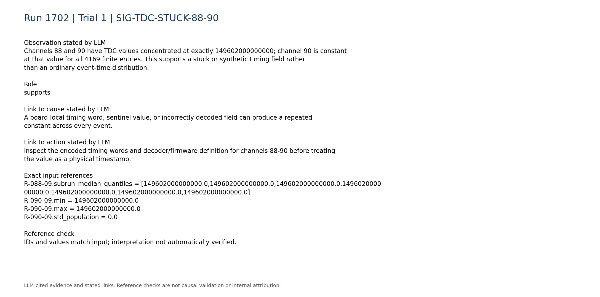

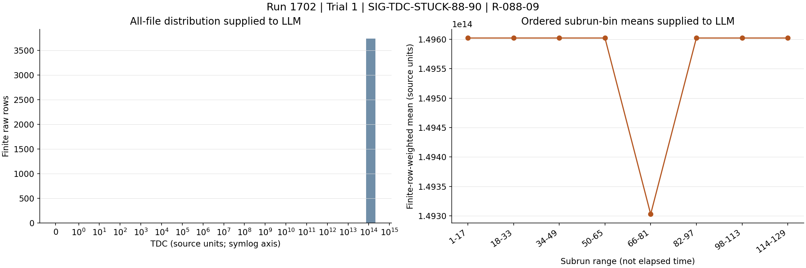

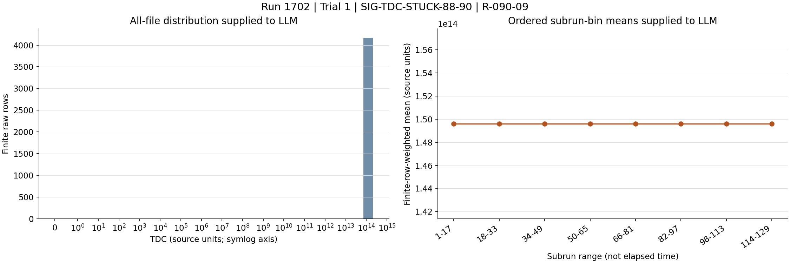

### SIG-TDC-ZERO-91-93

Immediately after the constant-TDC channels, channels 91-93 have TDC identically zero. The sharp contiguous-channel discontinuity supports a localized timing data-path or decoding boundary.

Role: supports

Cause link: Multiple adjacent channels switching from a fixed nonzero timestamp to all-zero timestamps is more consistent with structured readout/format corruption than independent detector failures.

Action link: Compare board, firmware, and decoder boundaries for channels 88-95 and inspect the same raw event words across channels 87-95.

```text
R-091-09.zero_fraction = 1.0
R-091-09.n = 3850
R-092-09.zero_fraction = 1.0
R-093-09.zero_fraction = 1.0
```

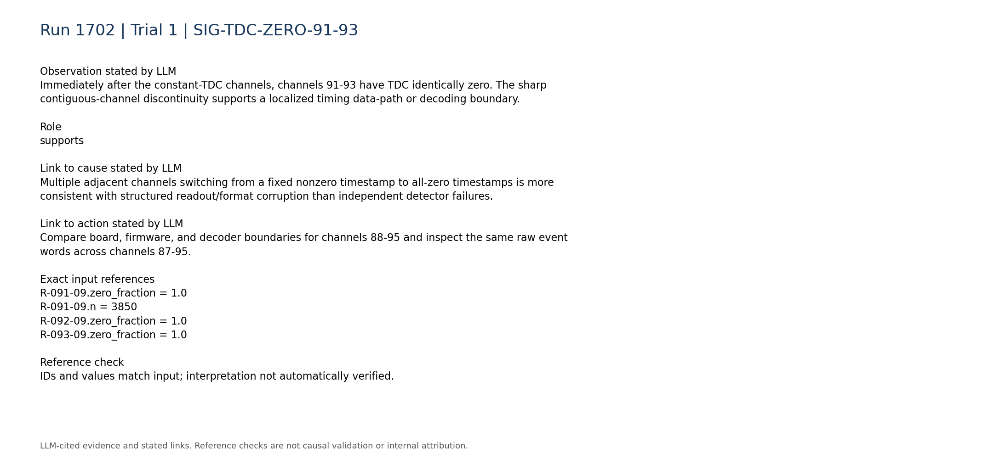

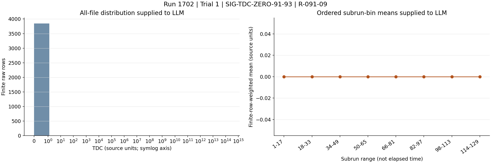


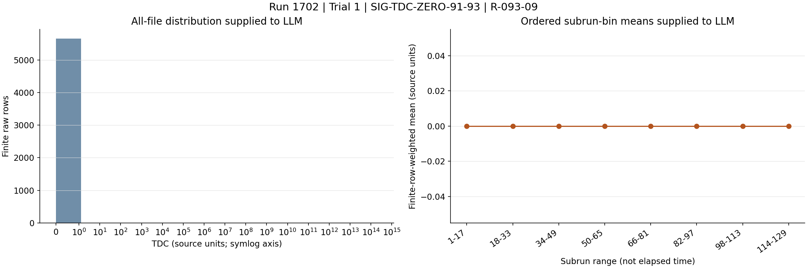

### SIG-ROLLOVER-IMPLAUSIBLE

Channels in the affected block contain sparse TDCRollovers values up to approximately 1.4e19, whereas most entries are zero. These values are incompatible with the zero-rollover pattern observed on earlier channels and support malformed or misdecoded rollover metadata.

Role: supports

Cause link: Rare enormous rollover words accompanying stuck or zero TDC fields indicate timing-word corruption, overflow misuse, or schema misinterpretation.

Action link: Decode rollover words bit-by-bit using the installed firmware specification and check for signedness, width, endianness, sentinel, or column-offset errors.

```text
R-089-10.max = 1.41672e+19
R-089-10.zero_fraction = 0.94196
R-091-10.max = 1.41305e+19
R-091-10.zero_fraction = 0.945974
R-095-10.max = 1.40209e+19
R-095-10.zero_fraction = 0.95453
```

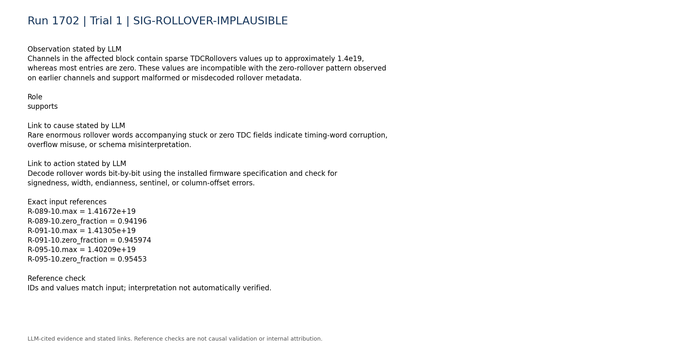

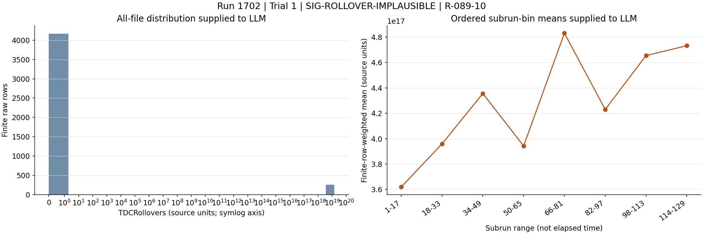

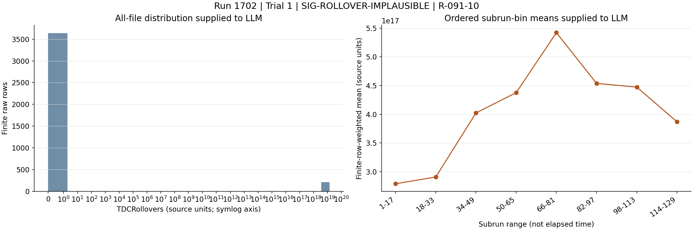

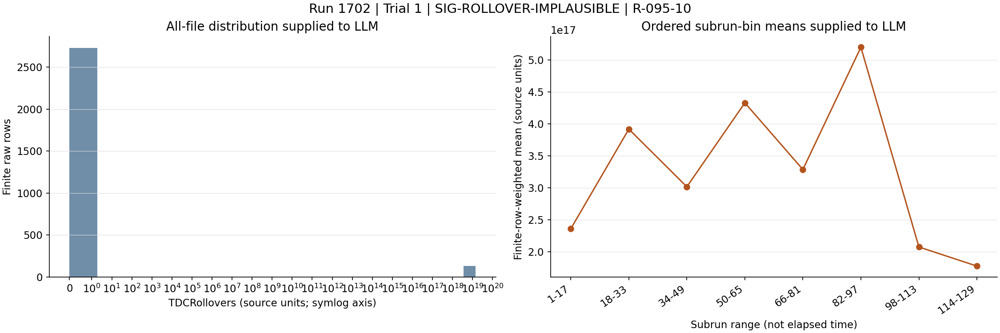

### SIG-NEIGHBOR-TIMING-NORMAL

Channel 87, immediately before the affected block, has a broad finite TDC distribution up to about 1.099e12 and TDCRollovers identically zero. This localizes the abrupt timing failure to the subsequent channel block rather than the complete run clock.

Role: supports

Cause link: Normal neighboring-channel timing argues against a global timestamp source failure and favors a board/channel-group-specific path.

Action link: Use channels 80-87 as the local comparison when testing the affected board or decoder segment.

```text
R-087-09.max = 1098920000000.0
R-087-09.std_population = 309627000000.0
R-087-10.zero_fraction = 1.0
```

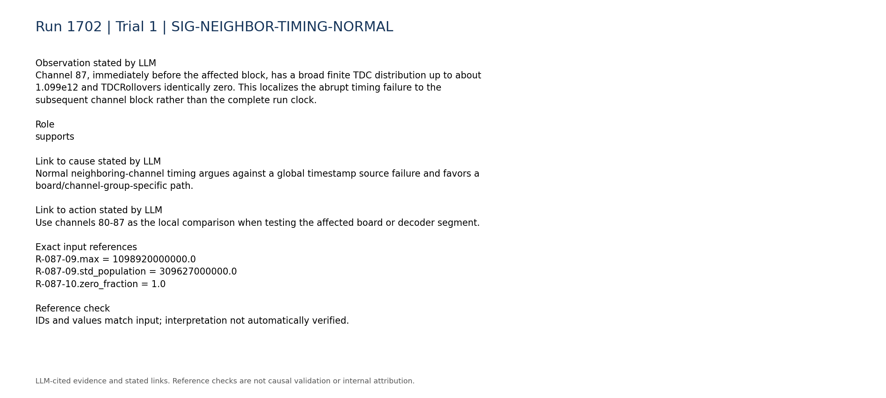

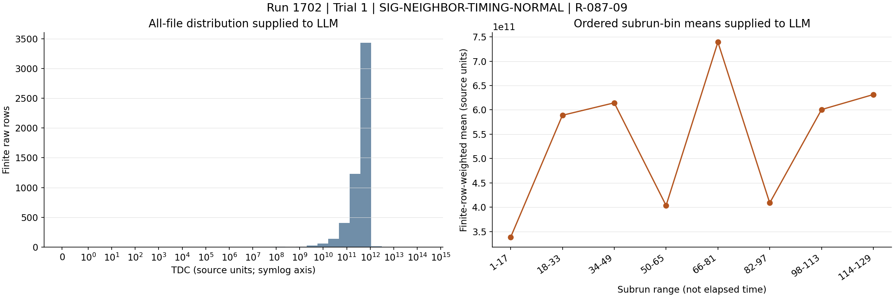

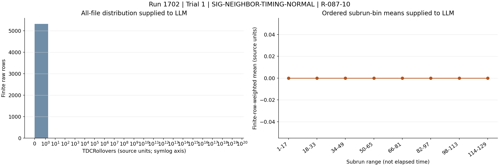

### SIG-PULSE-PRESENCE-CONTINUES

Affected endpoint channels 88 and 95 are present in every subrun with no absent ranges. Continuing pulse occupancy contradicts complete digitizer lockup, dead PMTs, or total loss of the signal path as the primary mechanism.

Role: contradicts

Cause link: A fully locked or powered-off digitizer/PMT path would ordinarily suppress or remove channel records, unlike the supplied continuous presence.

Action link: Do not replace PMT bases or declare a complete digitizer lockup solely from the timing fields; first separate waveform acquisition from timing metadata generation.

```text
P-088.present_subruns = 129
P-088.absent_subrun_ranges = []
P-095.present_subruns = 129
P-095.absent_subrun_ranges = []
```

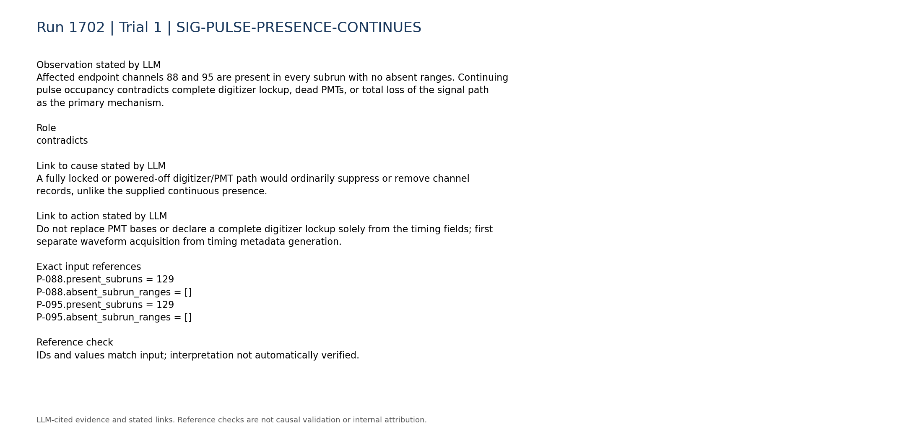

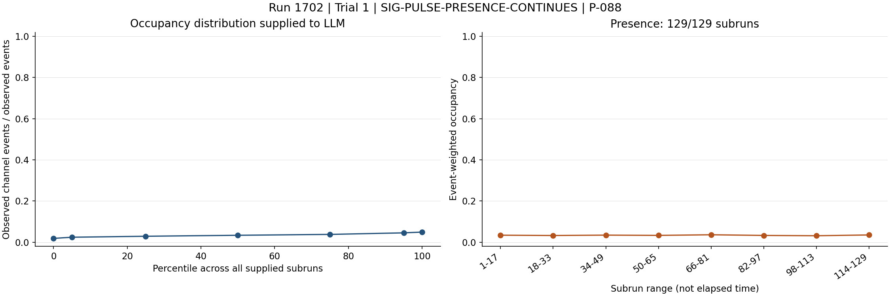

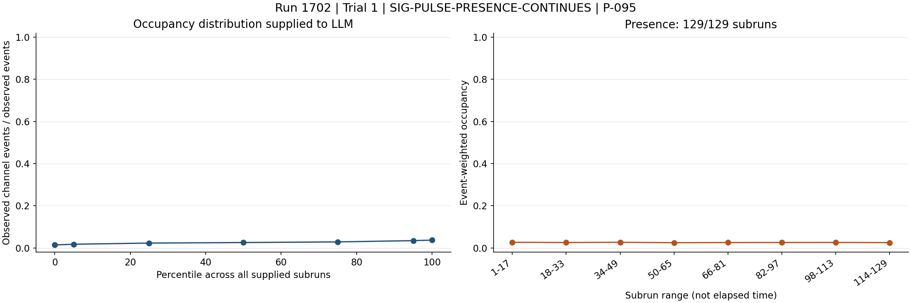

### SIG-GLOBAL-TRIGGER-STABLE

The total recorded trigger rate is described as stable and persistent, with median 4.857 and range 4.462 to 5.209. This contradicts a global high-trigger-rate or trigger-rate-collapse explanation for the timing-field pathology.

Role: contradicts

Cause link: A localized malformed TDC block can coexist with a normal aggregate trigger rate; the observation does not support global trigger instability.

Action link: Preserve the current trigger configuration while diagnosing the digitizer timing path unless board-level tests demonstrate a trigger coupling.

```text
C-trigger-001.text = "- Total trigger rate: median 4.857, range 4.462 to 5.209. Temporal behavior: stable/persistent."
```

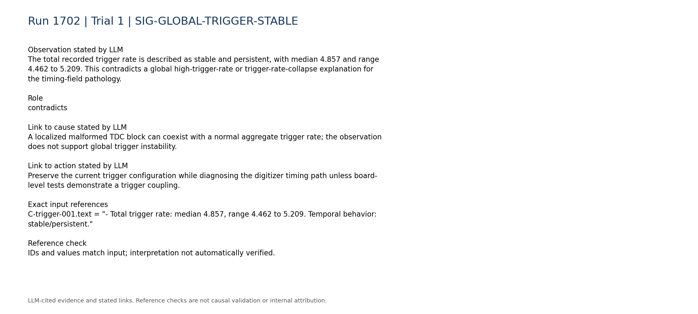

### SIG-LVDS-NO-PERSISTENT-PIN-FAULT

LVDS telemetry reports no persistent zero, missing, abnormally low, or abnormally high signal pins. This weakens LVDS disconnection/noise and broken-PMT-base hypotheses, although it cannot exclude intermittent or non-rate-visible faults.

Role: contradicts

Cause link: The supplied LVDS count summaries do not show the persistent pin loss expected from a disconnected or powered-off channel pair.

Action link: Prioritize timing-word and board diagnostics; inspect LVDS cabling only if synchronization tests implicate it, using the repository mapping rather than equating pin and channel indices.

```text
C-lvds-003.text = "- Persistent zero signal pins: none."
C-lvds-004.text = "- Persistent missing signal pins: none."
C-lvds-005.text = "- Persistently abnormally low signal pins: none."
C-lvds-006.text = "- Persistently abnormally high signal pins: none."
```

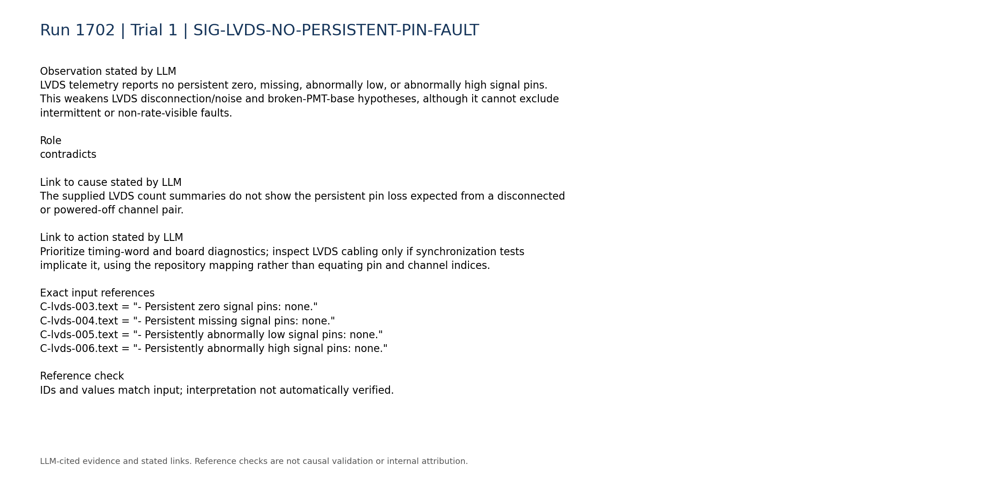

### SIG-DISCRIMINATING-TELEMETRY-UNAVAILABLE

Digitizer-versus-trigger-board rate consistency, board matching, synchronization, queue occupancy, and DAQ-state telemetry are unavailable. These missing measurements prevent discrimination among decoder error, firmware mismatch, and physical board synchronization/readout failure.

Role: limitation

Cause link: Without board-state and synchronization evidence, the root cause cannot be assigned confidently to software or hardware.

Action link: Collect board matching, synchronization/error counters, queue occupancy, firmware identity, and per-board rates in a controlled follow-up run.

```text
C-trigger-007.text = "- Digitizer-vs-trigger-board rate consistency: unavailable; no compact processed digitizer-rate telemetry was used."
C-daq_config-008.text = "- Board matching, synchronization, queue occupancy, and DAQ-state telemetry: unavailable."
C-daq_config-007.text = "- Within-run configuration changes: unavailable; only the static per-run configuration snapshot is parsed."
```

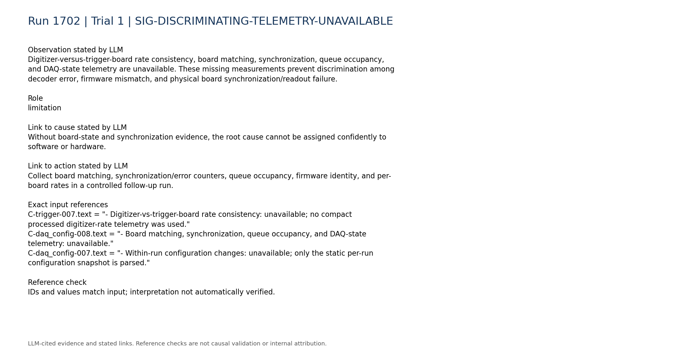

### SIG-HISTORICAL-PARTIAL-ONLY

Historical run 1620 involved a digitizer lockup, while run 1747 involved software not recompiled after firmware reflashing plus a faulty LVDS cable. They provide partial component/mechanism analogies but no exact match to the current combination of continuing occupancy and structured TDC/rollover corruption.

Role: limitation

Cause link: The analogies make digitizer state and firmware/software compatibility reasonable checks, but they do not establish either as the current cause.

Action link: Use restart or firmware/software correction only conditionally after live board and raw-word checks reproduce the corresponding failure mechanism.

```text
H-1620.entry.category = "digitizer_lockup"
H-1620.entry.cause = "Digi1 locked up on the slab detector. The report notes that run 1620 may have had an unknown firmware version, but does not establish this as the confirmed cause."
H-1747.entry.cause = "The slab detector entered a high-rate state following a power trip. The trigger logic was not behaving as expected. During troubleshooting, it was found that MilliDAQ had not been recompiled after the firmware was reflashed, and a faulty LVDS cable was also identified."
```

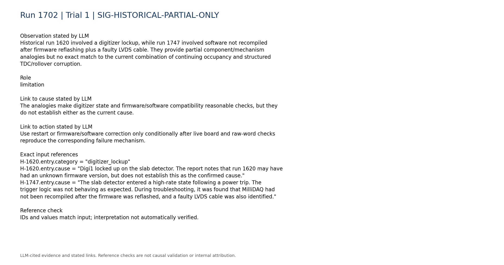

## Missing information

- Raw timing words or original event rows for channels 88-95 and neighboring channels 80-87.
- Digitizer board-to-channel mapping and confirmation that channels 88-95 share a board, link, or decoder segment.
- Installed firmware versions, firmware data-format specification, decoder/MilliDAQ build version, and their compatibility.
- Board matching efficiency, synchronization status, timing/error registers, queue occupancy, and DAQ-state logs.
- Per-board digitizer trigger rates compared with trigger-board rates.
- Whether a controlled restart changes the TDC and rollover fields in a subsequent run.
- A supplied known-good raw reference using the same firmware, decoder, and configuration.
