# Run 1702 | Trial 2

## Diagnosis

Category: digitizer_timing_readout_corruption

Cause: The observable symptom is corrupted or stuck TDC/TDCRollovers data localized to digitizer channels 88-95. The most likely mechanism is failure or mis-decoding of a shared timing counter/readout path for that channel group, rather than loss of detector pulses. The underlying root cause—firmware state, register/configuration error, serialization/decoding defect, synchronization fault, or hardware counter failure—is unknown from the supplied telemetry.

Action: First preserve and inspect event-level timing words for channels 88-95 and compare their raw encoding, board identity, firmware version, timing registers, clock/reset state, event counters, and timestamps with channels 80-87. Check board matching, synchronization, queue occupancy, and digitizer-versus-trigger-board rates. Do not translate trigger-mask indices directly into digitizer channel numbers; verify the physical mapping. If corruption is confirmed at the digitizer output, conditionally reset or restart the affected digitizer/DAQ path and reload validated firmware and configuration; reflash/recompile only if a firmware/software mismatch is demonstrated. If raw words are valid but processed values are not, correct the TDC/rollover decoder instead. Validate recovery in a new run by requiring plausible, varying TDC values and rollover behavior while occupancy and trigger rate remain stable.

Confidence: 0.92

OBSERVED: Channels 88-95 remain present, but their timing fields change abruptly from the behavior of channels 0-87: channels 88-90 contain nearly fixed extreme TDC values, channels 91-93 contain all-zero TDC with sparse enormous rollover values, and channels 94-95 contain a fixed TDC mode with extreme outliers and enormous rollovers. Trigger rate is stable and all LVDS signal pins are present and nonzero. INFERRED: This is a localized timing readout or decoding failure, not a PMT/HV outage, general LVDS disconnection, or detector-wide trigger-rate fault. UNKNOWN: The evidence cannot distinguish affected-board firmware/configuration, synchronization, hardware-counter, transport, or downstream decoder causes. No historical case is an exact match; run 1620 is only a partial digitizer-level analogy and described a lockup rather than this continuing, timing-only corruption.

## LLM-cited signatures

LLM-cited evidence and stated links. Reference checks are not causal validation or internal attribution.

### SIG-TDC-STUCK-90

Channel 90 reports exactly the same extreme TDC value for every supplied finite row: minimum and maximum are 149602000000000 with zero population standard deviation.

Role: supports

Cause link: A constant extreme timing word strongly supports a stuck counter, sentinel, or deterministic decoding failure rather than physical event timing.

Action link: Inspect the raw channel-90 timing word and decoder interpretation before changing detector hardware.

```text
R-090-09.metric = "TDC"
R-090-09.min = 149602000000000.0
R-090-09.max = 149602000000000.0
R-090-09.std_population = 0.0
```

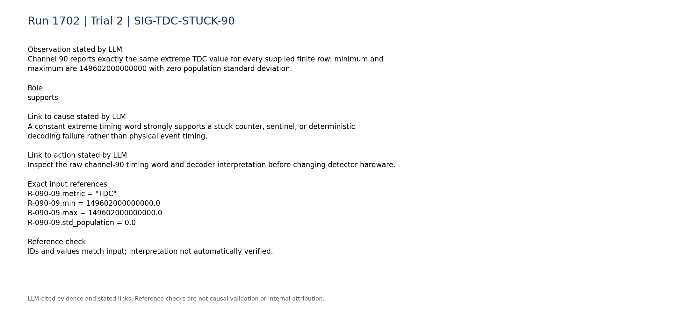

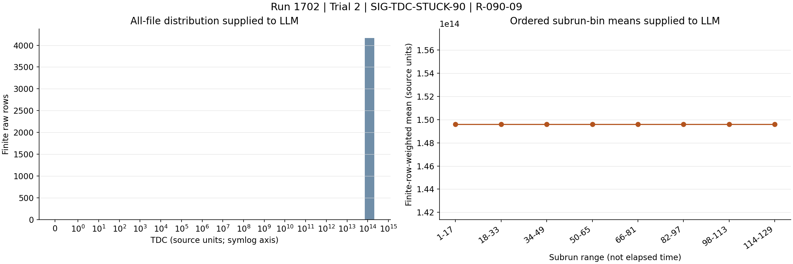

### SIG-TDC-ZERO-ROLLOVER-HUGE

Channels 91 and 93 have all-zero TDC values, while their TDCRollovers fields include values above 1.4e19.

Role: supports

Cause link: The paired zero-TDC/enormous-rollover pattern is consistent with timing-word corruption, field misalignment, or counter decoding failure.

Action link: Compare raw timing and rollover bit fields against the firmware data format and a validated channel or board.

```text
R-091-09.zero_fraction = 1.0
R-091-10.max = 1.41305e+19
R-093-09.zero_fraction = 1.0
R-093-10.max = 1.41672e+19
```

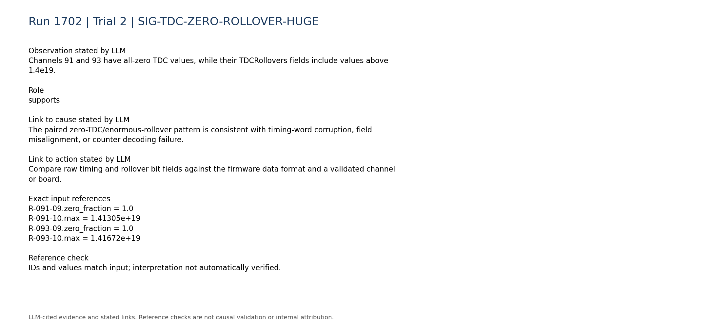

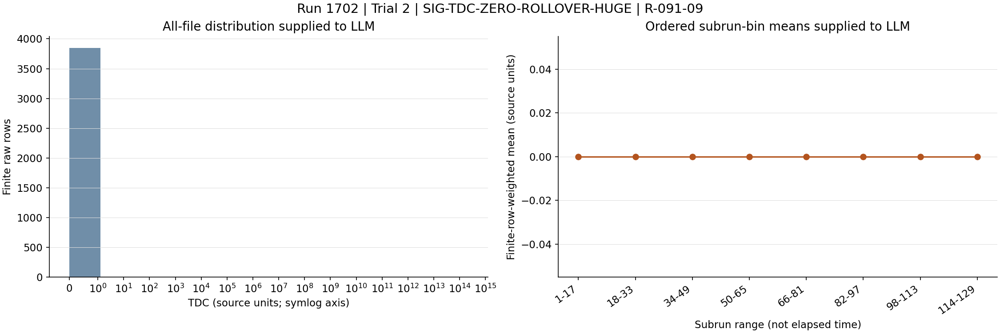

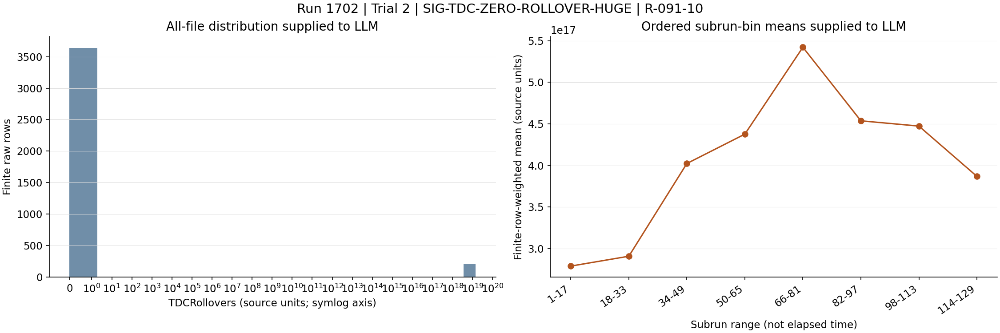

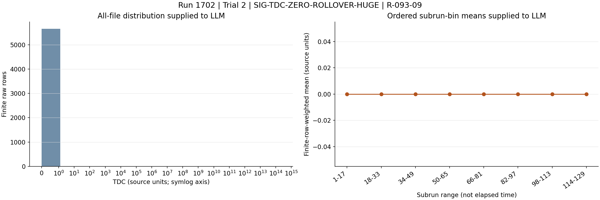

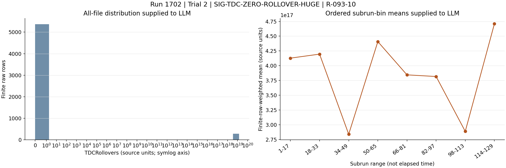

### SIG-TDC-94-95-FIXED-MODE

Channels 94 and 95 have subrun TDC medians fixed at 438087000000, but their event extrema reach 176343000000000 and 211527000000000, respectively; both also have rollover maxima near 1.4e19.

Role: supports

Cause link: A fixed modal timing value combined with extreme outliers and huge rollovers extends the corruption across the 88-95 channel group while showing more than one corrupt representation.

Action link: Test whether channels 88-95 share a board, timing link, firmware image, or decoder branch and reproduce the conversion from raw words.

```text
R-094-09.subrun_median_quantiles = [438087000000.0,438087000000.0,438087000000.0,438087000000.0,438087000000.0,438087000000.0,438087000000.0]
R-094-09.max = 176343000000000.0
R-094-10.max = 1.41056e+19
R-095-09.subrun_median_quantiles = [438087000000.0,438087000000.0,438087000000.0,438087000000.0,438087000000.0,438087000000.0,438087000000.0]
R-095-09.max = 211527000000000.0
R-095-10.max = 1.40209e+19
```

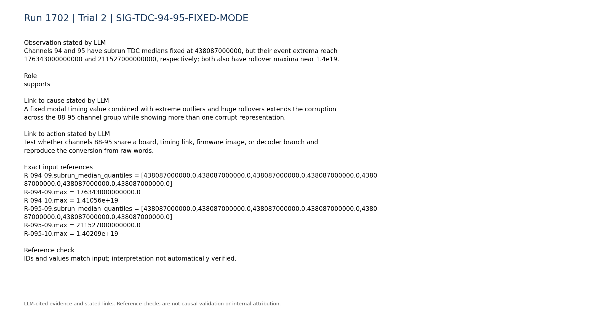

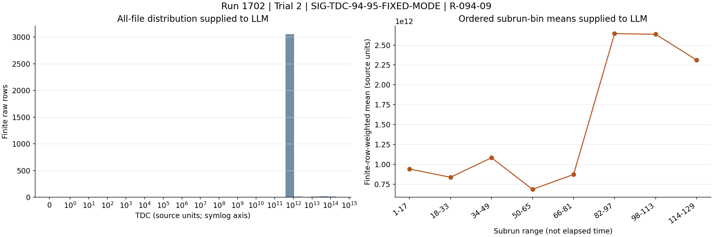

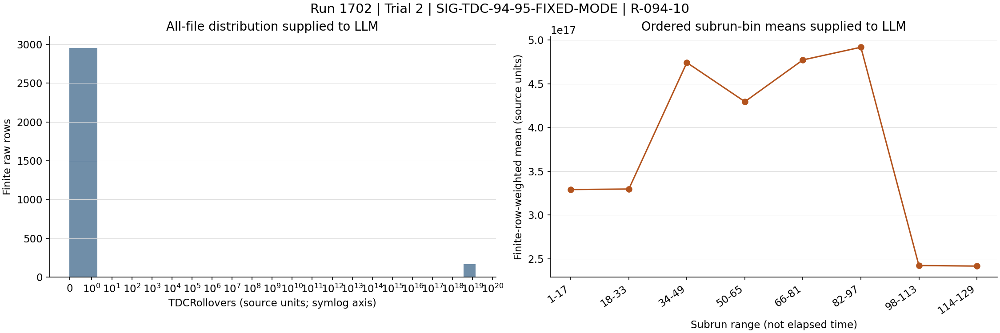

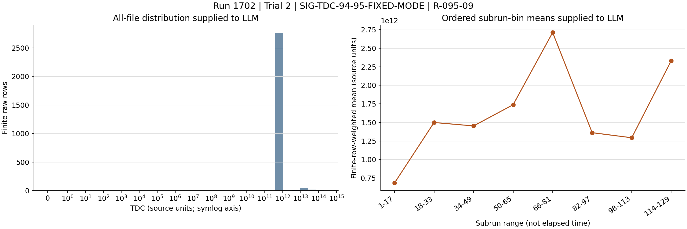

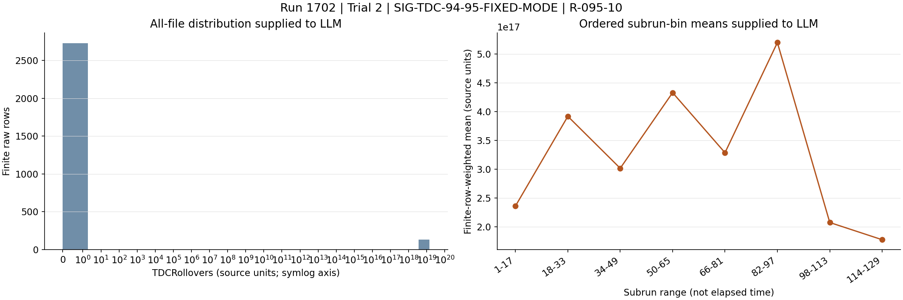

### SIG-BOUNDARY-87-88

Immediately before the affected group, channel 87 has a varying TDC distribution bounded near 1.1e12 and zero rollovers, unlike channel 88's nearly constant 1.49602e14 TDC and nonzero enormous rollover values.

Role: supports

Cause link: The sharp channel boundary supports a localized shared electronics or software path rather than a detector-wide clock phenomenon.

Action link: Use the 87/88 boundary to identify the responsible board, link, data block, or decoder dispatch boundary.

```text
R-087-09.max = 1098920000000.0
R-087-09.std_population = 309627000000.0
R-087-10.max = 0.0
R-088-09.subrun_median_quantiles = [149602000000000.0,149602000000000.0,149602000000000.0,149602000000000.0,149602000000000.0,149602000000000.0,149602000000000.0]
R-088-10.min = 1099510000000.0
R-088-10.max = 1103820000000.0
```

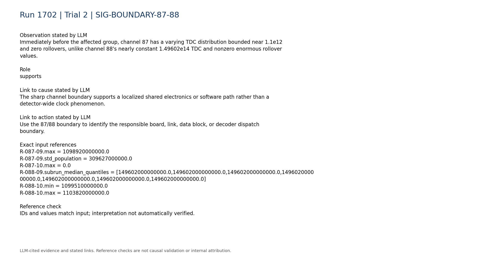

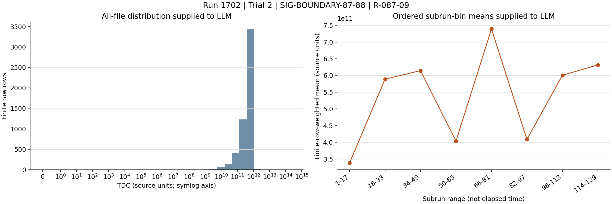

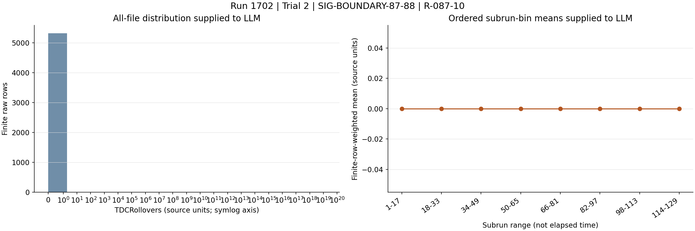

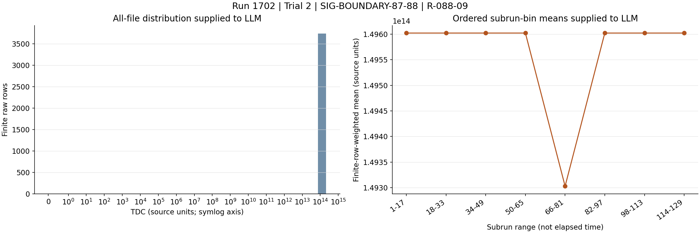

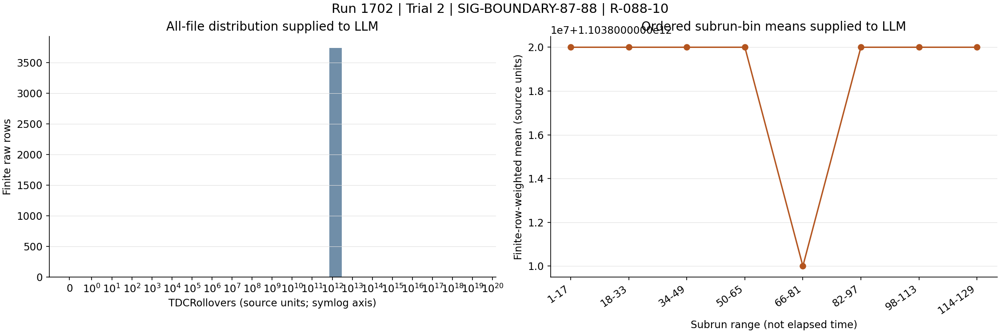

### SIG-PULSES-CONTINUE

Affected channels remain represented in all 129 subruns with nonzero, comparatively stable occupancy; for example, channels 88 and 95 have no absent subrun ranges.

Role: contradicts

Cause link: Continued pulse presence contradicts a complete digitizer lockup, PMT shutdown, or disconnected signal path, although it does not exclude a timing-only electronics failure.

Action link: Avoid replacing PMT/HV or signal components unless independent pulse or current checks identify an additional fault.

```text
P-088.present_subruns = 129
P-088.absent_subrun_ranges = []
P-088.time_bin_occupancy = [0.0337011,0.0321888,0.034038,0.03274,0.0358472,0.0325418,0.0309938,0.0349403]
P-095.present_subruns = 129
P-095.absent_subrun_ranges = []
P-095.time_bin_occupancy = [0.0263689,0.0253219,0.0264421,0.0244478,0.025186,0.0253898,0.0257443,0.0248415]
```

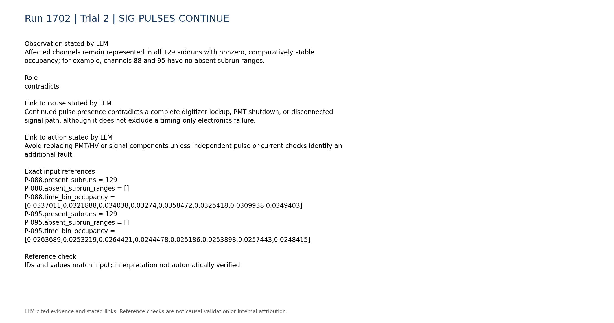

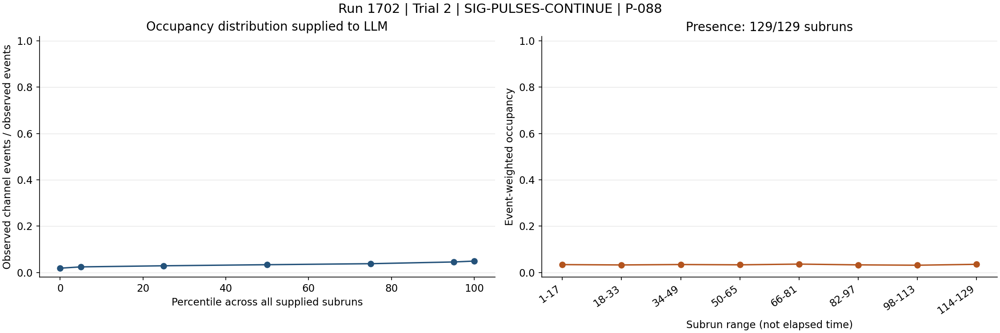

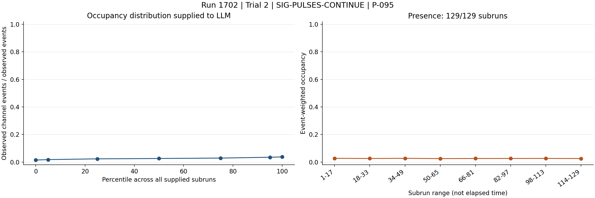

### SIG-TRIGGER-LVDS-NOMINAL

The total trigger rate is described as stable/persistent, and LVDS telemetry reports no persistently zero, missing, abnormally low, or abnormally high signal pins.

Role: contradicts

Cause link: This argues against the high-trigger-rate/LVDS-noise mechanisms in the historical cases and against a persistent broken-PMT-base signature that removes LVDS contributions.

Action link: Prioritize the digitizer timing and data-format path over LVDS reseating or trigger masking unless board-level checks reveal a connection fault.

```text
C-trigger-001.text = "- Total trigger rate: median 4.857, range 4.462 to 5.209. Temporal behavior: stable/persistent."
C-lvds-003.text = "- Persistent zero signal pins: none."
C-lvds-004.text = "- Persistent missing signal pins: none."
C-lvds-005.text = "- Persistently abnormally low signal pins: none."
C-lvds-006.text = "- Persistently abnormally high signal pins: none."
```

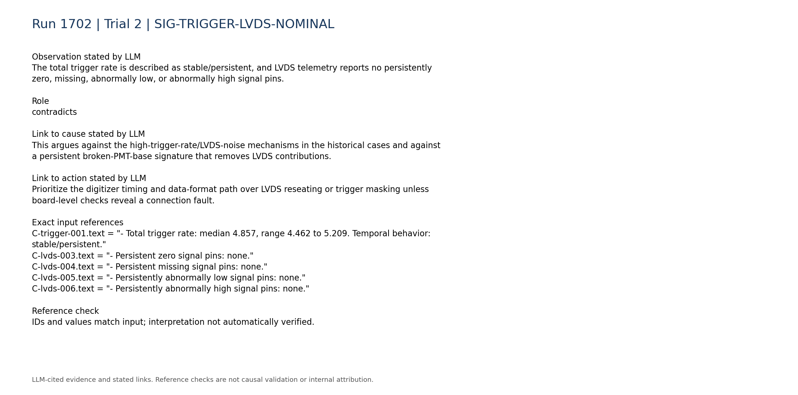

### SIG-DISCRIMINATING-TELEMETRY-MISSING

Digitizer-versus-trigger-board rate consistency, board matching, synchronization, queue occupancy, and DAQ-state telemetry are unavailable; only a static run configuration snapshot was parsed.

Role: limitation

Cause link: Without these measurements, the evidence cannot determine whether corruption originates in board synchronization, firmware/configuration, transport, or offline decoding.

Action link: Acquire these telemetry sources and inspect raw event timing words before selecting a corrective intervention.

```text
C-trigger-007.text = "- Digitizer-vs-trigger-board rate consistency: unavailable; no compact processed digitizer-rate telemetry was used."
C-daq_config-007.text = "- Within-run configuration changes: unavailable; only the static per-run configuration snapshot is parsed."
C-daq_config-008.text = "- Board matching, synchronization, queue occupancy, and DAQ-state telemetry: unavailable."
```

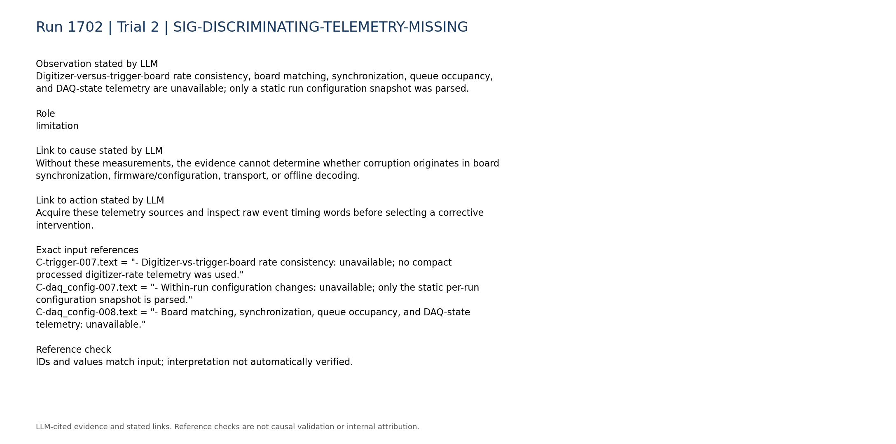

### SIG-HISTORICAL-NO-EXACT-MATCH

The closest supplied historical analogy is a digitizer lockup in run 1620, but its report only notes an unconfirmed firmware-version possibility and describes recovery after a PC reboot; the current case instead retains pulse occupancy and shows structured timing-field corruption.

Role: limitation

Cause link: This is only a component-level analogy and does not establish either a lockup or firmware mismatch in CASE_TARGET; no exact historical match was supplied.

Action link: Treat a restart as conditional after localization and preservation of diagnostic evidence, not as proof of the cause.

```text
H-1620.entry.category = "digitizer_lockup"
H-1620.entry.cause = "Digi1 locked up on the slab detector. The report notes that run 1620 may have had an unknown firmware version, but does not establish this as the confirmed cause."
H-1620.entry.action = "Restart the slab DAQ PC while the VME was powered off."
```

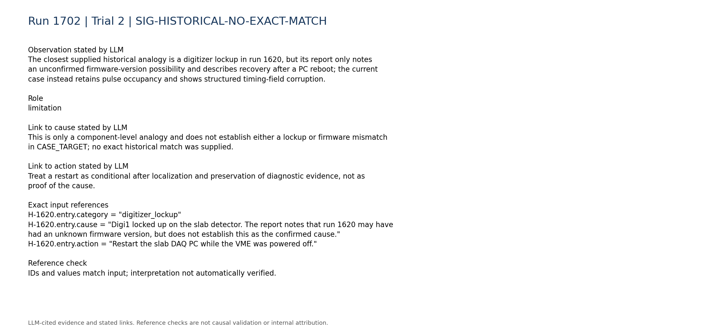

## Missing information

- Raw event-level TDC and rollover words for channels 88-95 and a known-good comparison group
- Digitizer board and firmware mapping for channels 88-95
- Firmware versions, timing register values, clock/reset state, and configuration load history
- Board-matching efficiency, synchronization status, event counters, queue occupancy, and DAQ-state logs
- Digitizer-versus-trigger-board rates for the affected interval
- Decoder/software version and exact TDC/rollover bit-field specification
- A validated good-run timing reference for the same hardware and configuration
