# Run 1702 | Trial 3

## Diagnosis

Category: digitizer_TDC_rollover_data_corruption

Cause: Observed mechanism: the TDC and TDCRollovers outputs for digitizer channels 88-95 are stuck, zero, or populated with implausibly large counter-like values, while those channels remain present. This is most consistent with corruption in the affected digitizer timing/counter state or its decoding. The underlying root cause is unknown; supplied evidence cannot distinguish a firmware/register-state fault from a packed-data or software-decoder/schema error.

Action: First quarantine TDC and TDCRollovers from timing analyses for channels 88-95. Compare packed raw timing words against decoded values, verify the channel-to-board mapping and firmware/decoder version, and inspect board matching, synchronization, and DAQ state. If raw words are valid, correct the decoder/schema and reprocess the data. If raw words themselves are stuck or corrupted, conditionally reset or restart the affected digitizer/DAQ and verify normal TDC and rollover distributions in a new run; reflash firmware only if a version or configuration mismatch is confirmed. Do not replace PMT/HV or LVDS hardware without additional evidence.

Confidence: 0.93

OBSERVED: channels 88-95 have sharply abnormal timing fields, including nearly constant TDC values, all-zero TDC values, and enormous rollover values; all remain present across 129 subruns. Trigger rate and LVDS pin telemetry do not show the dead-pin or high-rate pattern expected from the supplied LVDS/PMT analogies. INFERRED: the primary mechanism is localized timing-counter or timing-data corruption in the final eight digitizer channels, not loss of detector pulses. UNKNOWN: raw packed words, firmware version, decoder schema, board assignment, synchronization, and board-matching telemetry are unavailable, so the physical versus software origin cannot be resolved. No historical case is an exact match; run 1620 is only a partial digitizer-fault analogy.

## LLM-cited signatures

LLM-cited evidence and stated links. Reference checks are not causal validation or internal attribution.

### SIG-TDC-STUCK-HIGH-88

Channel 88 has an almost constant TDC near 1.49602e14 and a nearly constant TDCRollovers value near 1.10382e12, unlike the zero rollover fields on channels 0-87.

Role: supports

Cause link: Supports a boundary-localized timing/counter corruption beginning at channel 88 rather than a normal physical timing distribution.

Action link: Check the board/channel boundary, timing-register state, firmware, and decoder handling beginning at channel 88.

```text
R-088-09.subrun_median_quantiles = [149602000000000.0,149602000000000.0,149602000000000.0,149602000000000.0,149602000000000.0,149602000000000.0,149602000000000.0]
R-088-10.subrun_median_quantiles = [1103820000000.0,1103820000000.0,1103820000000.0,1103820000000.0,1103820000000.0,1103820000000.0,1103820000000.0]
R-087-10.zero_fraction = 1.0
```

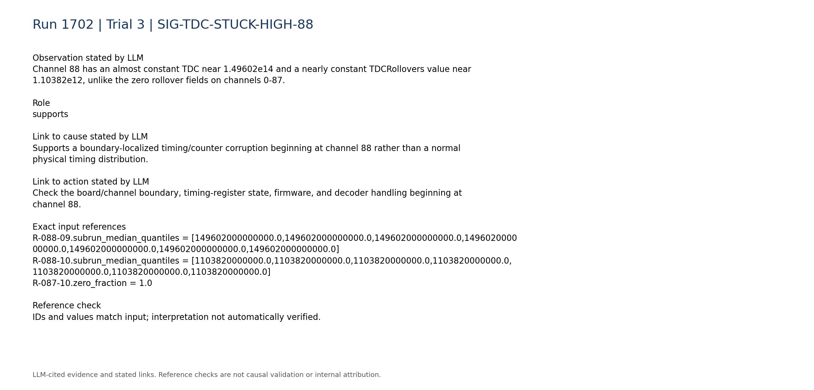

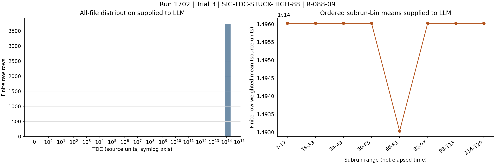

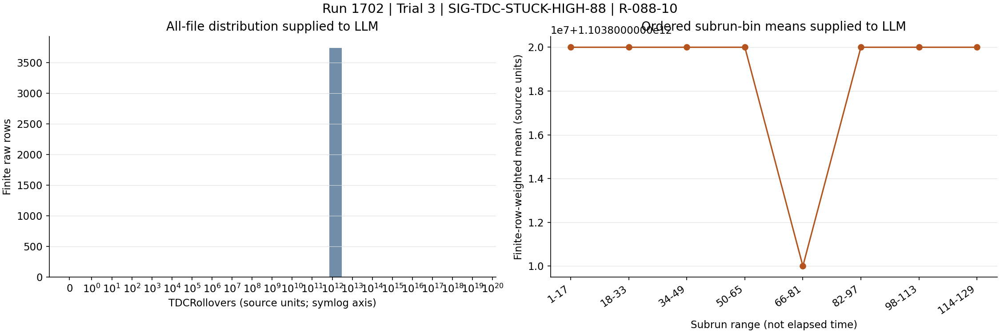

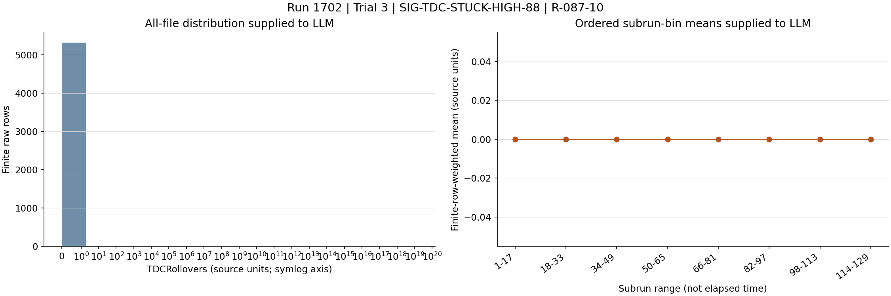

### SIG-TDC-STUCK-HIGH-89-90

Channels 89 and 90 also have TDC values concentrated at exactly 1.49602e14; channel 90 is completely constant at that value.

Role: supports

Cause link: An identical fixed timing value on adjacent channels strongly supports a shared electronic or decoding artifact rather than independent detector timing behavior.

Action link: Compare the packed timing words and shared decoder logic for channels 88-90 before hardware replacement.

```text
R-089-09.subrun_median_quantiles = [149602000000000.0,149602000000000.0,149602000000000.0,149602000000000.0,149602000000000.0,149602000000000.0,149602000000000.0]
R-090-09.min = 149602000000000.0
R-090-09.max = 149602000000000.0
R-090-09.std_population = 0.0
```

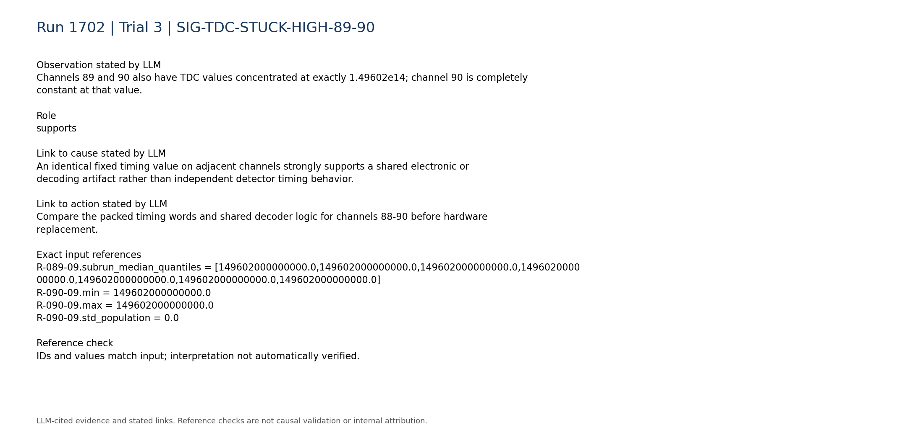

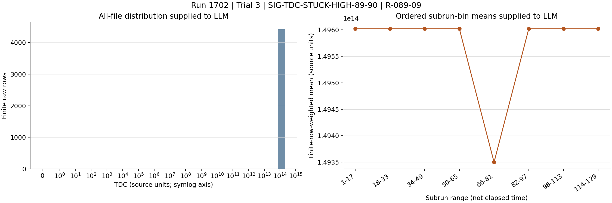

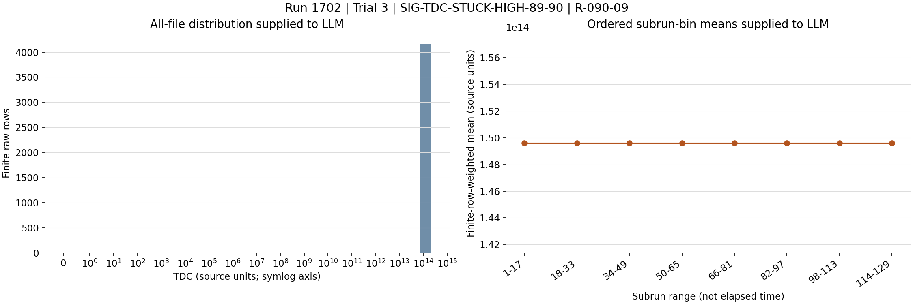

### SIG-TDC-ZERO-91-93

Channels 91, 92, and 93 have TDC identically zero for every supplied measurement, while their rollover fields contain sparse values as large as approximately 1.4e19.

Role: supports

Cause link: The combination of zero TDC and enormous sparse rollover values indicates malformed timing-field state or decoding, not a plausible detector timing process.

Action link: Inspect field widths, signedness, word offsets, rollover extraction, and timing-register state for channels 91-93.

```text
R-091-09.zero_fraction = 1.0
R-092-09.zero_fraction = 1.0
R-093-09.zero_fraction = 1.0
R-091-10.max = 1.41305e+19
R-092-10.max = 1.41399e+19
R-093-10.max = 1.41672e+19
```

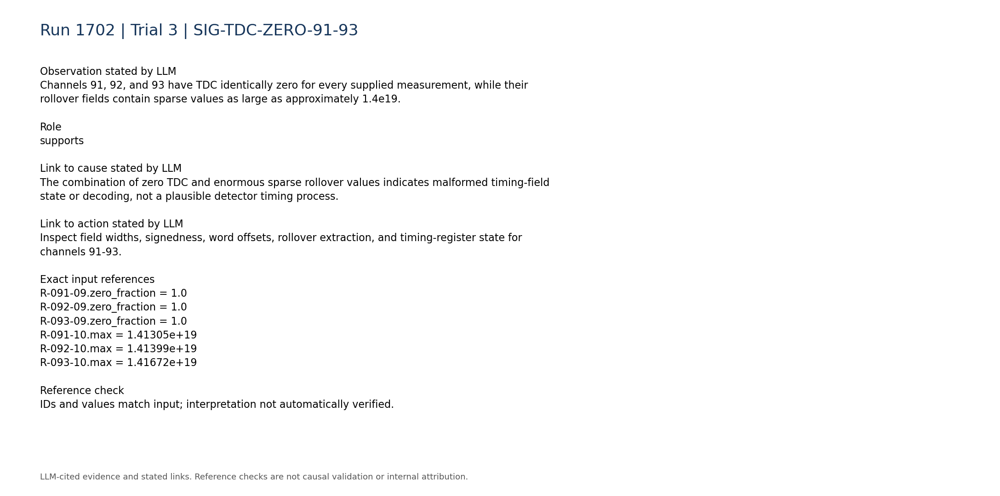

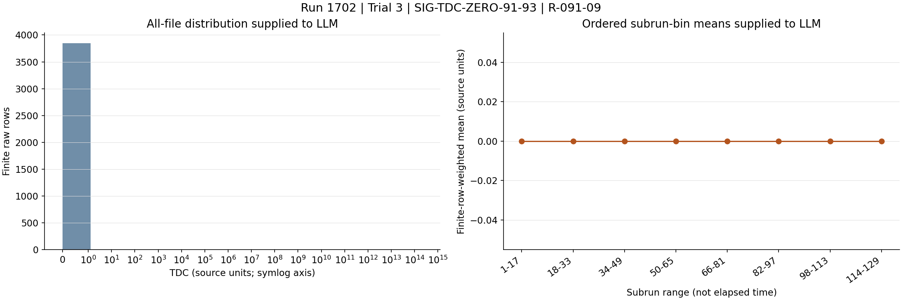

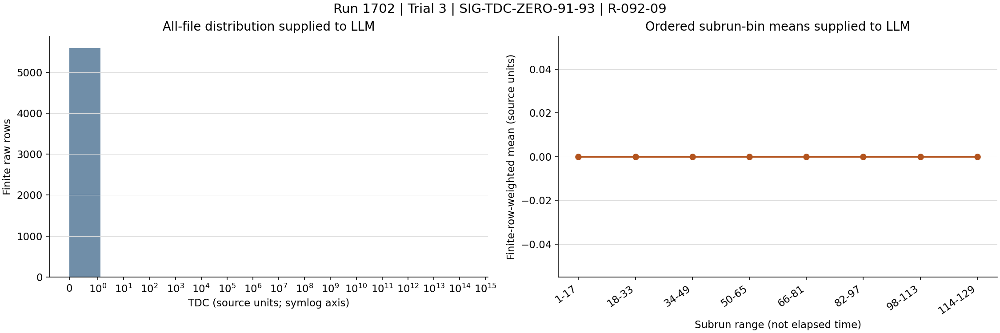


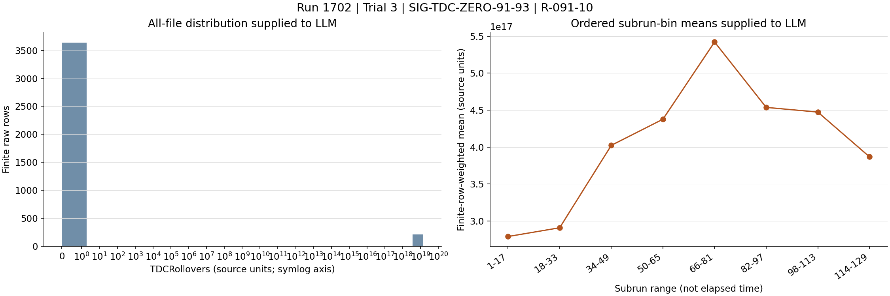

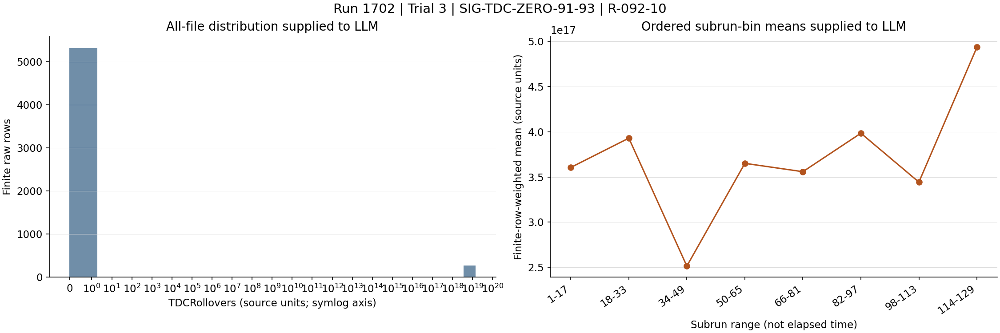

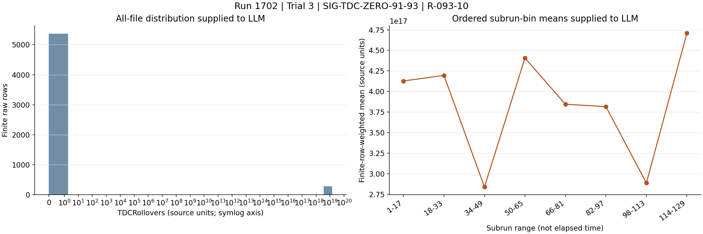

### SIG-TDC-ALTERNATE-STUCK-94-95

Channels 94 and 95 have TDC subrun medians fixed at 4.38087e11 while individual values extend to 1.76343e14 and 2.11527e14; both also show enormous rollover values.

Role: supports

Cause link: A second repeated fixed value within the same channel block supports structured word/field corruption or a shared timing-state failure.

Action link: Validate channel-specific word offsets and register readback for channels 94-95, then reprocess or reset conditionally.

```text
R-094-09.subrun_median_quantiles = [438087000000.0,438087000000.0,438087000000.0,438087000000.0,438087000000.0,438087000000.0,438087000000.0]
R-094-09.max = 176343000000000.0
R-094-10.max = 1.41056e+19
R-095-09.subrun_median_quantiles = [438087000000.0,438087000000.0,438087000000.0,438087000000000.0,438087000000.0,438087000000.0,438087000000.0]
R-095-09.max = 211527000000000.0
R-095-10.max = 1.40209e+19
```

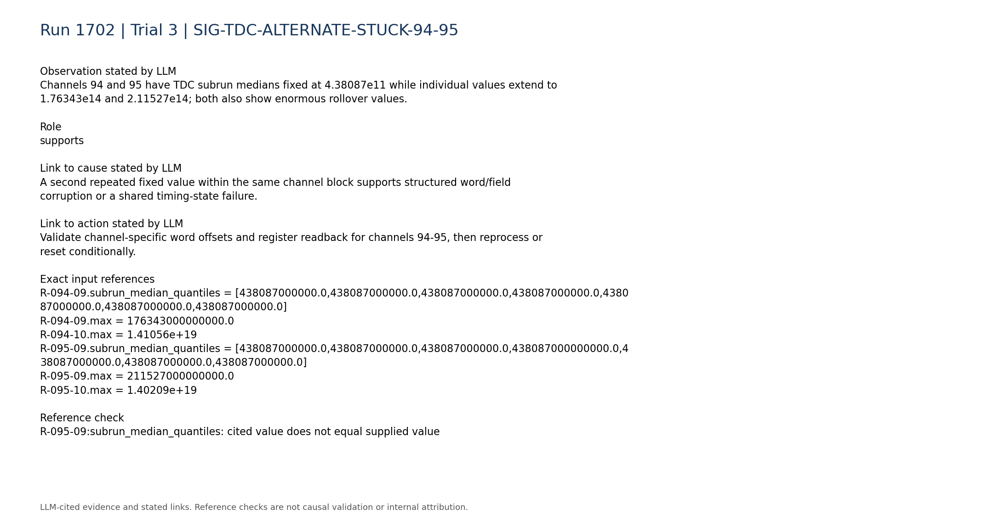

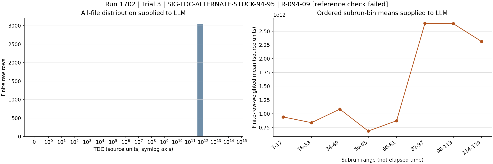


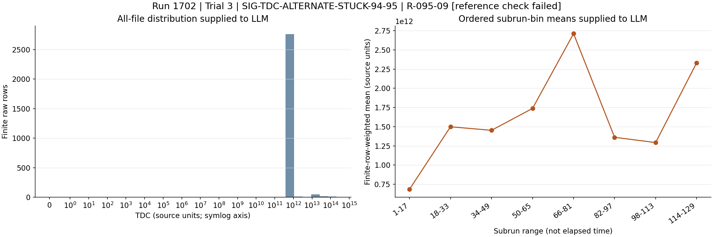

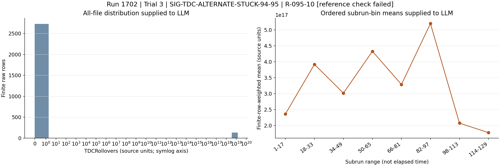

### SIG-AFFECTED-CHANNELS-PRESENT

Representative affected channels 88, 91, 94, and 95 are present in all 129 subruns; their observed occupancies are nonzero.

Role: contradicts

Cause link: Contradicts complete PMT/HV loss or full digitizer-channel disappearance; it does not exclude a timing-only electronics fault.

Action link: Avoid PMT-base or HV intervention unless independent HV/current evidence identifies a detector-side problem.

```text
P-088.present_subruns = 129
P-088.event_weighted_occupancy = 0.0333719
P-091.present_subruns = 129
P-091.event_weighted_occupancy = 0.0343076
P-094.present_subruns = 129
P-094.event_weighted_occupancy = 0.0278025
P-095.present_subruns = 129
P-095.event_weighted_occupancy = 0.0254767
```

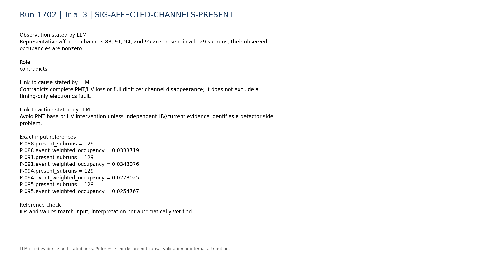

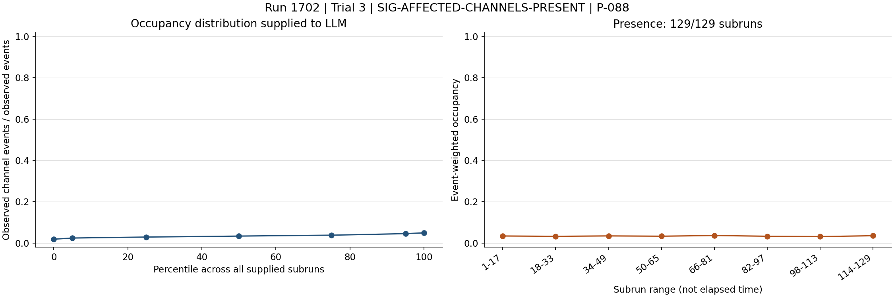

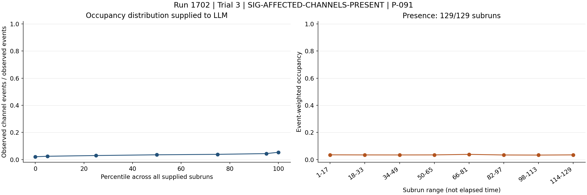

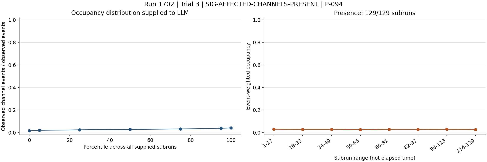

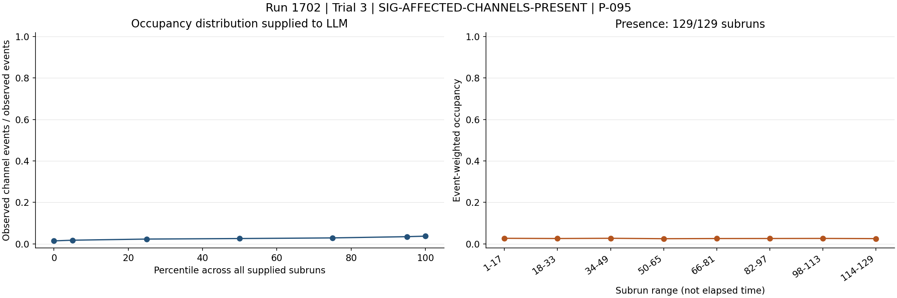

### SIG-LVDS-NOT-DEAD-OR-EXTREME

The LVDS summary reports no persistent zero, missing, abnormally low, or abnormally high signal pins.

Role: contradicts

Cause link: Contradicts the persistent dead-LVDS and gross LVDS-noise patterns in the historical cases, although intermittent or unmonitored connection faults are not fully excluded.

Action link: Prioritize timing-word, firmware, and digitizer-state checks over reseating LVDS hardware.

```text
C-lvds-003.text = "- Persistent zero signal pins: none."
C-lvds-004.text = "- Persistent missing signal pins: none."
C-lvds-005.text = "- Persistently abnormally low signal pins: none."
C-lvds-006.text = "- Persistently abnormally high signal pins: none."
```

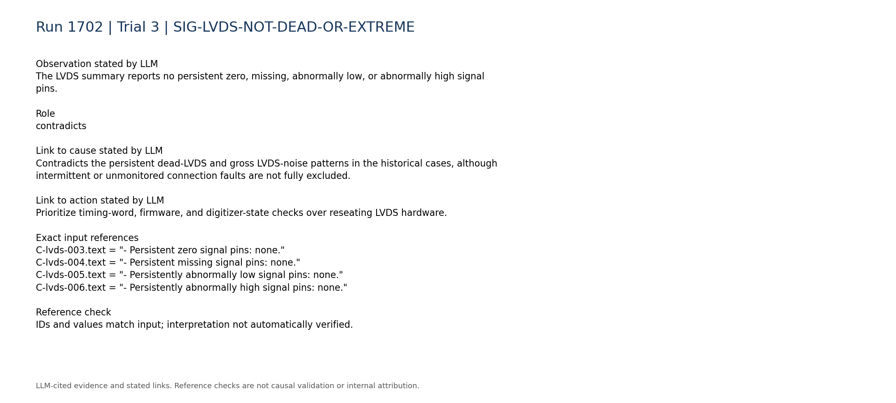

### SIG-TRIGGER-RATE-STABLE

The supplied total trigger rate is described as stable and persistent, with median 4.857 and range 4.462 to 5.209.

Role: contradicts

Cause link: Contradicts a detector-wide high-trigger-rate or severe trigger-logic failure as the primary mechanism.

Action link: Do not mask trigger paths solely on this evidence; verify digitizer timing integrity and board matching first.

```text
C-trigger-001.text = "- Total trigger rate: median 4.857, range 4.462 to 5.209. Temporal behavior: stable/persistent."
```

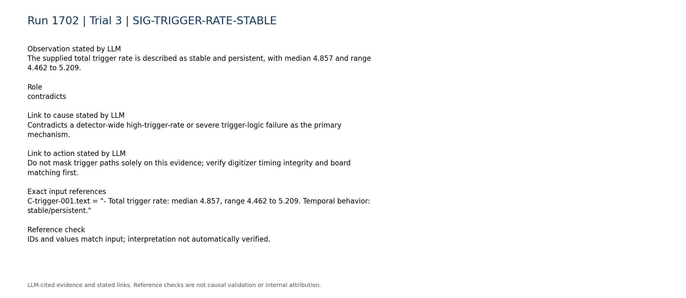

### SIG-DISCRIMINATING-TELEMETRY-UNAVAILABLE

Digitizer-versus-trigger-board rate consistency, board matching, synchronization, queue occupancy, DAQ-state telemetry, and within-run configuration changes are unavailable.

Role: limitation

Cause link: Prevents distinguishing firmware/register corruption, synchronization failure, digitizer lockup, and decoder/schema corruption.

Action link: Acquire these telemetry sources and inspect packed raw timing words before selecting a corrective reset, reflash, or software fix.

```text
C-trigger-007.text = "- Digitizer-vs-trigger-board rate consistency: unavailable; no compact processed digitizer-rate telemetry was used."
C-daq_config-007.text = "- Within-run configuration changes: unavailable; only the static per-run configuration snapshot is parsed."
C-daq_config-008.text = "- Board matching, synchronization, queue occupancy, and DAQ-state telemetry: unavailable."
```

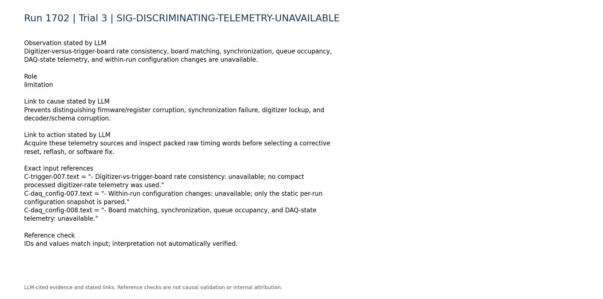

### SIG-HISTORICAL-PARTIAL-ANALOGY

Historical run 1620 involved a digitizer lockup resolved by restarting the slab DAQ PC, but its report did not establish firmware as the cause and does not describe the present structured TDC/rollover pattern.

Role: limitation

Cause link: Provides only a component-level analogy; it is not evidence that CASE_TARGET is a lockup or firmware failure.

Action link: Treat restart as conditional only after preserving diagnostics and confirming corruption in the hardware data path.

```text
H-1620.entry.category = "digitizer_lockup"
H-1620.entry.action = "Restart the slab DAQ PC while the VME was powered off."
H-1620.entry.cause = "Digi1 locked up on the slab detector. The report notes that run 1620 may have had an unknown firmware version, but does not establish this as the confirmed cause."
```

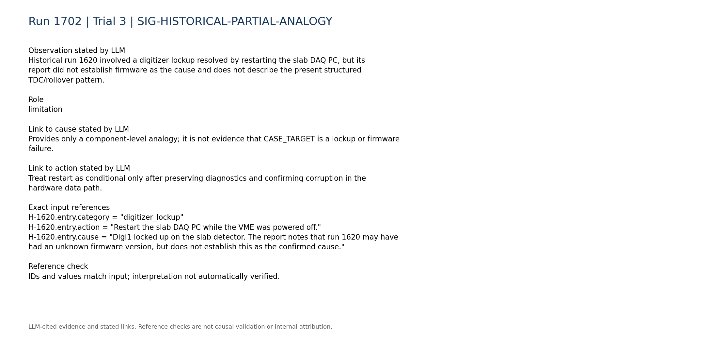

## Missing information

- Packed raw timing words for channels 88-95 and a known-good decoder comparison
- Digitizer board assignment and exact mapping for channels 88-95
- Digitizer firmware version, build compatibility, and timing-register readback
- Board-matching efficiency, synchronization state, queue occupancy, and DAQ-state telemetry
- Within-run configuration or reset history
- Known-good raw TDC and TDCRollovers reference distributions for the same hardware and configuration
- HV current and trip logs, if a detector-side hypothesis must be tested
