# Run 1703 | Trial 1

## Diagnosis

Category: digitizer_timing_metadata_corruption

Cause: The observed failure mechanism is corrupted, stuck, or sentinel-like TDC/TDCRollovers metadata in the contiguous channel block 88-95. The underlying root cause is unknown from the supplied telemetry; leading hypotheses are a digitizer timing-register/firmware/readout fault or a decoding/data-layout error affecting that block. Stable trigger telemetry, normal LVDS pin coverage, and persistent channel presence argue against a system-wide trigger failure, LVDS disconnection, PMT/HV loss, or complete digitizer lockup.

Action: First preserve the files and validate the TDC and TDCRollovers field layout, units, signedness, and rollover reconstruction for channels 88-95 against a known-good file or independent decoder. Identify which digitizer hardware/firmware serves this contiguous block, then inspect its firmware version, timing-register configuration, clock/synchronization state, and raw register words. Check board matching and DAQ-state telemetry during a controlled test run. If decoding is correct and the hardware timing fields remain stuck or impossible, conditionally restart/reinitialize the affected digitizer and DAQ process; reflash/recompile only after confirming a firmware mismatch. Quarantine timing values from channels 88-95 until validated, while retaining pulse/occupancy data separately if operationally acceptable.

Confidence: 0.9

OBSERVED: Channels 88-90 have TDC fixed at exactly 149602000000000 across all supplied events and time bins; channels 91-93 instead have TDC identically zero; channels 94-95 show another fixed median TDC value with extreme excursions. Multiple channels in 89-95 also contain sparse TDCRollovers values up to about 1.41672e19, while channel 88 has a different constant rollover value. All cited channels remain present in all 627 subruns, and trigger and LVDS summaries are stable without missing or persistently zero signal pins. INFERRED: The sharp contiguous timing-field pattern is much more consistent with timing metadata corruption, register/readout failure, or decoding misalignment than with detector pulses, PMT bases, or LVDS trigger noise. UNKNOWN: No exact resolved historical match is supplied, and firmware version, board mapping for channels 88-95, raw words, board matching, synchronization, DAQ state, and a known-good raw reference are unavailable; therefore the hardware-versus-decoder root cause cannot be resolved here.

## LLM-cited signatures

LLM-cited evidence and stated links. Reference checks are not causal validation or internal attribution.

### SIG-TDC-STUCK-HIGH-88-90

Channels 88, 89, and 90 each report TDC mean, minimum, and maximum equal to 149602000000000 with zero population standard deviation, so their TDC fields are constant throughout the supplied data.

Role: supports

Cause link: A shared exact constant across three adjacent channels is sentinel-like and supports a common timing-register, firmware/readout, or decoding fault rather than physical event timing.

Action link: Compare the encoded raw timing word and decoder layout for channels 88-90 with unaffected channels and a known-good file.

```text
R-088-09.mean = 149602000000000.0
R-088-09.std_population = 0.0
R-089-09.mean = 149602000000000.0
R-089-09.std_population = 0.0
R-090-09.mean = 149602000000000.0
R-090-09.std_population = 0.0
```

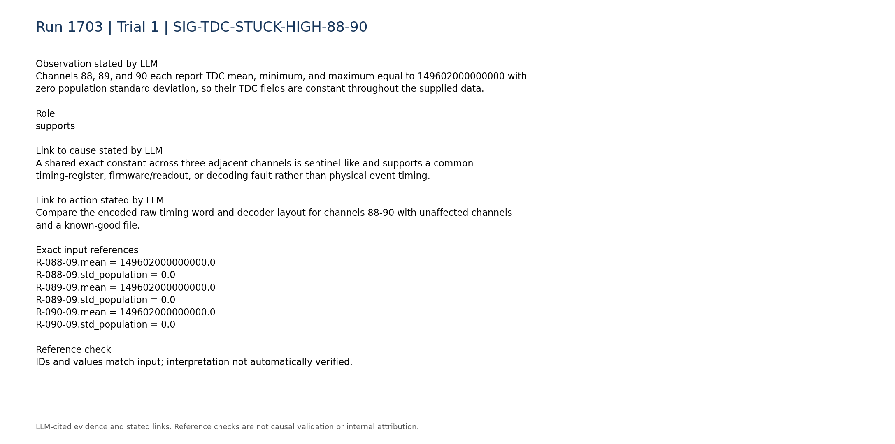

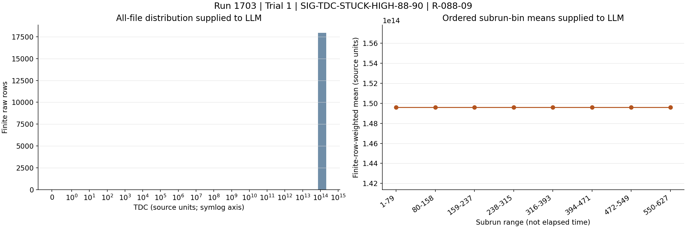


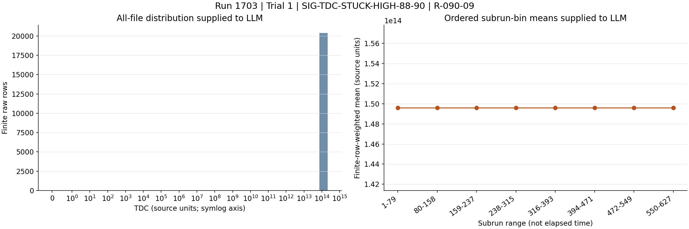

### SIG-TDC-ZERO-91-93

Channels 91, 92, and 93 have TDC equal to zero for every summarized event.

Role: supports

Cause link: The abrupt transition from an identical nonzero constant on channels 88-90 to all-zero TDC on channels 91-93 supports structured timing metadata corruption in a contiguous channel block.

Action link: Inspect channel-to-board mapping and per-channel timing-register enable/configuration for channels 91-93, and verify that the decoder has not shifted or substituted fields.

```text
R-091-09.zero_fraction = 1.0
R-092-09.zero_fraction = 1.0
R-093-09.zero_fraction = 1.0
```

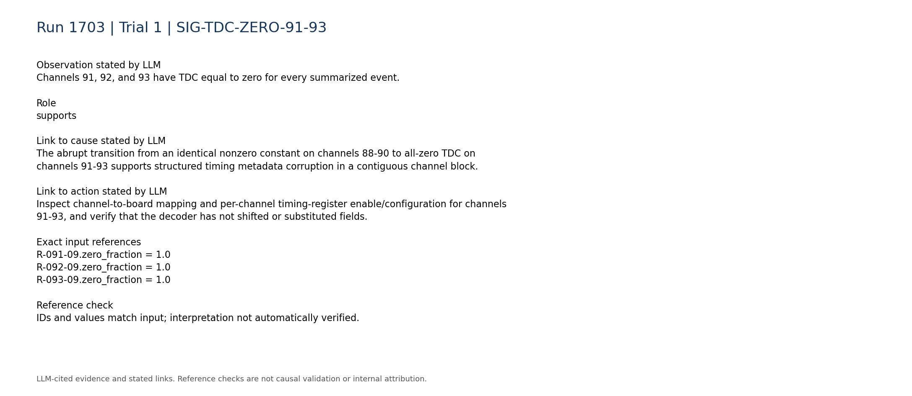

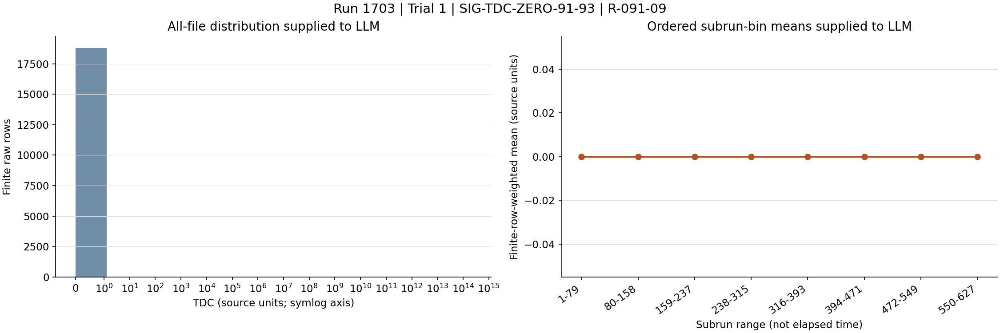


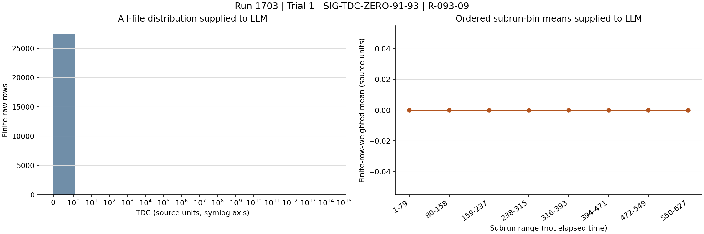

### SIG-ROLLOVER-IMPOSSIBLE

TDCRollovers metadata is also abnormal: channel 88 is fixed at 1103820000000, while channels 89 and 91 contain mostly zero values but maxima of 1.41672e19.

Role: supports

Cause link: Independent corruption in both TDC and rollover fields makes a timing metadata/register or serialization problem more likely than a normal physical timing distribution.

Action link: Validate rollover word width, signedness, byte alignment, and reconstruction logic before applying any hardware correction.

```text
R-088-10.mean = 1103820000000.0
R-088-10.std_population = 0.0
R-089-10.max = 1.41672e+19
R-089-10.zero_fraction = 0.94103
R-091-10.max = 1.41672e+19
R-091-10.zero_fraction = 0.947262
```

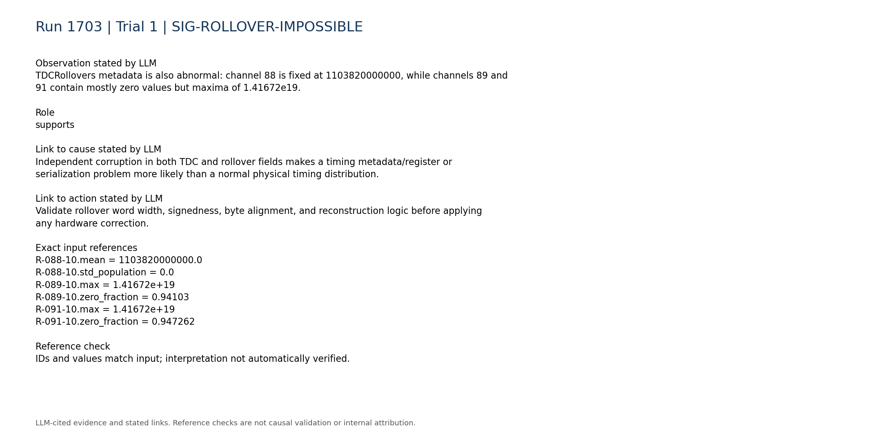

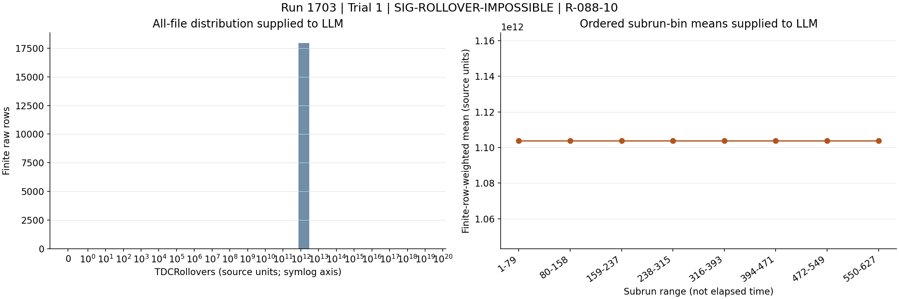

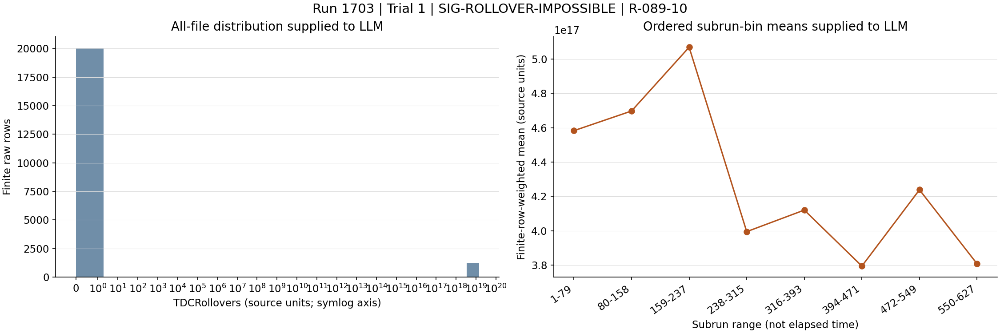

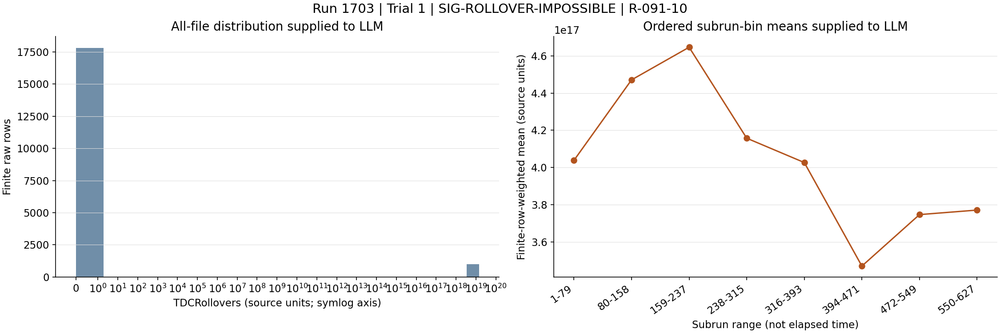

### SIG-TDC-94-95-DIFFERENT-SENTINEL

Channels 94 and 95 have TDC subrun medians fixed at 438087000000, but their pooled maxima reach approximately 2.116e14, extending the structured timing anomaly through channel 95.

Role: supports

Cause link: A second exact sentinel-like level on the final adjacent channels indicates a block-structured representation or readout problem rather than random event outliers.

Action link: Examine whether channels 94-95 use a different timing-word format, firmware lane, or decoder offset within the same hardware block.

```text
R-094-09.subrun_median_quantiles = [438087000000.0,438087000000.0,438087000000.0,438087000000.0,438087000000.0,438087000000.0,438087000000.0]
R-094-09.max = 211600000000000.0
R-095-09.subrun_median_quantiles = [438087000000.0,438087000000.0,438087000000.0,438087000000.0,438087000000.0,438087000000.0,438087000000.0]
R-095-09.max = 211527000000000.0
```

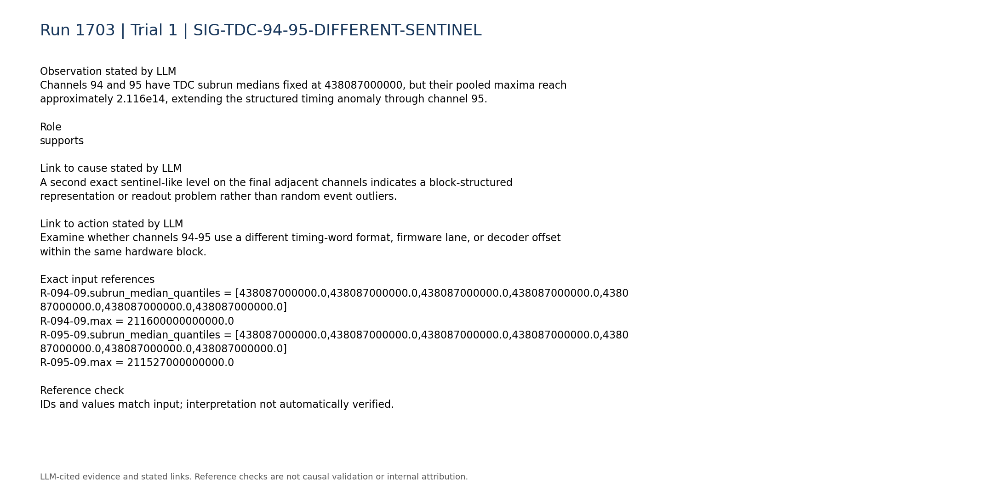

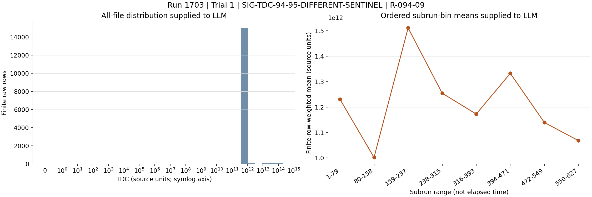

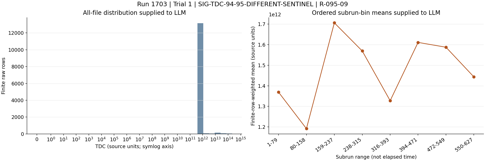

### SIG-PULSE-ACQUISITION-PRESENT

Channels at both ends of the affected timing block, 88 and 95, are present in all 627 subruns with no absent ranges, and their occupancy remains nonzero across all eight time bins.

Role: contradicts

Cause link: Persistent pulse-channel presence contradicts a complete digitizer lockup, dead PMT/HV path, or disconnected acquisition path, although it does not rule out failure limited to timing metadata.

Action link: Avoid discarding pulse data solely because timing fields are corrupt; validate timing and pulse content independently.

```text
P-088.present_subruns = 627
P-088.absent_subrun_ranges = []
P-088.time_bin_occupancy = [0.0324927,0.0334828,0.0332267,0.0335581,0.0324276,0.0323042,0.0334039,0.0324899]
P-095.present_subruns = 627
P-095.absent_subrun_ranges = []
P-095.time_bin_occupancy = [0.0256712,0.0250395,0.0255344,0.0243938,0.0246786,0.0250714,0.0240049,0.0243895]
```

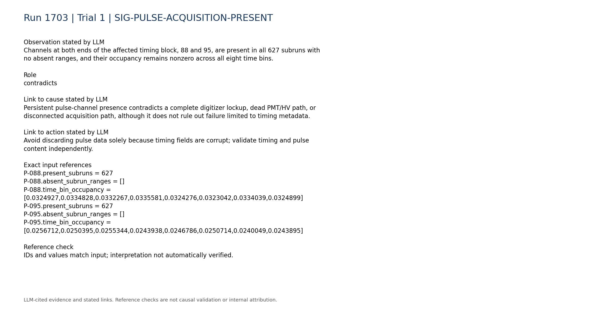

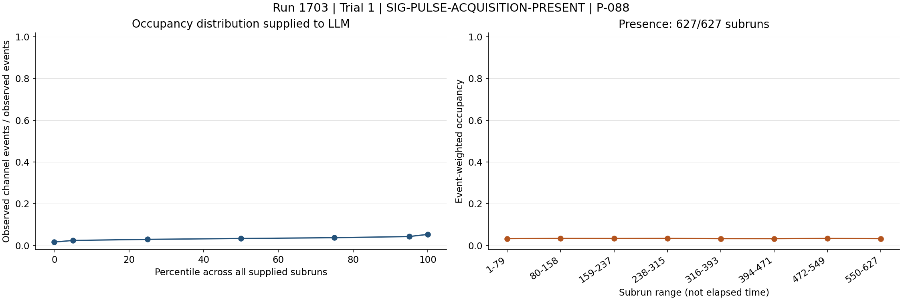

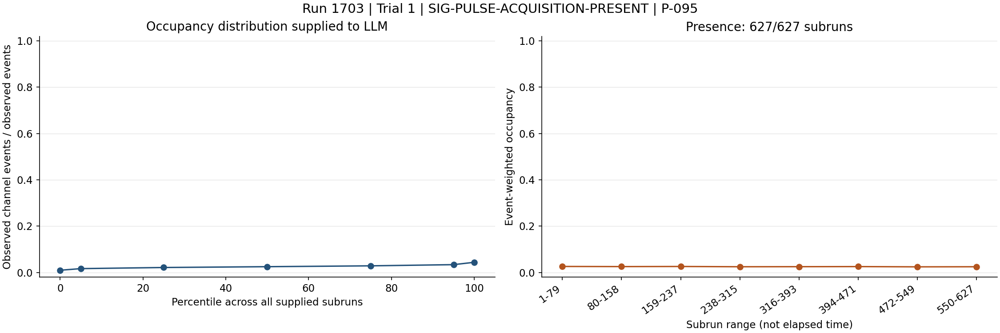

### SIG-TRIGGER-LVDS-NOMINAL

The total trigger rate is summarized as stable/persistent, and LVDS telemetry reports no persistent zero or missing signal pins.

Role: contradicts

Cause link: This argues against the high-rate LVDS-noise, disconnected-LVDS, or system-wide trigger-failure mechanisms in the historical cases; it does not test the digitizer timing registers or decoder.

Action link: Prioritize timing-word, firmware, synchronization, and decoding checks over reseating all LVDS connections unless later board-specific evidence implicates a cable.

```text
C-trigger-001.text = "- Total trigger rate: median 4.799, range 4.415 to 5.369. Temporal behavior: stable/persistent."
C-lvds-003.text = "- Persistent zero signal pins: none."
C-lvds-004.text = "- Persistent missing signal pins: none."
```

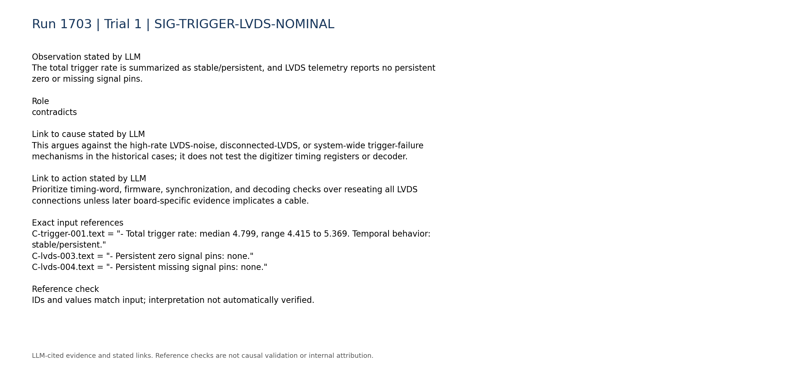

### SIG-BROAD-ANOMALY-LOG-LIMITATION

The frozen anomaly pipeline labels 52957 of 60192 channel-subrun rows anomalous, with 75-93 anomalous channels in each subrun, so its alerts are too broad to uniquely localize the timing fault.

Role: limitation

Cause link: The broad anomaly rate may reflect missing good-reference calibration or many pulse-distribution differences and cannot by itself identify the primary mechanism; the direct TDC signatures are more discriminating.

Action link: Use explicit timing-field validation rather than treating every anomaly-log channel as requiring hardware intervention.

```text
A-ALL.anomalous_rows = 52957
A-ALL.logged_rows = 60192
A-ALL.anomalous_channel_count_by_subrun.0 = 82
A-ALL.anomalous_channel_count_by_subrun.16 = 93
```

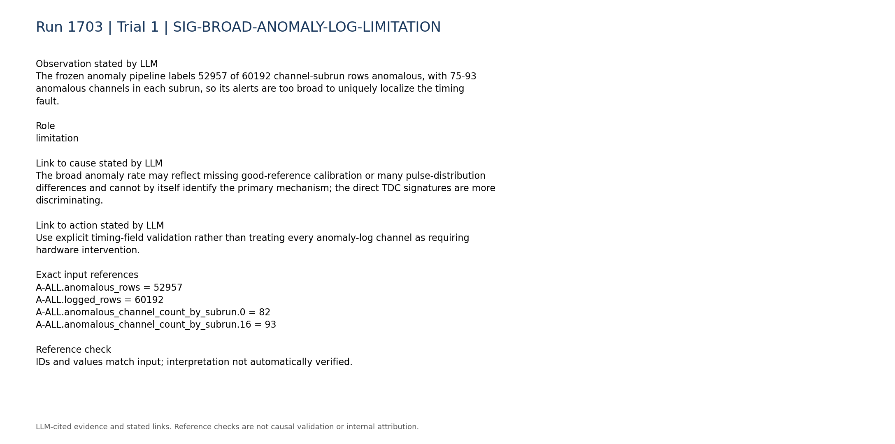

### SIG-MISSING-DISCRIMINATORS

Digitizer-versus-trigger-board rate consistency, within-run configuration changes, board matching, synchronization, queue occupancy, and DAQ-state telemetry are unavailable.

Role: limitation

Cause link: These missing diagnostics prevent distinguishing hardware timing-register failure, firmware/configuration mismatch, synchronization loss, and offline decoding error.

Action link: Collect these discriminating telemetry sources in a controlled run before selecting restart, firmware, cabling, or parser remediation.

```text
C-trigger-007.text = "- Digitizer-vs-trigger-board rate consistency: unavailable; no compact processed digitizer-rate telemetry was used."
C-daq_config-007.text = "- Within-run configuration changes: unavailable; only the static per-run configuration snapshot is parsed."
C-daq_config-008.text = "- Board matching, synchronization, queue occupancy, and DAQ-state telemetry: unavailable."
```

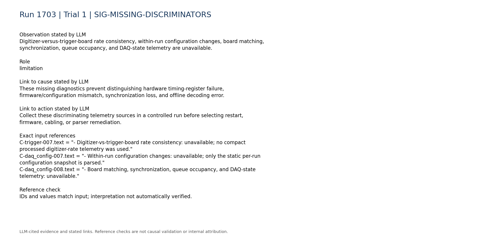

## Missing information

- Digitizer/board mapping for channels 88-95 and confirmation that they share one timing/readout module
- Firmware versions, build/recompile history, and timing-register configuration for the affected hardware
- Original raw timing words or an independent decoder to test field alignment, units, signedness, and rollover reconstruction
- Known-good raw reference from the same detector configuration
- Board-matching efficiency, synchronization/clock-lock status, queue occupancy, and DAQ-state logs
- Digitizer-side per-board rates for comparison with the stable trigger-board rates
- Whether a controlled digitizer reinitialization changes the TDC/TDCRollovers constants
