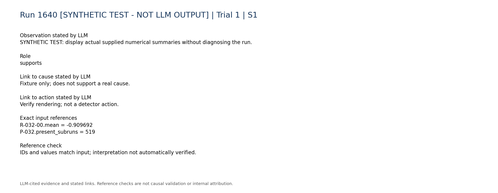
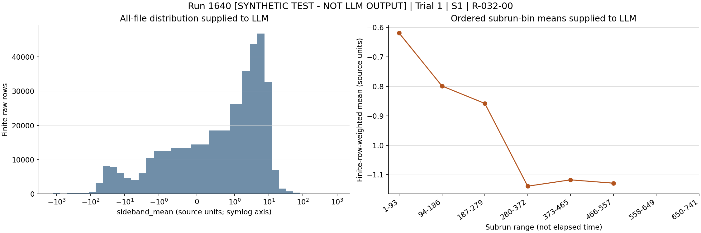
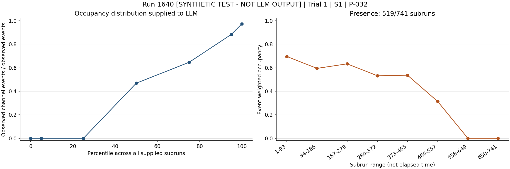

# Run 1640 [SYNTHETIC TEST - NOT LLM OUTPUT] | Trial 1

## Diagnosis

Category: SYNTHETIC PIPELINE TEST - NOT LLM OUTPUT

Cause: No real diagnostic inference; only renderer QA.

Action: No real action recommended

Confidence: 0.0

Synthetic fixture for offline rendering.

## LLM-cited signatures

LLM-cited evidence and stated links. Reference checks are not causal validation or internal attribution.

### S1

SYNTHETIC TEST: display actual supplied numerical summaries without diagnosing the run.

Role: supports

Cause link: Fixture only; does not support a real cause.

Action link: Verify rendering; not a detector action.

```text
R-032-00.mean = -0.909692
P-032.present_subruns = 519
```







## Missing information

