# Run 1620 | Trial 1

## Diagnosis

Category: digitizer_timing_data_corruption

Cause: The observed symptom is a persistent, channel-block-localized corruption of TDC and TDCRollovers values on digitizer channels 88-95. The inferred mechanism is invalid timing-word generation or interpretation—such as a digitizer timing-register/firmware state fault, synchronization fault, or decoder/schema error. The supplied evidence cannot distinguish among those mechanisms, so the underlying hardware/software cause is unknown. No exact resolved historical match was supplied.

Action: Preserve the affected files and inspect raw timing words and event headers for channels 88-95, comparing them with adjacent channel 87 and the documented data schema. Verify channel-to-board grouping, TDC/rollover field offsets, integer widths, signedness, endianness, firmware version, timing-register configuration, clock synchronization, board matching, and any configuration change near run start. If direct readout shows the same invalid values, conditionally reinitialize the affected digitizer/timing logic or reload validated firmware/configuration and confirm recovery in a short test run. If raw words are valid but processed values are not, correct the decoder/schema and reprocess. Do not treat this as an LVDS-pin fault or remap mask indices to same-numbered digitizer channels without validating the supplied physical-pin mapping.

Confidence: 0.91

OBSERVED: channels 88-90 contain invariant TDC values around 1.49602e14 with nonzero or enormous rollover values; channels 91-93 have TDC fixed at zero while rollover values are enormous; channels 94-95 have TDC distributions dominated by 4.38087e11 and enormous rollovers. Adjacent channel 87 instead has a varying TDC distribution and zero rollovers. All channels remain present across all 259 raw-covered subruns, while trigger and LVDS summaries are broadly stable. INFERRED: this sharply localized boundary and mutually invalid timing fields identify corruption in the timing-data path rather than loss of PMT pulses, a broken PMT base, or a global trigger-rate fault. UNKNOWN: raw timing words, board assignment, firmware/register state, synchronization and board-matching telemetry are unavailable, preventing attribution to hardware, firmware, DAQ synchronization, or offline decoding.

## LLM-cited signatures

LLM-cited evidence and stated links. Reference checks are not causal validation or internal attribution.

### SIG-TIMING-88-90

Channels 88-90 have TDC fixed at exactly 149602000000000 for every summarized event; channel 88 also has a fixed nonzero TDCRollovers value, while channels 89-90 have enormous rollover values.

Role: supports

Cause link: Invariant TDC values combined with impossible-scale rollover values support malformed timing words or timing-field decoding rather than physical event-time variation.

Action link: Check raw words, field offsets, data types, firmware and timing registers for these channels before altering detector connections.

```text
R-088-09.mean = 149602000000000.0
R-088-09.std_population = 0.0
R-088-10.mean = 1103820000000.0
R-089-09.mean = 149602000000000.0
R-089-10.mean = 8.5305e+18
R-090-09.mean = 149602000000000.0
R-090-10.mean = 7.85133e+18
```

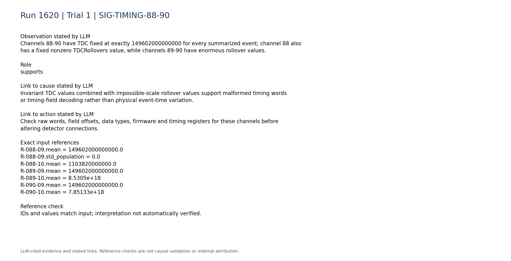


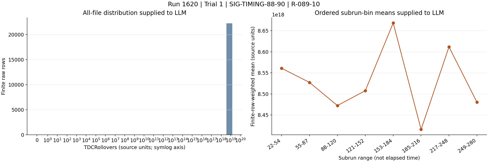

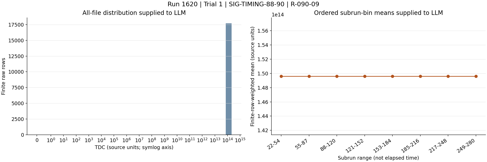

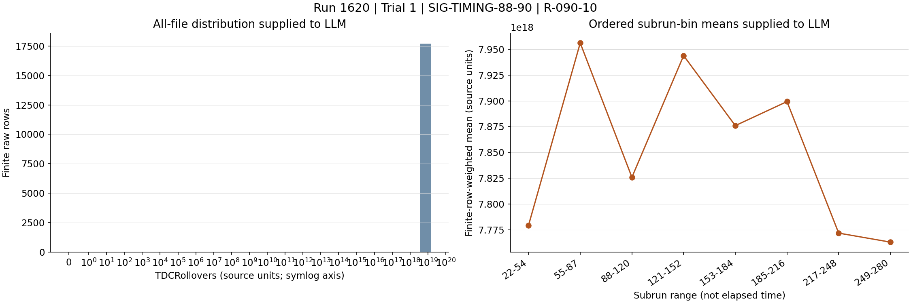

### SIG-TIMING-91-93

Channels 91-93 have TDC equal to zero for all summarized events while TDCRollovers remains extremely large.

Role: supports

Cause link: A zero TDC paired with huge rollovers across three contiguous channels is internally inconsistent with normal counter behavior and extends the corrupted block through channel 93.

Action link: Inspect whether TDC and rollover words are shifted, swapped, truncated, or read with the wrong width/signedness.

```text
R-091-09.mean = 0.0
R-091-10.mean = 8.81182e+18
R-092-09.mean = 0.0
R-092-10.mean = 9.35354e+18
R-093-09.mean = 0.0
R-093-10.mean = 8.8588e+18
```

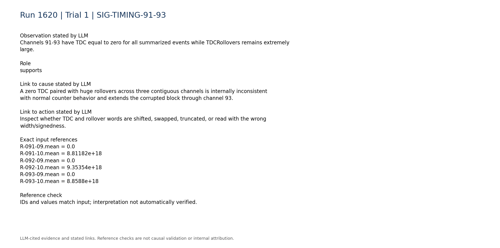

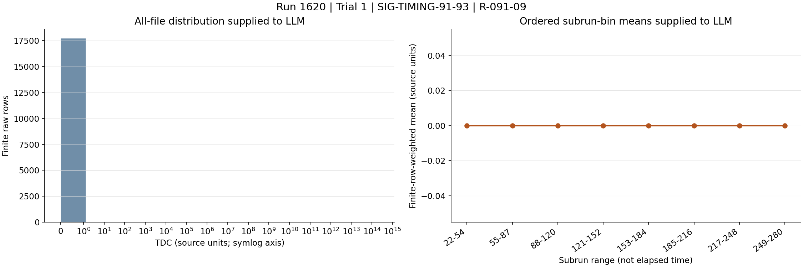

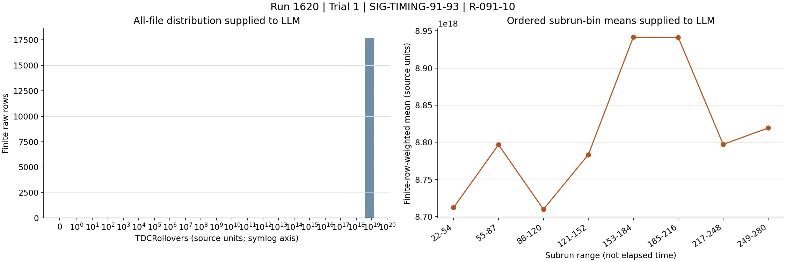

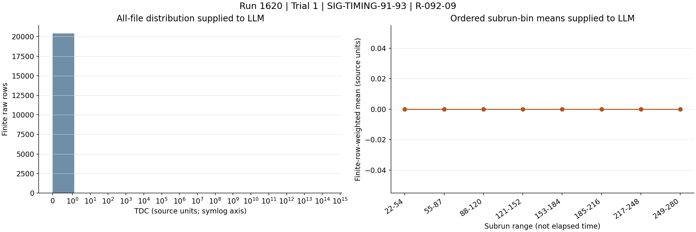

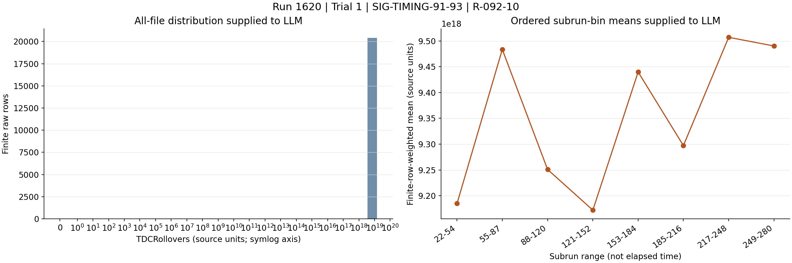

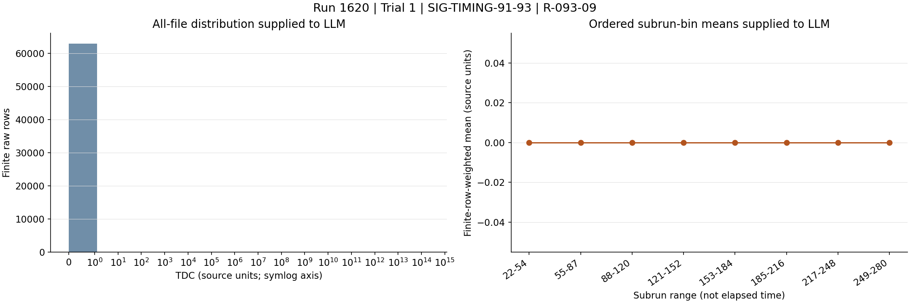

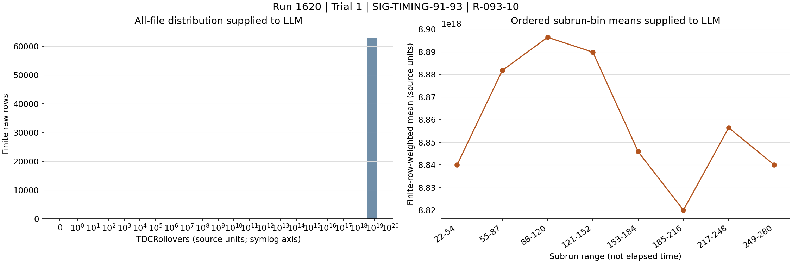

### SIG-TIMING-94-95

For channels 94-95, every subrun-median TDC quantile is 438087000000, although pooled extrema include large outliers; both channels also have enormous rollover values.

Role: supports

Cause link: The shared persistent TDC plateau and huge rollover values show that the timing corruption continues through channels 94-95, with a different malformed representation than channels 88-93.

Action link: Compare board/channel metadata and raw word layouts at the channel 93/94 boundary to identify a register, lane, or decoder-mode transition.

```text
R-094-09.subrun_median_quantiles = [438087000000.0,438087000000.0,438087000000.0,438087000000.0,438087000000.0,438087000000.0,438087000000.0]
R-094-10.mean = 8.52821e+18
R-095-09.subrun_median_quantiles = [438087000000.0,438087000000.0,438087000000.0,438087000000.0,438087000000.0,438087000000.0,438087000000.0]
R-095-10.mean = 8.59807e+18
```

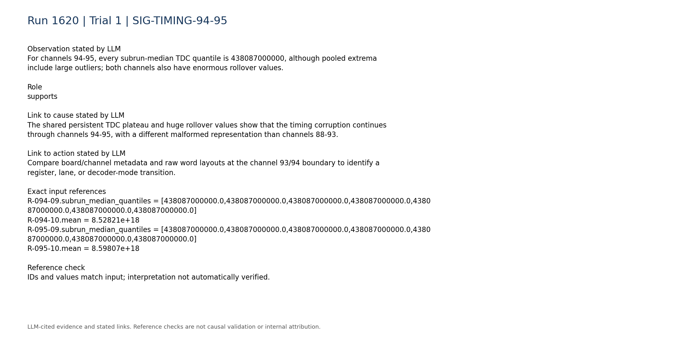

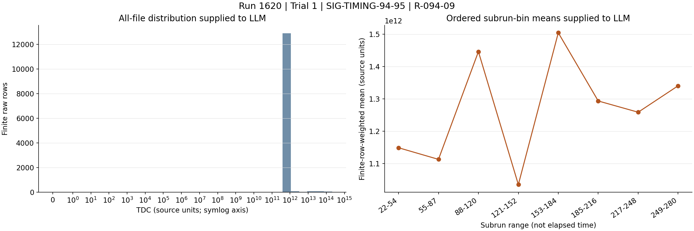

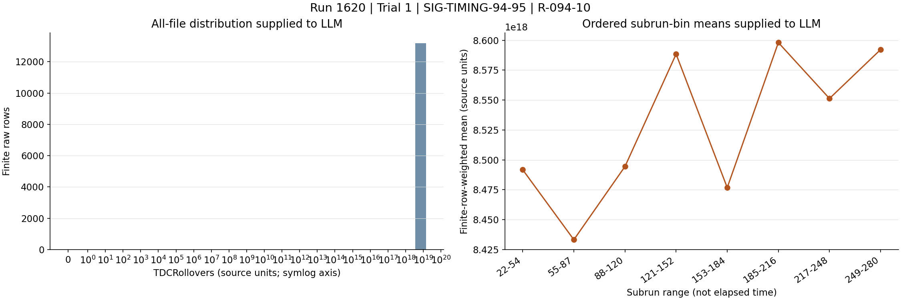

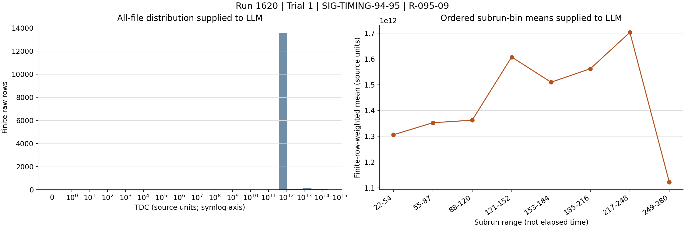

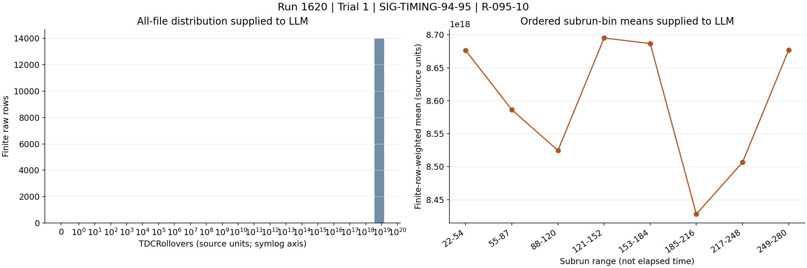

### SIG-BOUNDARY-87-88

Adjacent channel 87 has a varying TDC distribution and zero TDCRollovers, in sharp contrast to channel 88's invariant TDC and nonzero fixed rollovers.

Role: supports

Cause link: The abrupt boundary between channels 87 and 88 localizes the failure to a channel group, board region, or decoding branch rather than a run-wide clock phenomenon.

Action link: Use channel 87 as a local reference and verify the hardware-board and decoder grouping that begins at channel 88.

```text
R-087-09.std_population = 321719000000.0
R-087-10.mean = 0.0
R-088-09.std_population = 0.0
R-088-10.mean = 1103820000000.0
```

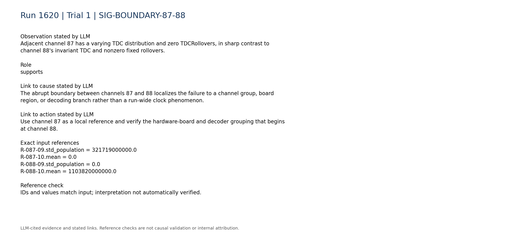

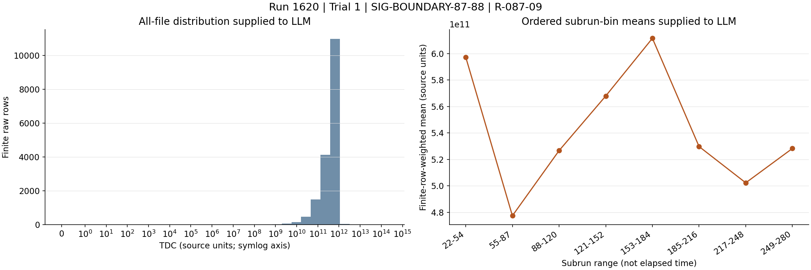

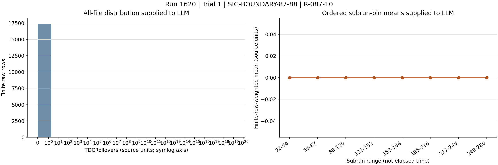

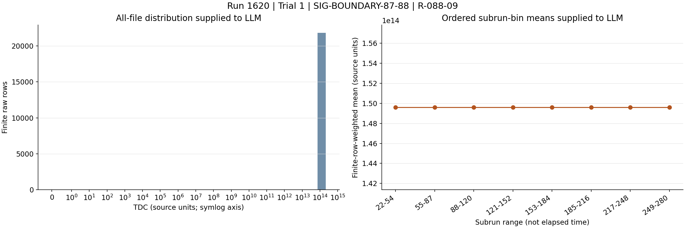

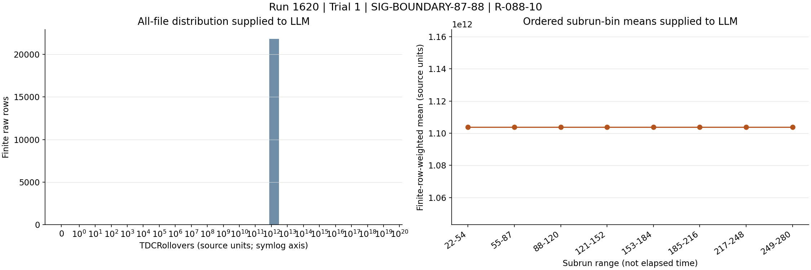

### SIG-PULSE-PRESENCE

Affected channels remain represented throughout the raw-covered run; for example, channels 88 and 95 are present in all 259 subruns with no absent range.

Role: contradicts

Cause link: Continued channel presence contradicts complete PMT, HV, or readout-channel loss; it does not exclude corruption limited to timing metadata.

Action link: Prioritize timing-word and digitizer-state checks over replacing PMT bases or disabling HV.

```text
P-088.present_subruns = 259
P-088.absent_subrun_ranges = []
P-095.present_subruns = 259
P-095.absent_subrun_ranges = []
```

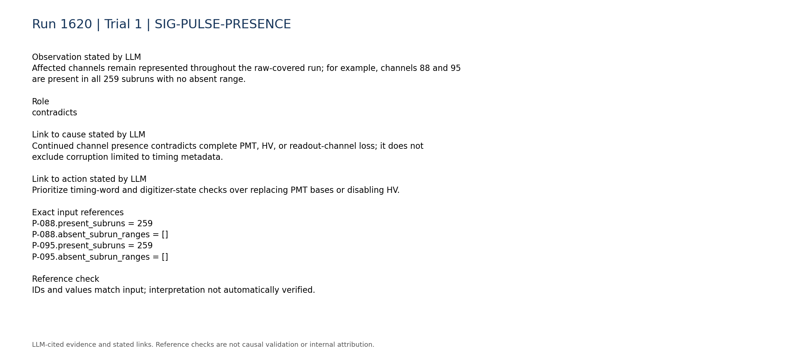

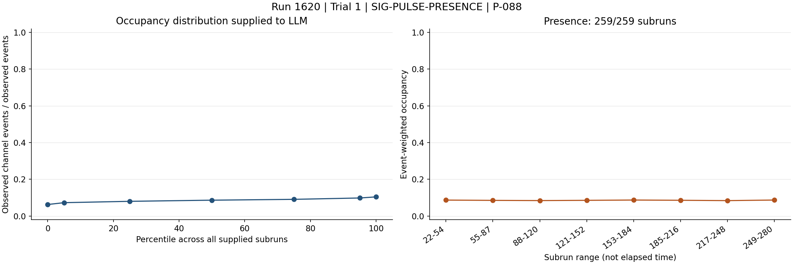

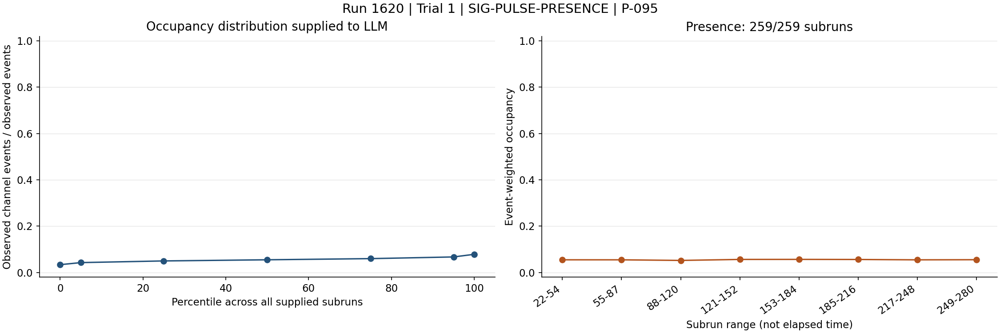

### SIG-GLOBAL-SYSTEM-NORMAL

The compact trigger summary describes a stable total trigger rate, and the LVDS summary reports no persistent zero signal pins.

Role: contradicts

Cause link: These observations contradict the high-rate or dead-pin signatures of supplied LVDS-noise and broken-base analogies, though compact telemetry cannot exclude a timing-only board fault.

Action link: Do not reseat or mask LVDS connections solely from this evidence; first confirm a connection-related timing fault with direct board diagnostics.

```text
C-trigger-001.text = "- Total trigger rate: median 4.88, range 4.485 to 5.342. Temporal behavior: stable/persistent."
C-lvds-003.text = "- Persistent zero signal pins: none."
C-lvds-005.text = "- Persistently abnormally low signal pins: none."
C-lvds-006.text = "- Persistently abnormally high signal pins: none."
```

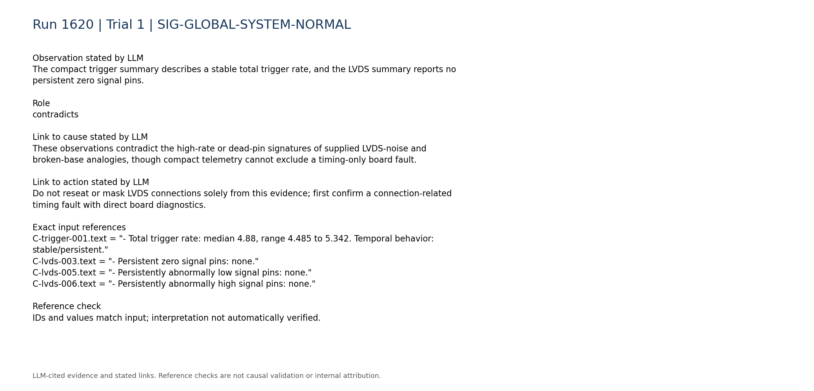

### SIG-DISCRIMINATION-LIMIT

Digitizer-versus-trigger-board rate consistency, board matching, synchronization, queue occupancy, DAQ-state telemetry, and within-run configuration changes are unavailable.

Role: limitation

Cause link: Without these diagnostics, the evidence cannot distinguish a digitizer hardware/register fault from firmware, synchronization, or offline decoder corruption.

Action link: Retrieve these telemetry sources and compare them with raw timing words before selecting a corrective intervention.

```text
C-trigger-007.text = "- Digitizer-vs-trigger-board rate consistency: unavailable; no compact processed digitizer-rate telemetry was used."
C-daq_config-007.text = "- Within-run configuration changes: unavailable; only the static per-run configuration snapshot is parsed."
C-daq_config-008.text = "- Board matching, synchronization, queue occupancy, and DAQ-state telemetry: unavailable."
```

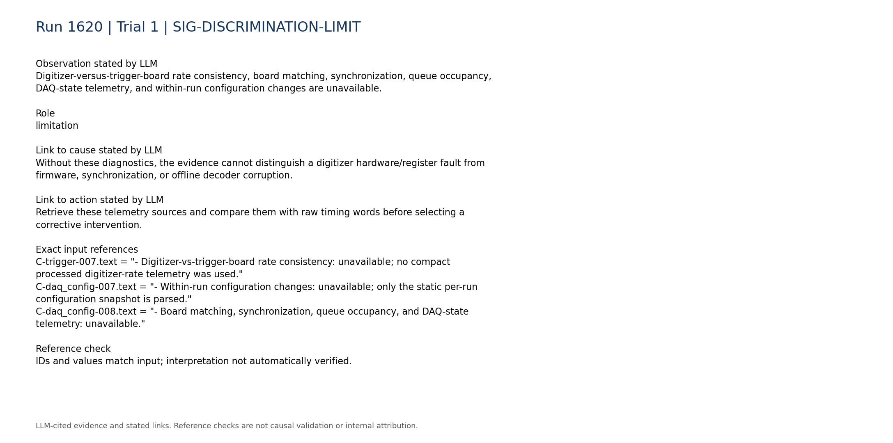

### SIG-LOSSY-RAW-LIMIT

The supplied raw-derived products are explicitly lossy summaries rather than original event rows.

Role: limitation

Cause link: The aggregate proves persistence of the channel-88 constant but cannot reveal timing-word layout, event-level correlations, or the first malformed event.

Action link: Inspect original event records or a byte-level dump to discriminate generation from parsing errors.

```text
R-088-09.histogram_counts = [0,0,0,0,0,0,0,0,0,0,0,0,0,0,0,0,0,0,0,0,0,0,0,0,0,0,0,0,0,0,0,21843]
```

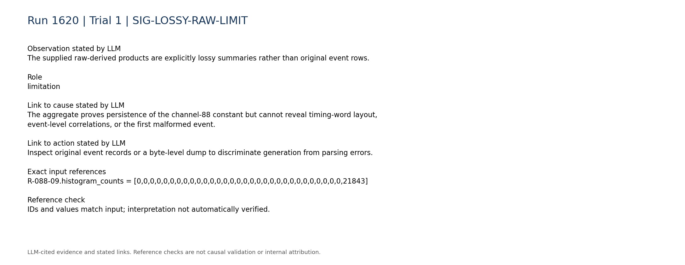

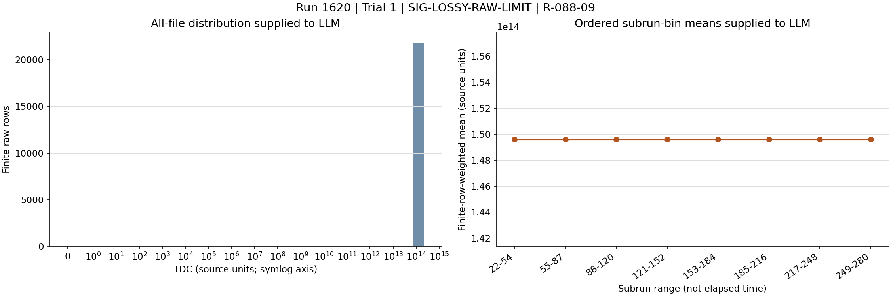

## Missing information

- Original event-level TDC and TDCRollovers words for channels 87-95, including byte layout and headers
- Digitizer board/crate/lane assignment for channels 88-95
- Firmware versions, register dumps, clock-lock status, and timing initialization history
- Board-matching efficiency, synchronization status, queue occupancy, and DAQ-state telemetry
- Decoder schema, integer widths, signedness, endianness, and field-offset validation
- A known-good raw reference acquired with the same firmware and configuration
- Within-run configuration or restart history
