# Run 1620 | Trial 2

## Diagnosis

Category: digitizer_timing_metadata_corruption

Cause: The observable symptom is invalid TDC/TDCRollovers metadata confined to digitizer channels 88-95. The inferred mechanism is board- or readout-group-specific corruption, misdecoding, or misconfiguration of timing-counter fields: channels 88-90 report an identical constant TDC of 149602000000000 while their rollover fields are nonzero and implausibly large; channels 91-93 report zero TDC with very large rollover values; and channels 94-95 have nearly constant TDC medians around 438087000000 with large rollover values and occasional extreme TDC values. Channels through 87 instead have ordinary varying TDC values and zero rollovers. The exact root cause—firmware/register state, counter-width or data-type decoding, serialization, or hardware timing logic—is unknown from the supplied summaries.

Action: First preserve and inspect representative original event records from channels 87-95, then verify the channel-to-digitizer-board grouping and decode the TDC/TDCRollovers words directly against the firmware data format, expected counter widths, signedness, byte order, and rollover semantics. Compare firmware, register, clock/synchronization, and readout configuration for the board serving channels 88-95 with a healthy board, and check board matching and DAQ-state logs. Do not use trigger-mask pin numbers as digitizer channel numbers. If direct raw-word inspection confirms a bad board state, conditionally restart or reset that digitizer and reapply validated timing registers; reflash/recompile only if a firmware/software-format mismatch is demonstrated. Start a short validation run and require TDC variation and rollover behavior consistent with healthy channels before accepting data.

Confidence: 0.97

OBSERVED: A sharp channel boundary separates healthy-looking timing summaries on channel 87 from incompatible TDC/rollover encodings on channels 88-95, while all affected channels remain present in every supplied subrun. Trigger-rate and LVDS summaries are stable and show no persistently missing or abnormal signal pin. INFERRED: This is primarily corruption or misinterpretation of digitizer timing metadata, not PMT loss, an LVDS disconnection, or a detector-wide trigger-rate failure. No supplied historical case is an exact match; firmware/readout problems in the historical set are only broad analogies and have different rate symptoms. UNKNOWN: The responsible board boundary, raw timing words, firmware/register history, board synchronization, matching efficiency, and queue state are unavailable, so the exact hardware-versus-software root cause cannot be selected.

## LLM-cited signatures

LLM-cited evidence and stated links. Reference checks are not causal validation or internal attribution.

### SIG-TIMING-BOUNDARY-87-88

Channel 87 has a varying TDC distribution with mean 542646000000 and zero TDCRollovers, whereas channel 88 has a constant TDC mean of 149602000000000 and a constant nonzero rollover mean of 1103820000000. This abrupt adjacent-channel boundary supports localization to a digitizer/readout group rather than a run-wide clock effect.

Role: supports

Cause link: The exact boundary at channel 88 is characteristic of a channel-group readout/decode problem; it is not explained by normal event timing variation.

Action link: Confirm whether channels 88-95 share a digitizer or data block, and compare that block's raw words and registers with the block containing channel 87.

```text
R-087-09.mean = 542646000000.0
R-087-10.mean = 0.0
R-088-09.mean = 149602000000000.0
R-088-09.std_population = 0.0
R-088-10.mean = 1103820000000.0
R-088-10.std_population = 0.0
```

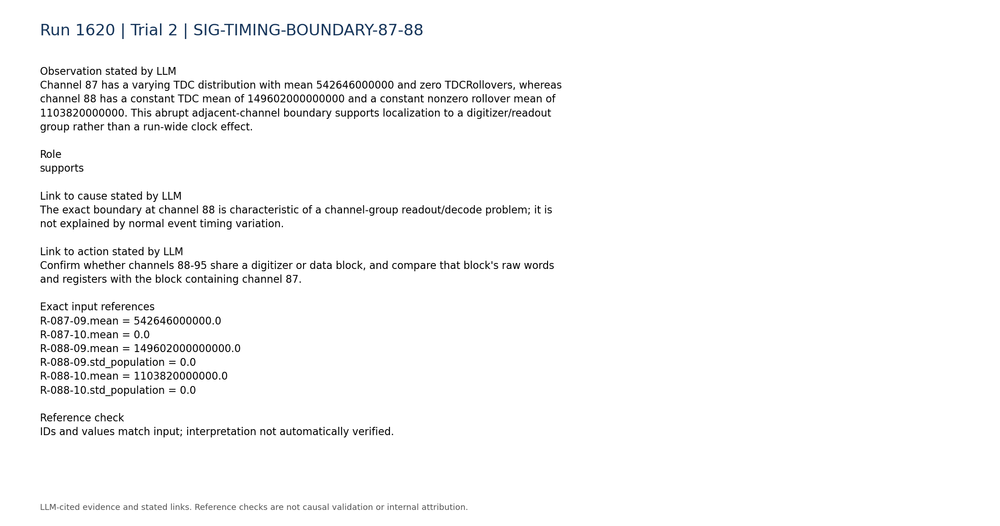

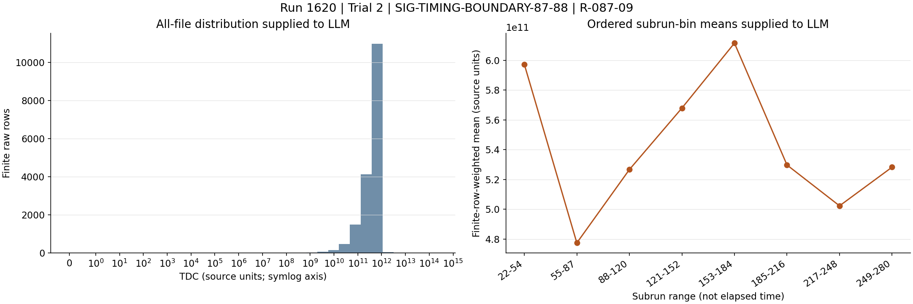

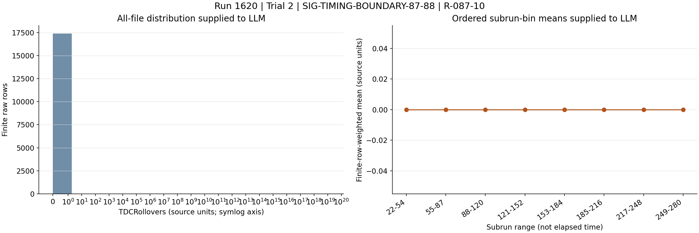

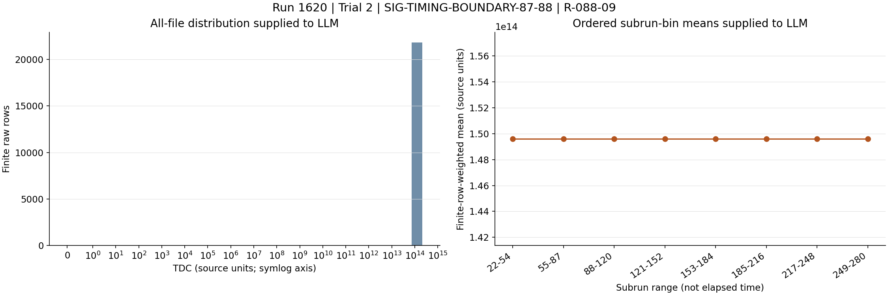

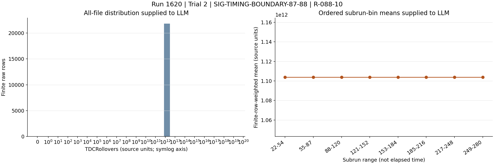

### SIG-CONSTANT-TDC-88-90

Channels 88, 89, and 90 each report exactly the same constant TDC value, 149602000000000, for every summarized event. Their rollover fields are nonzero, with channel 88 also constant and channels 89-90 spanning extremely large values. Identical stuck TDC values across three channels strongly support malformed or misdecoded metadata.

Role: supports

Cause link: A shared exact constant is more consistent with a sentinel, wrong field offset, stale register value, or data-type/format error than with physical detector timing.

Action link: Decode the corresponding raw words using the documented firmware layout and test field offsets, widths, endianness, and rollover interpretation.

```text
R-088-09.subrun_median_quantiles = [149602000000000.0,149602000000000.0,149602000000000.0,149602000000000.0,149602000000000.0,149602000000000.0,149602000000000.0]
R-089-09.mean = 149602000000000.0
R-089-09.std_population = 0.0
R-090-09.mean = 149602000000000.0
R-090-09.std_population = 0.0
R-089-10.max = 1.41673e+19
R-090-10.max = 1.41673e+19
```

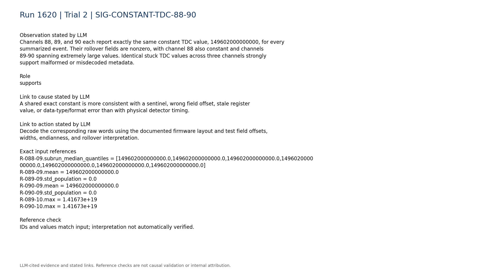

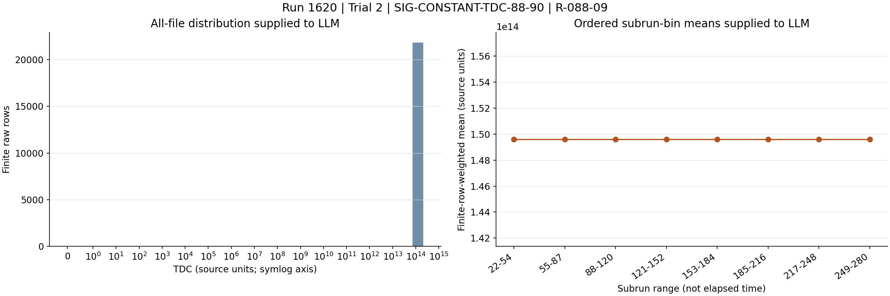


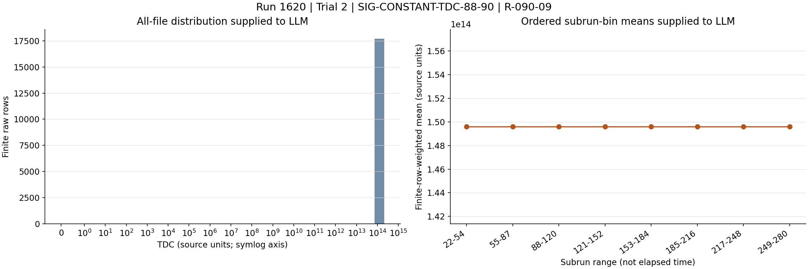

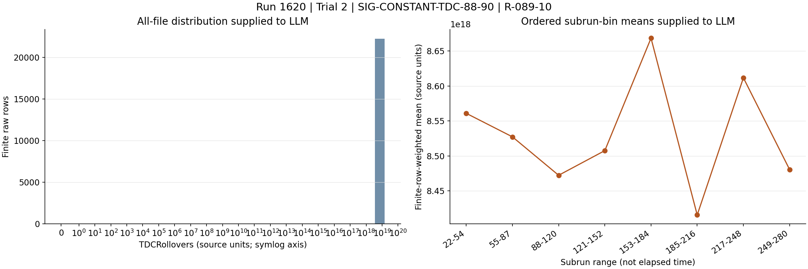

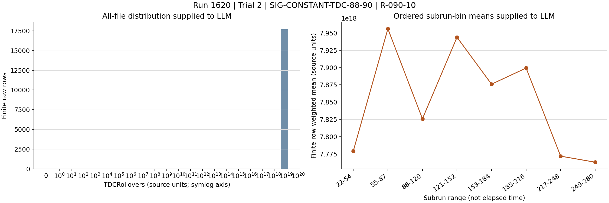

### SIG-ZERO-TDC-HUGE-ROLLOVER-91-93

Channels 91-93 have TDC equal to zero for all summarized rows, while their TDCRollovers means are approximately 8.81e18, 9.35e18, and 8.86e18. The mutually incompatible zero-TDC/huge-rollover combination supports corruption or field misassignment.

Role: supports

Cause link: The coordinated inversion from stuck-high TDC to all-zero TDC within the same contiguous region suggests different malformed fields or sub-block offsets, not a physical timing distribution.

Action link: Inspect channel-specific word alignment and structure packing for channels 91-93 and verify that TDC and rollover columns are sourced from the intended fields.

```text
R-091-09.mean = 0.0
R-091-09.zero_fraction = 1.0
R-091-10.mean = 8.81182e+18
R-092-09.mean = 0.0
R-092-10.mean = 9.35354e+18
R-093-09.mean = 0.0
R-093-10.mean = 8.8588e+18
```

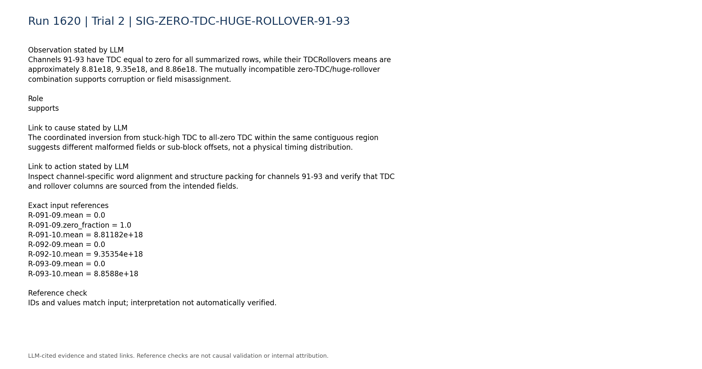

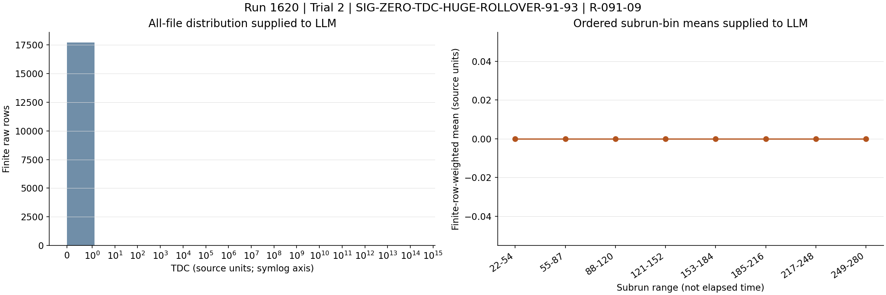

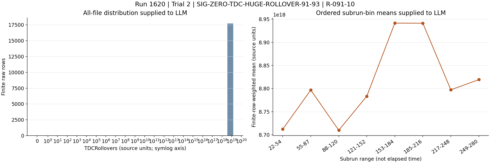


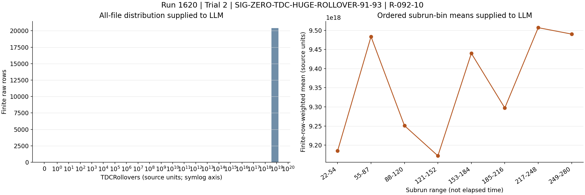

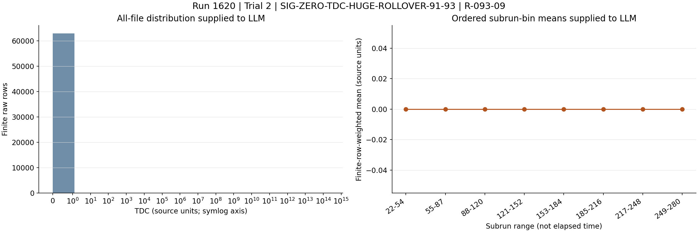

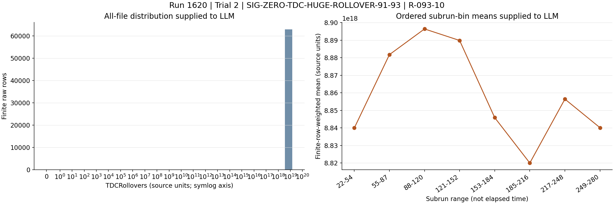

### SIG-MALFORMED-TIMING-94-95

Channels 94 and 95 have TDC subrun medians fixed at 438087000000 despite event-level maxima of 211527000000000, and both have very large nonzero rollover distributions. This extends the malformed timing region through channel 95 while showing a third abnormal encoding pattern.

Role: supports

Cause link: Fixed medians plus rare much larger values are compatible with a default/stale field interspersed with misparsed words, further favoring a readout or decoding mechanism.

Action link: Retain raw examples at both the fixed value and the extrema and compare their packet structure before changing hardware.

```text
R-094-09.subrun_median_quantiles = [438087000000.0,438087000000.0,438087000000.0,438087000000.0,438087000000.0,438087000000.0,438087000000.0]
R-094-09.max = 211527000000000.0
R-094-10.mean = 8.52821e+18
R-095-09.subrun_median_quantiles = [438087000000.0,438087000000.0,438087000000.0,438087000000.0,438087000000.0,438087000000.0,438087000000.0]
R-095-09.max = 211527000000000.0
R-095-10.mean = 8.59807e+18
```

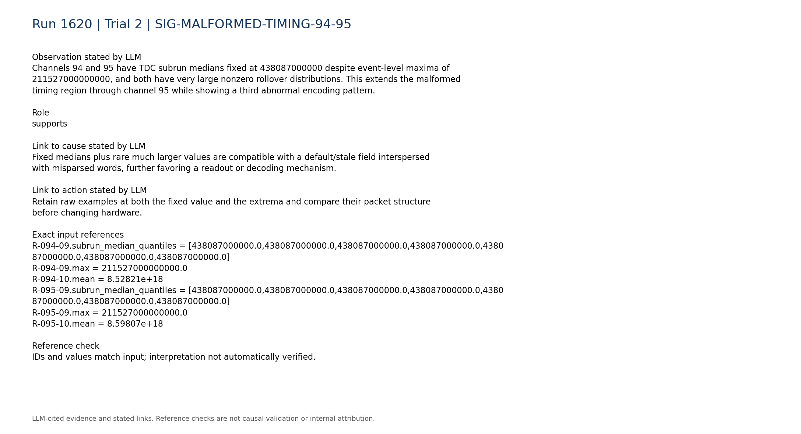

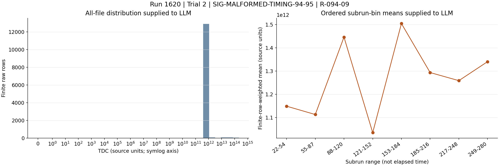

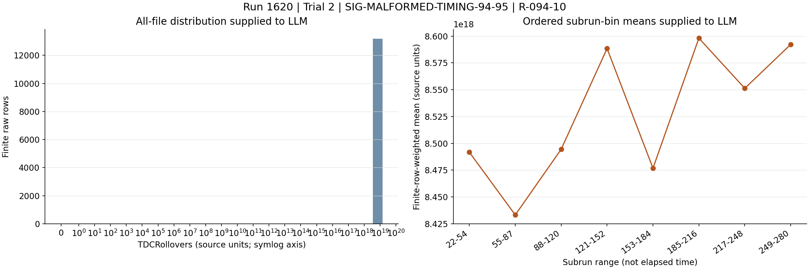

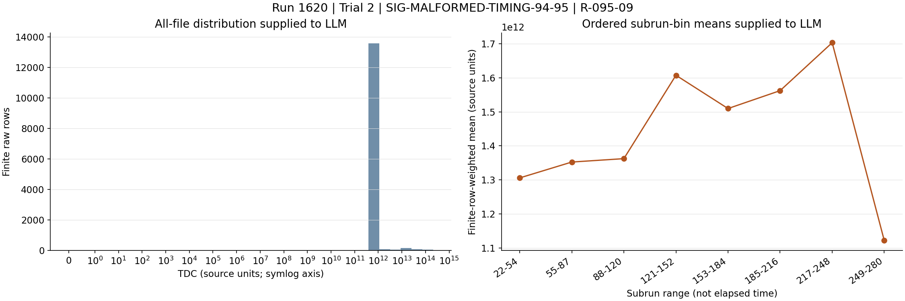

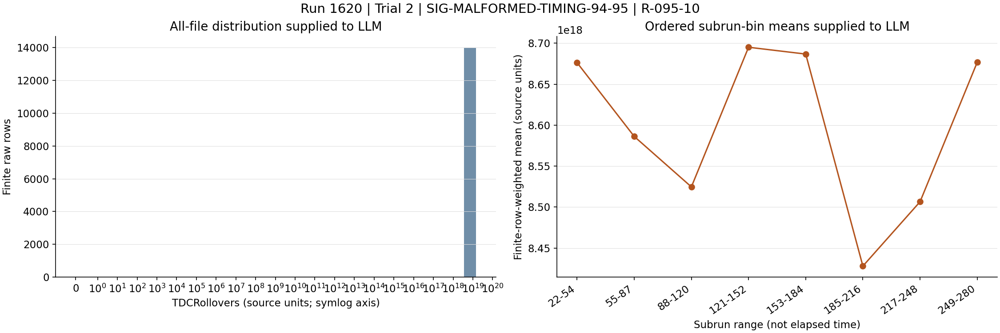

### SIG-AFFECTED-CHANNELS-STILL-PRESENT

Affected channels 88 and 95 are present in all 259 supplied subruns, with no absent ranges and broadly stable occupancy across the eight time bins. This contradicts a dead PMT, tripped HV channel, or disconnected signal path as the primary explanation for the timing fields.

Role: contradicts

Cause link: Continued pulse-bearing event presence argues against the broken-base historical mechanism, whose defining symptom included loss of channel contributions.

Action link: Prioritize timing-word and digitizer diagnostics; inspect HV only if independent current or pulse-amplitude evidence later indicates a separate detector fault.

```text
P-088.present_subruns = 259
P-088.absent_subrun_ranges = []
P-088.time_bin_occupancy = [0.0865011,0.0848776,0.0838259,0.0851252,0.0867711,0.0854113,0.0835859,0.0867342]
P-095.present_subruns = 259
P-095.absent_subrun_ranges = []
P-095.time_bin_occupancy = [0.0544001,0.0543388,0.0517289,0.0560134,0.0561943,0.055773,0.0542929,0.0548081]
```

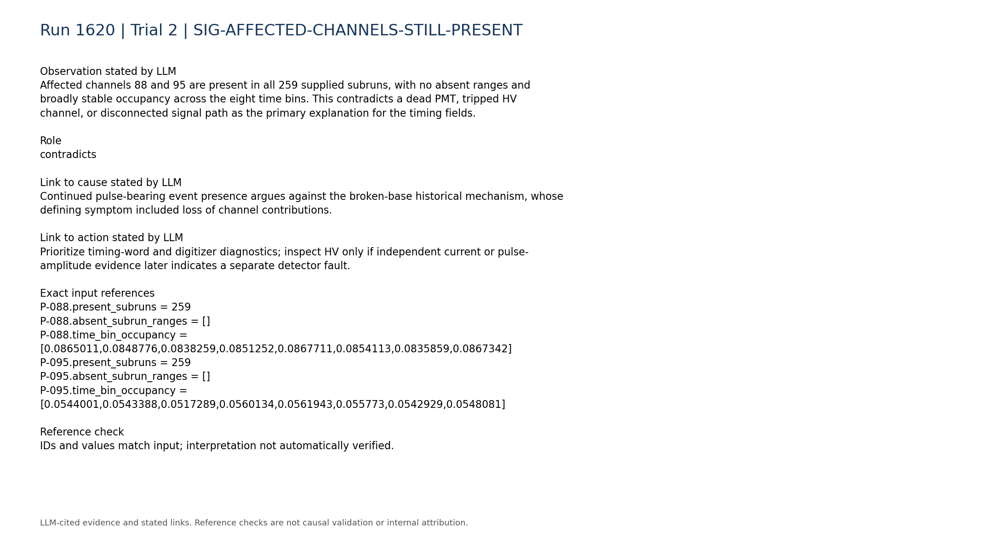

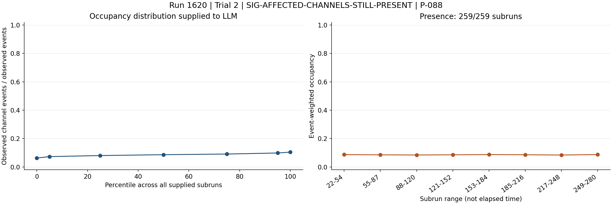

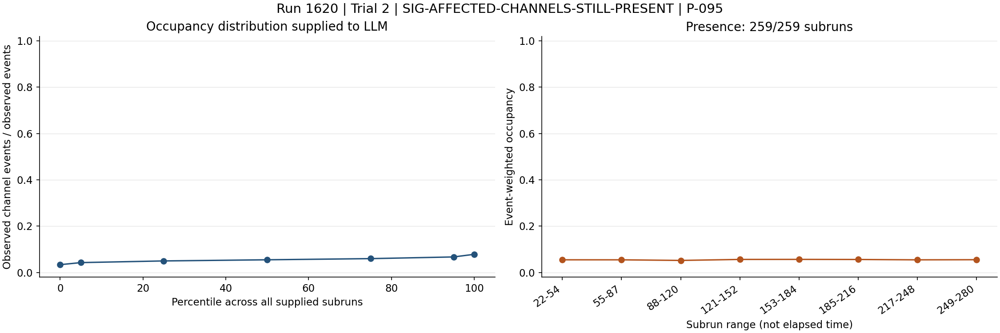

### SIG-TRIGGER-LVDS-NOMINAL

The compact telemetry describes the total trigger rate as stable, reports no intermittent trigger bits, and finds no persistent zero, missing, abnormally low, or abnormally high LVDS signal pins. This contradicts high-trigger-rate LVDS noise as the primary mechanism.

Role: contradicts

Cause link: Known LVDS-noise analogies involved abnormal rates or missing/misbehaving connections; those signatures are not observed here.

Action link: Do not mask or reseat LVDS solely from these timing summaries; first verify the digitizer timing data path.

```text
C-trigger-001.text = "- Total trigger rate: median 4.88, range 4.485 to 5.342. Temporal behavior: stable/persistent."
C-trigger-005.text = "- Variable/intermittent trigger bits: none detected by compact summary."
C-lvds-003.text = "- Persistent zero signal pins: none."
C-lvds-004.text = "- Persistent missing signal pins: none."
C-lvds-005.text = "- Persistently abnormally low signal pins: none."
C-lvds-006.text = "- Persistently abnormally high signal pins: none."
```

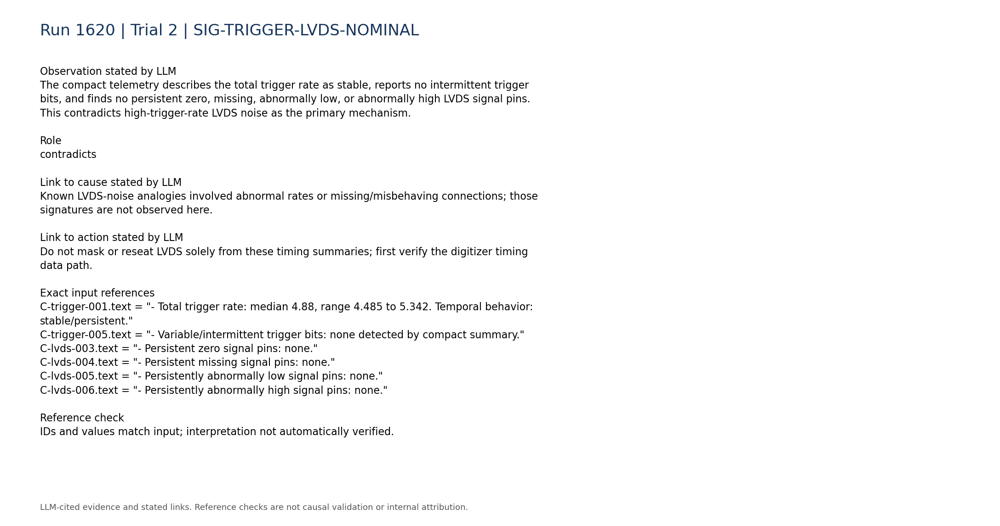

### SIG-ANOMALY-PIPELINE-LIMITATION

The frozen anomaly log reports no anomalous subruns for channels 88 and 89 and only an nPulses anomaly for channel 90, despite the raw-derived timing contradictions. Therefore the anomaly log does not validate the timing fields and was likely insensitive to this failure mode.

Role: limitation

Cause link: Absence from the anomaly log cannot contradict the diagnosis because the raw summaries expose a coherent failure outside the logged feature signature.

Action link: Add explicit absolute and cross-channel sanity checks for TDC/rollover ranges, constants, and board-boundary discontinuities.

```text
A-088.anomalous_subruns = 0
A-089.anomalous_subruns = 0
A-090.triggered_feature_counts = {"nPulses_median":1}
```

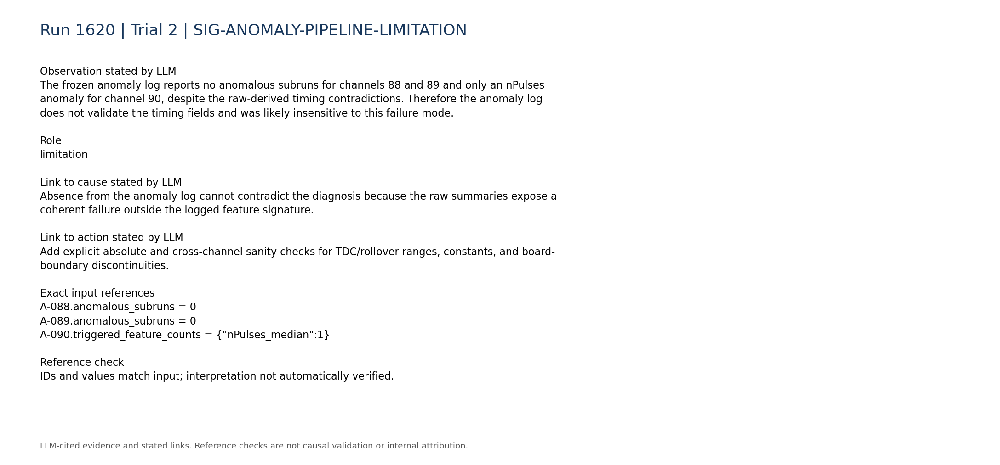

### SIG-MISSING-BOARD-DISCRIMINANTS

Board matching, synchronization, queue occupancy, and DAQ-state telemetry are unavailable, and only a static configuration snapshot was parsed. These missing data prevent distinguishing firmware/register failure, synchronization failure, and software decoding error.

Role: limitation

Cause link: Without these discriminants, the component and metadata-failure mechanism are strongly localized but the initiating cause remains unknown.

Action link: Retrieve board-level logs and configuration history and compare raw digitizer rates with trigger-board rates before choosing reset, reflash, hardware replacement, or decoder correction.

```text
C-daq_config-007.text = "- Within-run configuration changes: unavailable; only the static per-run configuration snapshot is parsed."
C-daq_config-008.text = "- Board matching, synchronization, queue occupancy, and DAQ-state telemetry: unavailable."
C-trigger-007.text = "- Digitizer-vs-trigger-board rate consistency: unavailable; no compact processed digitizer-rate telemetry was used."
```

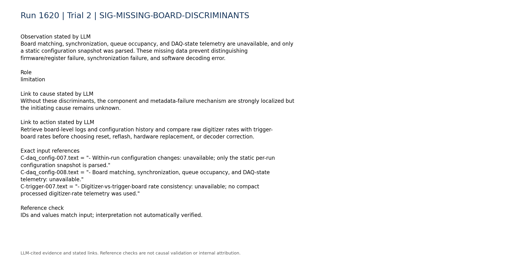

## Missing information

- Original event rows or raw timing words for channels 87-95, especially records at the constant values and extrema.
- Confirmed digitizer-board/readout-block mapping for channels 88-95; trigger-mask physical pin indices must not be substituted for channel numbers.
- Expected units, valid ranges, bit widths, signedness, byte order, and rollover semantics for TDC and TDCRollovers.
- Firmware version, build compatibility, register values, clock state, and any within-run configuration changes for the affected digitizer.
- Board matching, synchronization, queue occupancy, DAQ-state, and digitizer-versus-trigger-board rate telemetry.
- A known-good raw reference acquired with the same firmware and configuration.
- Result of a controlled restart/reset, register reload, decoder correction, or firmware validation run.
