# Run 1620 | Trial 3

## Diagnosis

Category: board-local TDC/rollover data corruption

Cause: Primary root cause is unknown. The observed symptom is persistent, channel-local corruption or misinterpretation of the TDC and TDCRollovers fields on contiguous digitizer channels 88-95. The most likely mechanism is a shared timing-counter readout, firmware/configuration, schema, or decoder fault affecting that channel block, rather than a PMT/HV or LVDS signal failure. The supplied summaries cannot distinguish corrupted source words from incorrect downstream decoding.

Action: First inspect representative original timing words and event records for channels 87-95 and reproduce the TDC/TDCRollovers decoding with the exact firmware, schema, data type, units, and channel mapping. Compare against a known-good run and verify board identity, synchronization, counter-reset behavior, firmware/configuration, and any run-time configuration changes. If raw words are valid but decoded incorrectly, fix the parser/schema and reprocess the data. If the source counters are demonstrably stuck or malformed, conditionally reconfigure or restart the affected digitizer, then reflash validated firmware or replace/repair the board only if the fault persists. Do not alter PMT HV or LVDS cabling without independent evidence of a signal-path fault.

Confidence: 0.94

OBSERVED: Channels 88-95 form a sharp timing-field anomaly block. Channels 88-90 report a constant TDC value of 149602000000000, channels 91-93 report TDC=0, and channels 94-95 are dominated by a different repeated TDC value while retaining extreme outliers. Their TDCRollovers fields are nonzero and enormous, whereas channel 87 has varying TDC and zero rollovers. Occupancy remains present across all subruns, and compact trigger/LVDS telemetry is stable with no persistently abnormal LVDS pins. INFERRED: This localizes the mechanism to timing readout or decoding shared by channels 88-95 and argues against broken PMT bases, lost HV, or LVDS-noise/high-trigger-rate failure. UNKNOWN: Original event words, board assignment, parser/schema details, firmware state, board synchronization, counter resets, and within-run configuration are unavailable. No exact resolved historical match was supplied; firmware-related historical cases are only weak analogies because their observed trigger-rate behavior does not match this case.

## LLM-cited signatures

LLM-cited evidence and stated links. Reference checks are not causal validation or internal attribution.

### SIG-TDC-CONSTANT-88-90

Channels 88 and 89 have TDC fixed at 149602000000000 with zero population standard deviation; this repeated value is also reported for channel 90. This supports a stuck or synthesized timing value rather than ordinary event timing variation.

Role: supports

Cause link: A common exact TDC value across multiple contiguous channels is consistent with a shared timing-counter readout or decoding failure.

Action link: Check the raw encoded words, data type, units, sentinel handling, and board/channel association for channels 88-90.

```text
R-088-09.mean = 149602000000000.0
R-088-09.std_population = 0.0
R-089-09.mean = 149602000000000.0
R-090-09.mean = 149602000000000.0
```

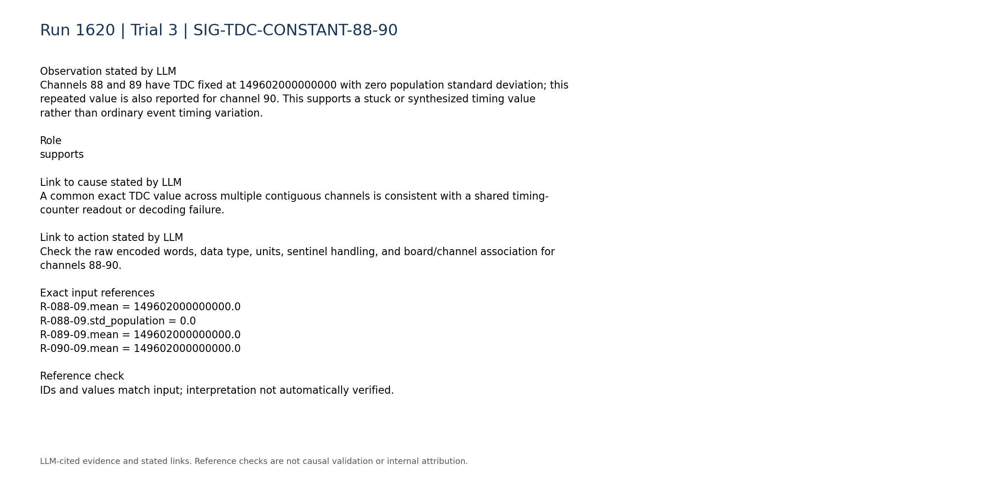

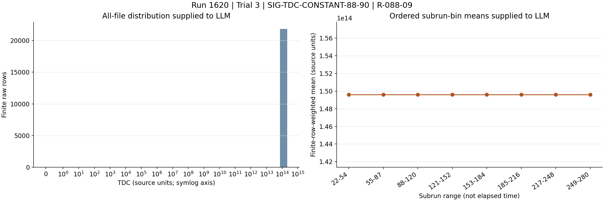

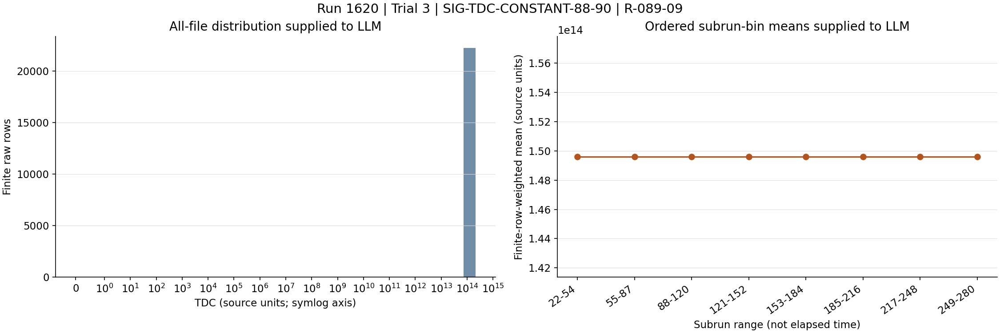

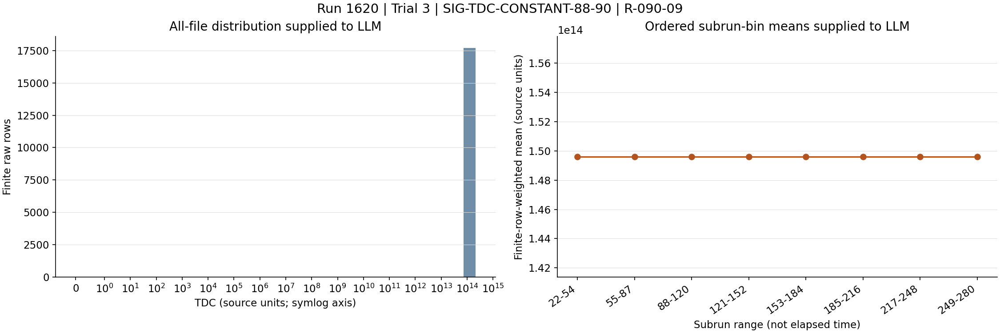

### SIG-TDC-ZERO-91-93

Channels 91, 92, and 93 have TDC mean 0 and zero fraction 1.0 across all summarized values, while their rollover fields are large and nonzero. This is a second malformed timing pattern within the same contiguous channel block.

Role: supports

Cause link: Zero TDC paired with enormous rollover values is internally inconsistent with the normal channel pattern and suggests field corruption, column/type misinterpretation, or failed counter readout.

Action link: Decode representative TDC and rollover words independently and test for field swaps, integer-width/sign errors, invalid sentinels, and schema mismatch.

```text
R-091-09.zero_fraction = 1.0
R-092-09.zero_fraction = 1.0
R-093-09.zero_fraction = 1.0
R-091-10.mean = 8.81182e+18
R-092-10.mean = 9.35354e+18
R-093-10.mean = 8.8588e+18
```

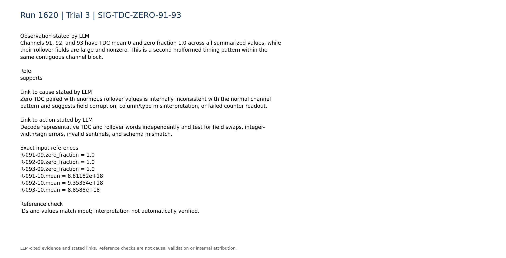


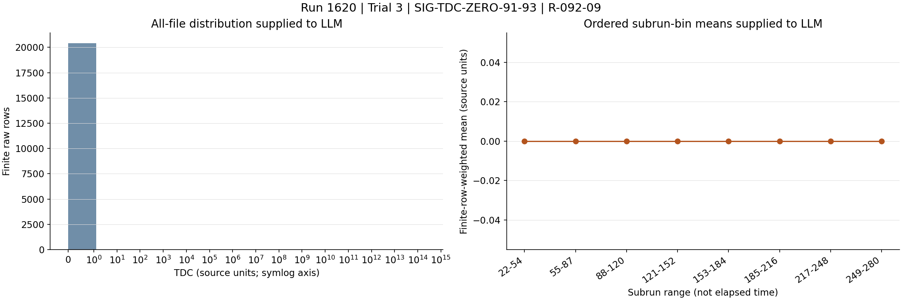

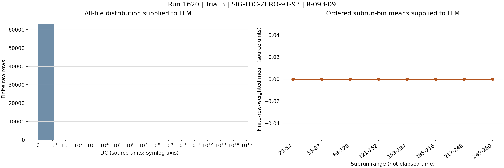

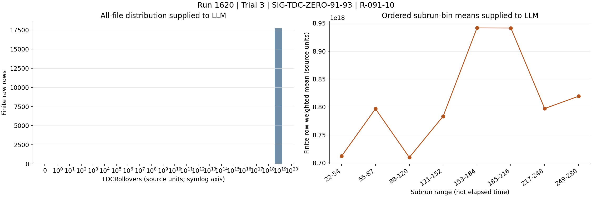

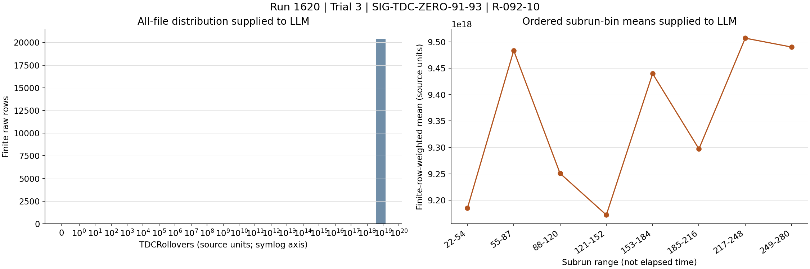

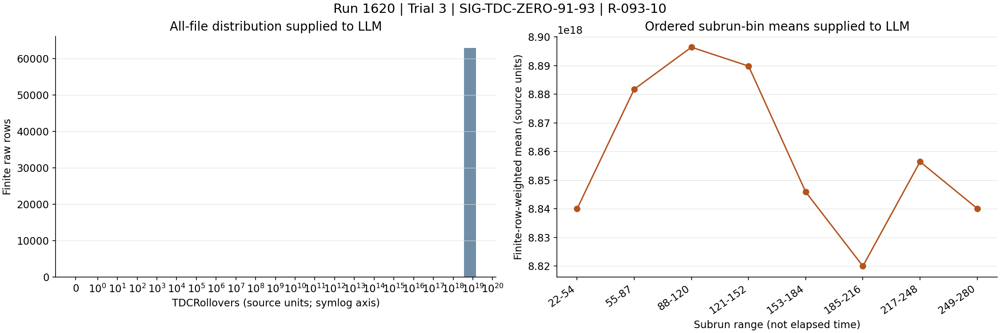

### SIG-TIMING-ANOMALY-94-95

Channels 94 and 95 have TDC subrun medians fixed at 438087000000 while their pooled maxima reach 211527000000000, and both have rollover means near 8.5e18. This extends the timing corruption through channel 95 but shows a different malformed representation than channels 88-93.

Role: supports

Cause link: Several distinct pathological encodings inside one contiguous block favor a shared board-format, firmware, memory-layout, or decoder problem over independent detector failures.

Action link: Determine the exact board and data-format boundary for channels 88-95 and compare its firmware/schema against unaffected channels.

```text
R-094-09.subrun_median_quantiles = [438087000000.0,438087000000.0,438087000000.0,438087000000.0,438087000000.0,438087000000.0,438087000000.0]
R-094-09.max = 211527000000000.0
R-095-09.subrun_median_quantiles = [438087000000.0,438087000000.0,438087000000.0,438087000000.0,438087000000.0,438087000000.0,438087000000.0]
R-095-10.mean = 8.59807e+18
```

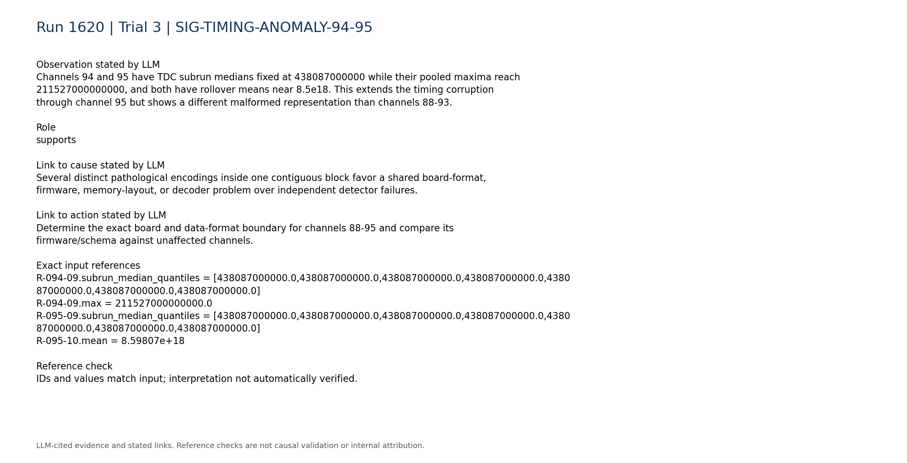

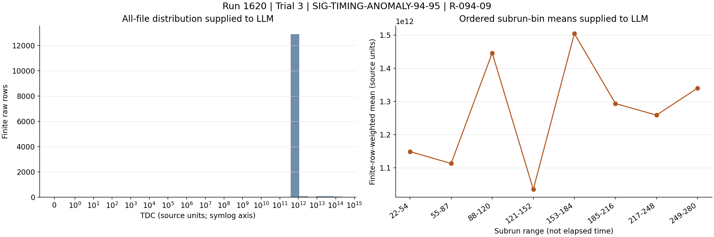

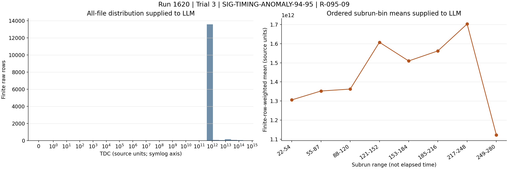

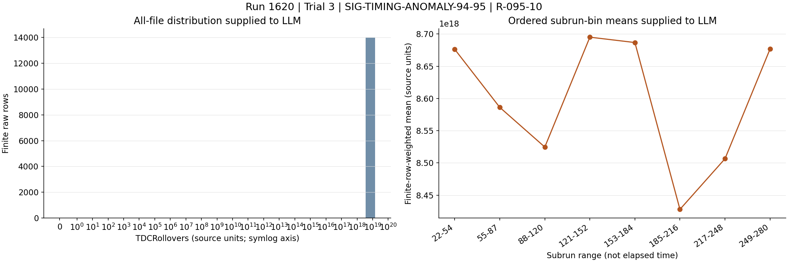

### SIG-SHARP-BOUNDARY-AT-88

Immediately preceding channel 87 has a varying TDC distribution and TDCRollovers identically zero, unlike channel 88 where both timing fields become constant, large nonzero values. This supports localization at the 87/88 channel boundary.

Role: supports

Cause link: The abrupt transition from normal timing behavior at channel 87 to malformed fields at channel 88 points to a shared electronics or software boundary rather than a run-wide timing condition.

Action link: Verify board/module assignment and parser offsets specifically at the channel 87/88 boundary; do not infer a physical-pin identity from the digitizer channel number.

```text
R-087-09.std_population = 321719000000.0
R-087-10.zero_fraction = 1.0
R-088-09.std_population = 0.0
R-088-10.mean = 1103820000000.0
```

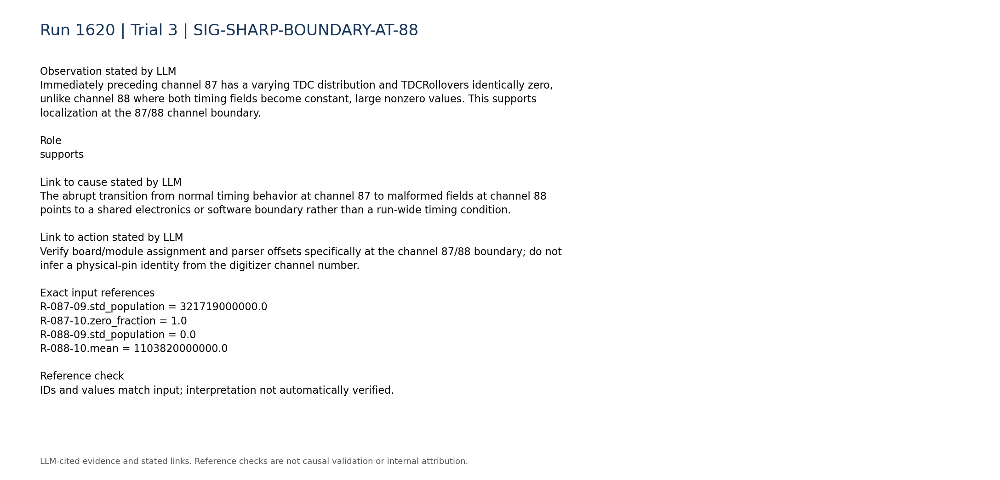

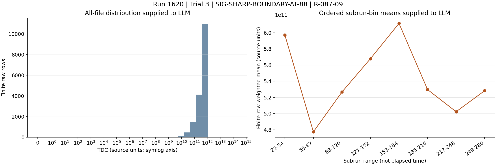

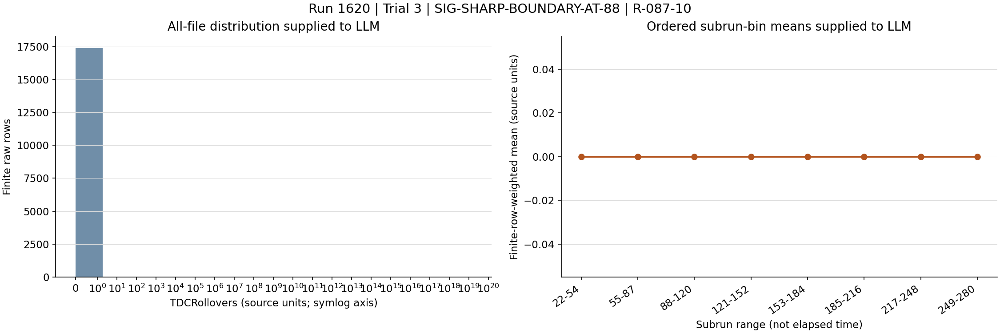

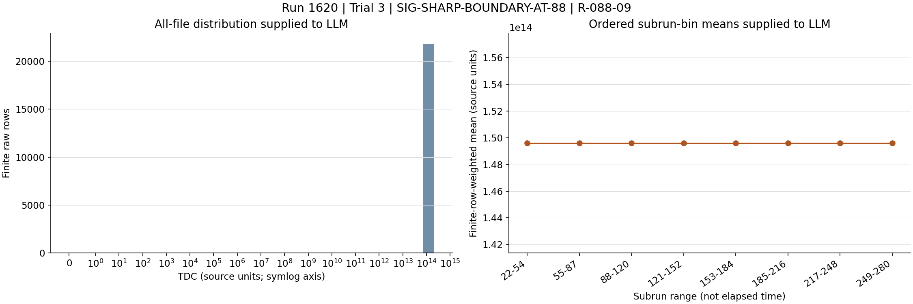

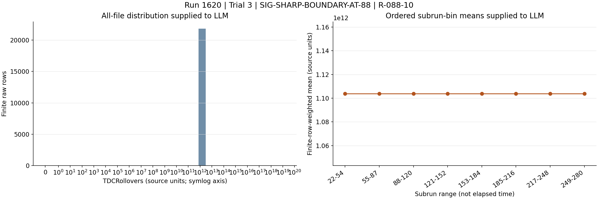

### SIG-SIGNAL-PRESENCE-PRESERVED

Representative affected channels 88, 91, and 95 are present in all 259 subruns with stable time-bin occupancies. This contradicts a persistent dead-channel or tripped-HV explanation for the timing anomaly.

Role: contradicts

Cause link: Continued event presence does not prove healthy timing electronics, but it argues against loss of PMT/HV signal as the primary mechanism.

Action link: Prioritize timing-word and electronics diagnostics; inspect HV only if independent current or waveform evidence later indicates a PMT path problem.

```text
P-088.present_subruns = 259
P-088.time_bin_occupancy = [0.0865011,0.0848776,0.0838259,0.0851252,0.0867711,0.0854113,0.0835859,0.0867342]
P-091.present_subruns = 259
P-095.present_subruns = 259
```

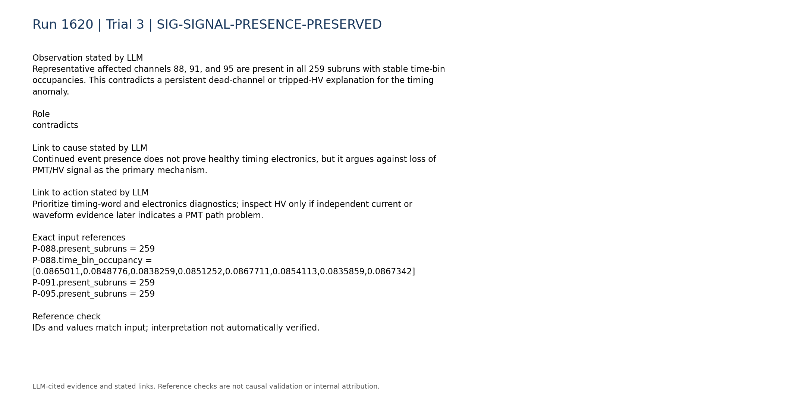

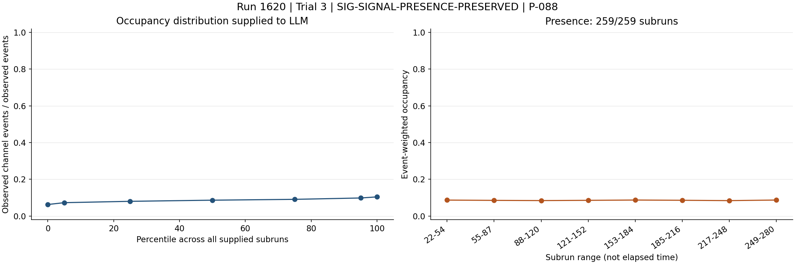

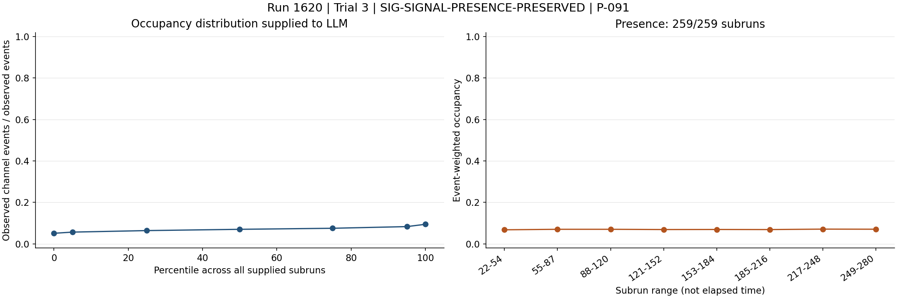

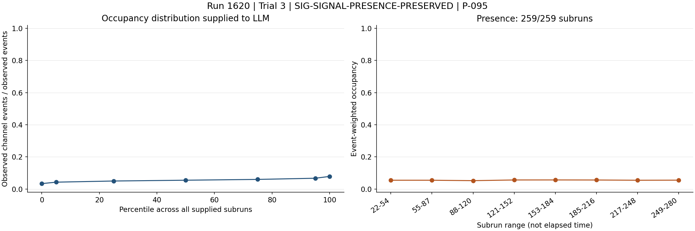

### SIG-TRIGGER-LVDS-STABLE

The compact trigger summary describes a stable total trigger rate, and the LVDS summary reports no persistent zero or abnormally low/high signal pins. This contradicts the high-trigger-rate/LVDS-noise and complete LVDS-loss signatures in the supplied historical cases.

Role: contradicts

Cause link: Stable global triggering and populated LVDS pins make trigger-noise or disconnected LVDS paths less likely as the primary cause, although compact summaries cannot exclude brief local effects.

Action link: Do not reseat or mask LVDS connections solely from this evidence; first verify timing data integrity and board-local state.

```text
C-trigger-001.text = "- Total trigger rate: median 4.88, range 4.485 to 5.342. Temporal behavior: stable/persistent."
C-lvds-003.text = "- Persistent zero signal pins: none."
C-lvds-005.text = "- Persistently abnormally low signal pins: none."
C-lvds-006.text = "- Persistently abnormally high signal pins: none."
```

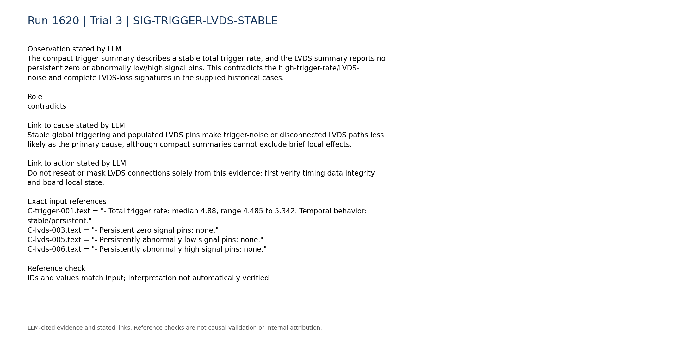

### SIG-DISCRIMINATING-TELEMETRY-MISSING

Digitizer-versus-trigger-board rate consistency, board matching, synchronization, queue occupancy, DAQ state, and within-run configuration changes are unavailable. Therefore the evidence cannot determine whether the corruption originates in hardware, firmware, synchronization, or offline decoding.

Role: limitation

Cause link: The anomaly is strongly localized, but the missing diagnostics prevent assignment of a definitive hardware versus software root cause.

Action link: Retrieve these diagnostics and original event words before applying irreversible hardware changes.

```text
C-trigger-007.text = "- Digitizer-vs-trigger-board rate consistency: unavailable; no compact processed digitizer-rate telemetry was used."
C-daq_config-007.text = "- Within-run configuration changes: unavailable; only the static per-run configuration snapshot is parsed."
C-daq_config-008.text = "- Board matching, synchronization, queue occupancy, and DAQ-state telemetry: unavailable."
```

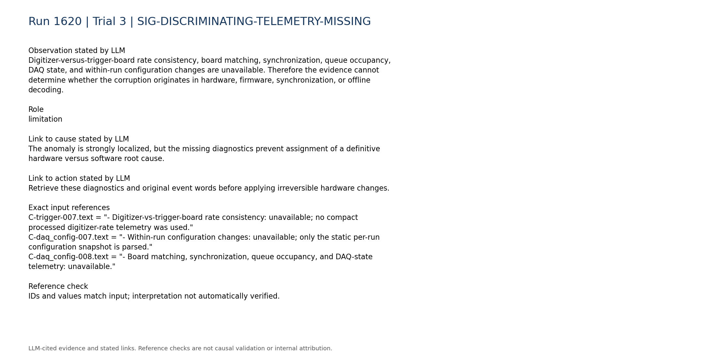

## Missing information

- Original event-level TDC and TDCRollovers words for channels 87-95, including raw integer types and byte layout
- Exact digitizer board/module mapping for channels 88-95 and whether channel 88 begins a hardware or data-format boundary
- Firmware versions, compile state, and per-board configuration compared with a known-good run
- Parser/schema version, field offsets, signedness, integer width, units, sentinel handling, and overflow logic
- Board matching, synchronization, queue occupancy, DAQ-state, and counter-reset telemetry
- Within-run configuration or restart history
- Independent timing reference or known-good raw reference for absolute validation
