# Run 1640 | Trial 1

## Diagnosis

Category: localized_digitizer_readout_loss

Cause: Unknown root cause. The observed mechanism is complete loss of event records for digitizer channels 32 and 33 beginning at subrun 520. The leading hypothesis is a localized digitizer/readout-path failure, reset, or unintended disablement after subrun 519; the supplied evidence cannot distinguish hardware lockup, link failure, configuration change, or upstream trigger-path loss.

Action: First compare channel-level event counters, board-matching efficiency, queue occupancy, digitizer status, and configuration immediately across subruns 519-520. Compare the correctly mapped LVDS physical pin for digitizer channels 32/33 before and after that boundary; do not equate a trigger-mask index with the same-numbered digitizer channel. If the LVDS input continues while digitizer records stop, conditionally reinitialize or restart the affected digitizer/readout process and inspect its data, clock, and trigger links. If LVDS input also stops, inspect and reseat the corresponding mapped LVDS connection and verify masking/configuration. Independently validate timing-field decoding for channels 88-95 against firmware and data-format definitions before using their TDC or rollover values.

Confidence: 0.68

OBSERVED: Channels 32 and 33 are present through subrun 519 and absent for every subrun 520-741, while adjacent channels 34 and 35 remain present throughout. Their pre-loss occupancy is substantial, so this is a readout disappearance rather than evidence of a persistently inactive detector element. Trigger and LVDS telemetry continue across the run, and the aggregate LVDS classification reports no persistently missing or low signal pin, arguing against a detector-wide trigger outage. INFERRED: The exact paired and sustained boundary most strongly indicates a localized shared acquisition path affecting digitizer channels 32/33. A digitizer/readout failure or unintended disablement is more consistent than a global DAQ failure, but an intermittent or late-run LVDS-path failure remains possible because the LVDS summaries are aggregate and board-matching telemetry is unavailable. No historical case is an exact match: run 1620 is only a digitizer-lockup analogy, and run 2126 is only a localized LVDS/readout-path analogy. A separate timing-data anomaly is also present on high-numbered channels, including constant extreme TDC values and extreme rollover values; it does not explain the channel-32/33 disappearance and should be investigated independently as possible decoding, firmware, or data corruption.

## LLM-cited signatures

LLM-cited evidence and stated links. Reference checks are not causal validation or internal attribution.

### SIG-PAIR-DISAPPEARANCE

Digitizer channels 32 and 33 are both absent for the contiguous range 520-741 and were present in 519 subruns.

Role: supports

Cause link: The identical sustained boundary on a channel pair supports failure or disablement of a shared local acquisition path, but does not identify whether that path failed in the digitizer, transport, configuration, or mapped trigger input.

Action link: Inspect counters and status across subruns 519-520 and localize the first stage at which both channels disappear.

```text
P-032.absent_subrun_ranges = [[520,741]]
P-032.present_subruns = 519
P-033.absent_subrun_ranges = [[520,741]]
P-033.present_subruns = 519
```

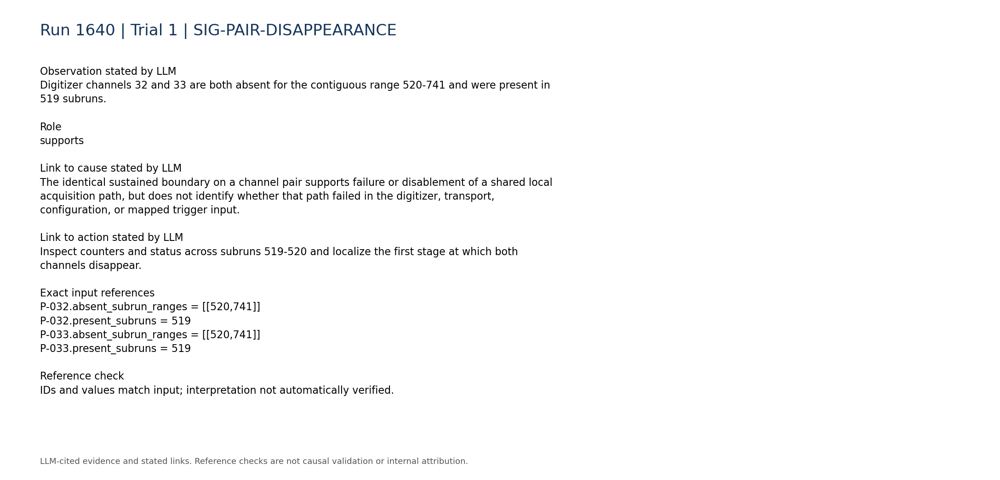


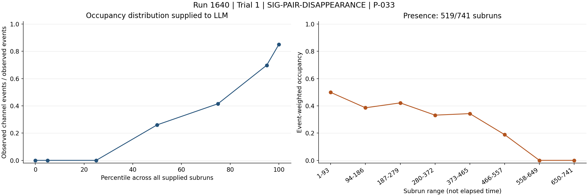

### SIG-PRELOSS-ACTIVITY

Before disappearance, channels 32 and 33 had nonzero event-weighted occupancies of 0.415581 and 0.272787; their final two time-bin occupancies are zero because no channel records are present there.

Role: supports

Cause link: Substantial activity before the boundary followed by total absence supports an acquired loss rather than a channel that was never active.

Action link: Check for a reset, disable command, link transition, or board-state change at the 519-520 boundary.

```text
P-032.event_weighted_occupancy = 0.415581
P-032.time_bin_occupancy = [0.695848,0.594798,0.633326,0.532006,0.536425,0.313187,0.0,0.0]
P-033.event_weighted_occupancy = 0.272787
P-033.time_bin_occupancy = [0.4989,0.385677,0.421703,0.331669,0.342898,0.18863,0.0,0.0]
```

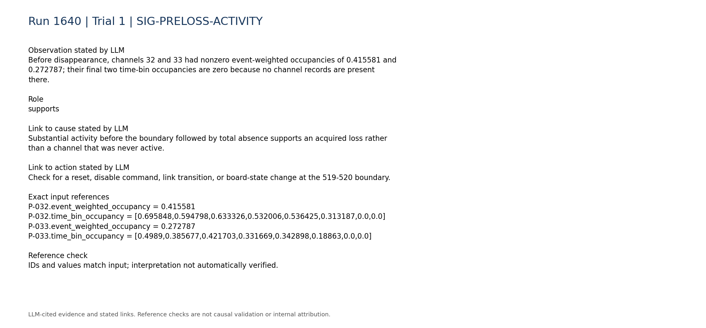

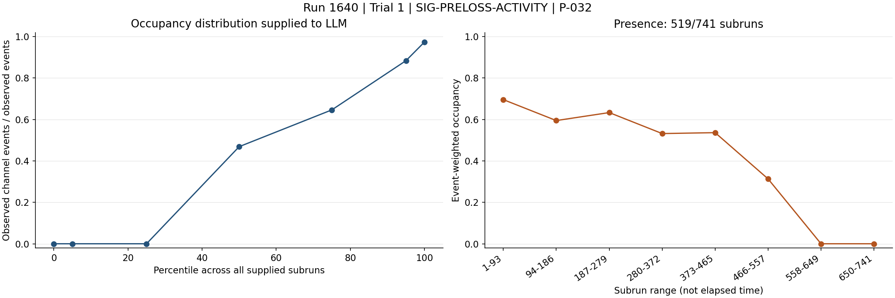


### SIG-LOCALIZED-NOT-ADJACENT

Adjacent digitizer channels 34 and 35 remain present in all 741 subruns with no absent ranges.

Role: supports

Cause link: Continued neighboring-channel presence argues against a detector-wide or file-wide loss and favors a narrowly shared channel-pair path.

Action link: Prioritize components uniquely shared by channels 32/33 rather than restarting the entire DAQ before localization.

```text
P-034.absent_subrun_ranges = []
P-034.present_subruns = 741
P-035.absent_subrun_ranges = []
P-035.present_subruns = 741
```

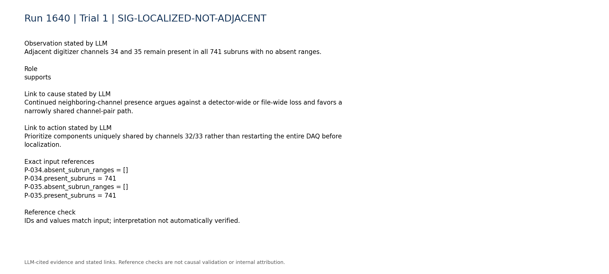

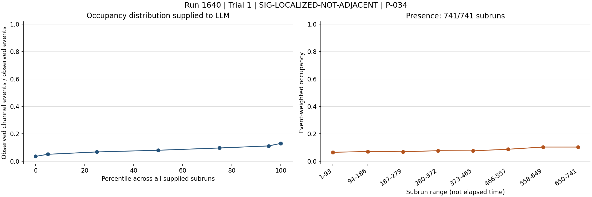

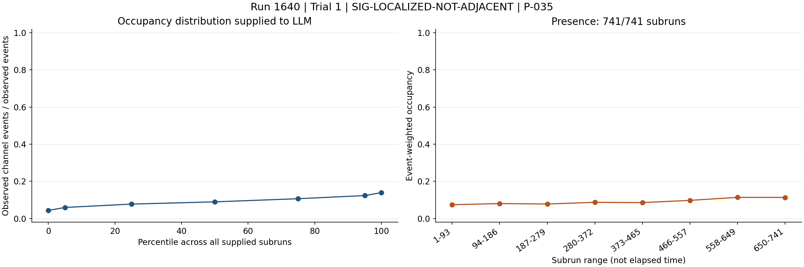

### SIG-GLOBAL-TRIGGER-CONTINUES

Trigger telemetry and LVDS telemetry each cover all 741 subruns, and the LVDS summary reports no persistent zero, missing, or abnormally low signal pins.

Role: contradicts

Cause link: These observations contradict a global trigger-board or persistent run-wide LVDS outage, but aggregate classifications cannot exclude a late-run failure of the specifically mapped pin.

Action link: Compare the correctly mapped individual LVDS pin before and after subrun 519 rather than relying on run-wide classifications.

```text
C-trigger-000.text = "- Coverage: 741 rows spanning subruns 1-741."
C-lvds-000.text = "- Coverage: 741 rows spanning subruns 1-741."
C-lvds-003.text = "- Persistent zero signal pins: none."
C-lvds-004.text = "- Persistent missing signal pins: none."
C-lvds-005.text = "- Persistently abnormally low signal pins: none."
```

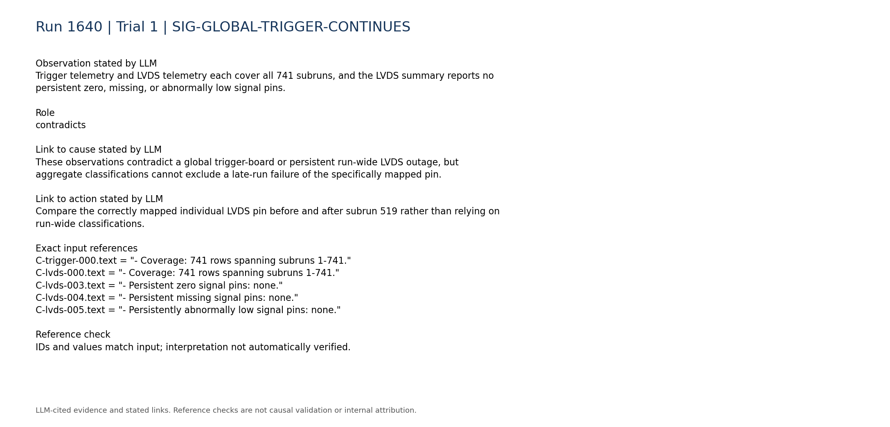

### SIG-MISSING-DISCRIMINATORS

Within-run configuration changes, board matching, synchronization, queue occupancy, and DAQ-state telemetry are unavailable.

Role: limitation

Cause link: Without these discriminators, the evidence cannot separate digitizer lockup, transport mismatch, queue failure, configuration disablement, and upstream trigger loss.

Action link: Retrieve these telemetry sources or reproduce their comparisons in a diagnostic run before selecting a hardware intervention.

```text
C-daq_config-007.text = "- Within-run configuration changes: unavailable; only the static per-run configuration snapshot is parsed."
C-daq_config-008.text = "- Board matching, synchronization, queue occupancy, and DAQ-state telemetry: unavailable."
C-trigger-007.text = "- Digitizer-vs-trigger-board rate consistency: unavailable; no compact processed digitizer-rate telemetry was used."
```

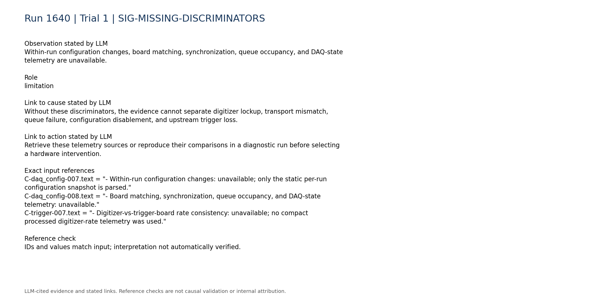

### SIG-SEPARATE-TIMING-ANOMALY

Channel 89 has a constant TDC mean of 149602000000000 with zero population standard deviation and an extreme TDCRollovers mean of 8.4779e+18, whereas channel 87 has a TDC mean of 543162000000. This indicates a separate localized timing representation anomaly.

Role: limitation

Cause link: The timing-field discontinuity suggests decoding, firmware, initialization, or corruption affecting high-numbered channels, but it does not establish the cause of the channel-32/33 record loss.

Action link: Validate timing-field schema and firmware compatibility independently and avoid using affected TDC/rollover fields until verified.

```text
R-089-09.mean = 149602000000000.0
R-089-09.std_population = 0.0
R-089-10.mean = 8.4779e+18
R-087-09.mean = 543162000000.0
```

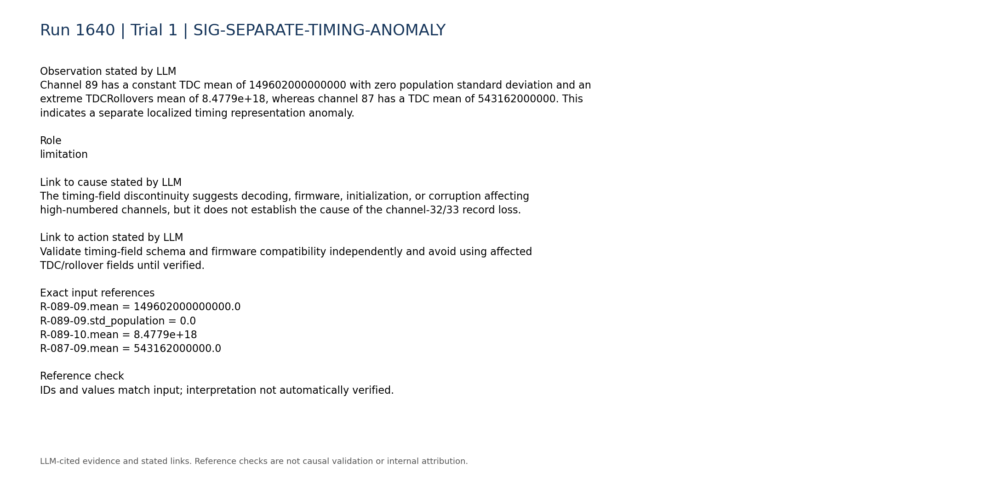

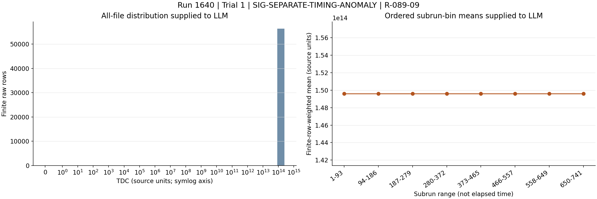

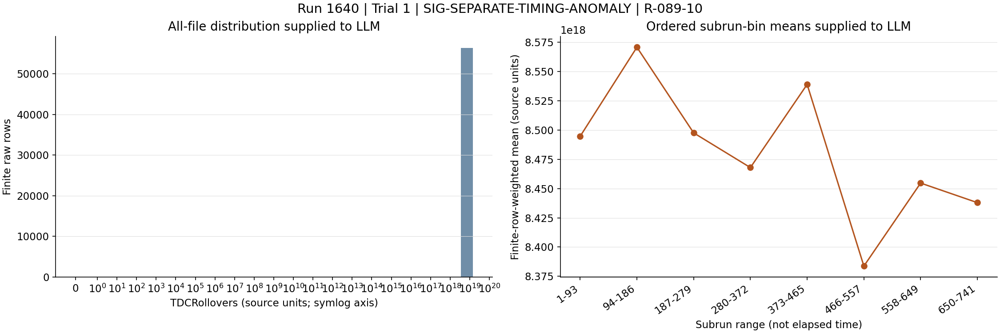

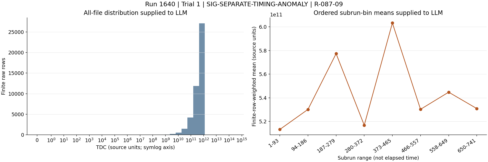

### SIG-HISTORICAL-PARTIAL-ONLY

Historical references include a digitizer lockup and an LVDS-noise case, but neither is an exact evidentiary match to the target because the target lacks board-state, queue, and mapped-pin transition data.

Role: limitation

Cause link: These cases justify testing digitizer and LVDS branches but cannot establish either as the target's root cause.

Action link: Use their interventions only conditionally after the target-specific boundary checks localize the failure.

```text
H-1620.entry.category = "digitizer_lockup"
H-1620.entry.action = "Restart the slab DAQ PC while the VME was powered off."
H-2126.entry.category = "LVDS_noise"
```

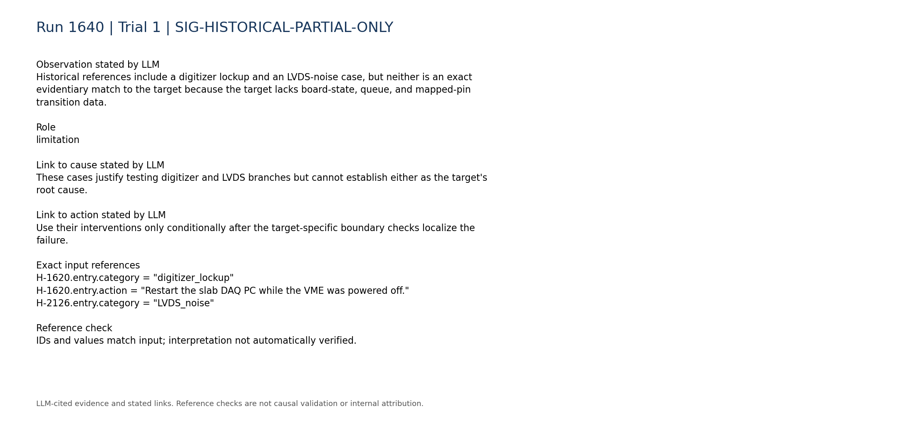

## Missing information

- Per-board and per-channel event counters immediately before and after subrun 520
- Board-matching efficiency, synchronization state, queue occupancy, and DAQ process state around the transition
- Within-run configuration or channel-enable changes at subruns 519-520
- Correctly mapped LVDS physical-pin time series for digitizer channels 32 and 33 around the boundary
- Digitizer firmware versions, reset logs, link status, and error registers
- Raw event headers or schema validation for the anomalous TDC and TDCRollovers fields on channels 88-95
- A supplied known-good reference run under the same detector and trigger configuration
