# Run 1640 | Trial 2

## Diagnosis

Category: localized_paired_channel_readout_loss

Cause: OBSERVED symptom: digitizer channels 32 and 33 have no supplied channel measurements from subrun 520 through 741 after being present through subrun 519. INFERRED mechanism: a localized readout, channel-enable/configuration, or data-decoding failure affecting this channel pair began at the 519/520 boundary. The primary underlying hardware or software cause is unknown. A static trigger mask is not established as the cause, and persistent LVDS-pin failure or a global trigger-rate failure is disfavored by the supplied aggregate telemetry. An exact historical match is absent; digitizer lockup and intermittent LVDS connection cases are only partial analogies.

Action: First verify the channel-to-board and physical-pin mapping, then compare DAQ/channel-enable configuration, digitizer status, firmware state, and raw fragment inventory immediately before and after subrun 520. Check board matching, synchronization, queue occupancy, per-board event counts, and whether channels 32/33 are absent in raw digitizer fragments or only lost during decoding. If raw fragments are absent and the affected digitizer path is unresponsive, conditionally reinitialize or restart the affected digitizer/DAQ process and confirm recovery in a new run. If fragments exist but decoded channels do not, conditionally correct the channel map or decoder/configuration. Inspect or reseat the mapped LVDS/signal connection only if pin-level or board-matching tests localize the fault there; do not use mask indices as digitizer-channel numbers.

Confidence: 0.86

OBSERVED: channels 32 and 33 are jointly absent for the final 222 subruns, while each was present for 519 subruns. Both channels were already highly anomalous before disappearing. No persistent zero, missing, low, or high LVDS signal pin is reported, and the summarized global trigger and LVDS transitions occur at other boundaries rather than subrun 520. INFERRED: the sharp paired loss is most consistent with a localized downstream readout/configuration/decoding transition, not a detector-wide trigger change. UNKNOWN: board matching, synchronization, queue state, within-run configuration changes, raw fragment presence, digitizer health, and signed per-feature values are unavailable, so digitizer lockup, accidental disablement, mapping/decoder failure, and an intermittent connection cannot be distinguished. Separate extreme TDC/rollover encodings on channels 88-95 also raise a possible broader decoding or data-format concern but do not explain the specific 32/33 dropout.

## LLM-cited signatures

LLM-cited evidence and stated links. Reference checks are not causal validation or internal attribution.

### SIG-PAIR-DROPOUT-520

Channels 32 and 33 are both absent over exactly subruns 520-741 and are reported present in 519 of 741 subruns.

Role: supports

Cause link: The synchronized, persistent loss of an adjacent channel pair supports a localized shared readout/configuration/decoding failure beginning at the 519/520 boundary.

Action link: Compare raw fragments, board/channel enable state, configuration, and digitizer health across subruns 519 and 520.

```text
P-032.absent_subrun_ranges = [[520,741]]
P-032.present_subruns = 519
P-033.absent_subrun_ranges = [[520,741]]
P-033.present_subruns = 519
```

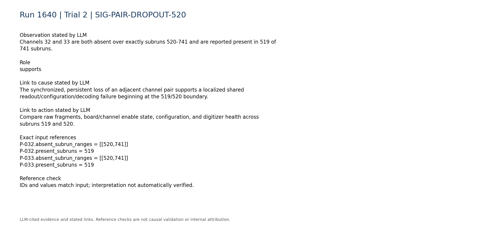

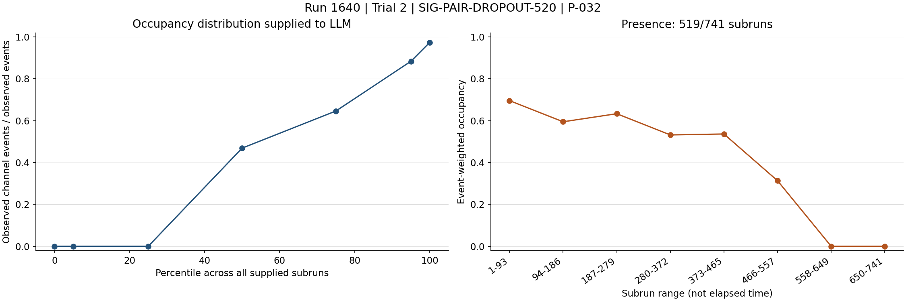


### SIG-MISSING-CHANNEL-CLASSIFICATION

The anomaly records classify 222 subruns as missing_channel for each of channels 32 and 33; channel 32 is anomalous in 740 subruns and channel 33 in 650.

Role: supports

Cause link: This independently corroborates that the terminal absence is systematic and that the pair had abnormal behavior before the complete loss; it does not identify the physical cause.

Action link: Investigate both the pre-drop abnormal state and the terminal disappearance rather than treating the final absence as isolated low occupancy.

```text
A-032.method_counts.missing_channel = 222
A-032.anomalous_subruns = 740
A-033.method_counts.missing_channel = 222
A-033.anomalous_subruns = 650
```

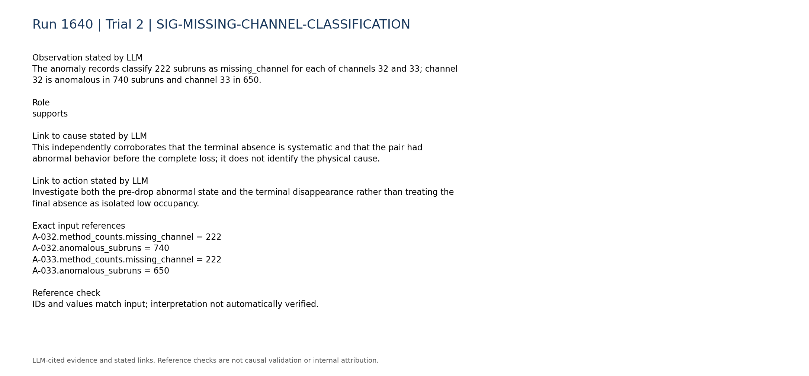

### SIG-PAIR-PRECURSOR-BEHAVIOR

Before becoming absent, channels 32 and 33 had unusually large and declining occupancy summaries; their final two time-bin occupancies are both zero because no measurements are present there.

Role: supports

Cause link: Shared evolution followed by shared disappearance suggests a common path or state rather than two independent detector-channel failures. The coarse time bins cannot locate the precursor changes event by event.

Action link: Review per-subrun configuration and board diagnostics leading up to subrun 520, not only the first fully absent subrun.

```text
P-032.time_bin_occupancy = [0.695848,0.594798,0.633326,0.532006,0.536425,0.313187,0.0,0.0]
P-033.time_bin_occupancy = [0.4989,0.385677,0.421703,0.331669,0.342898,0.18863,0.0,0.0]
```

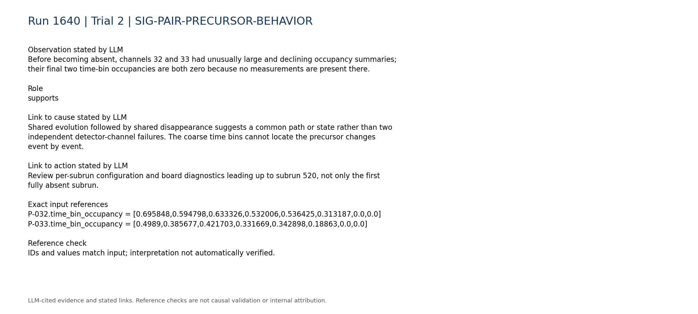

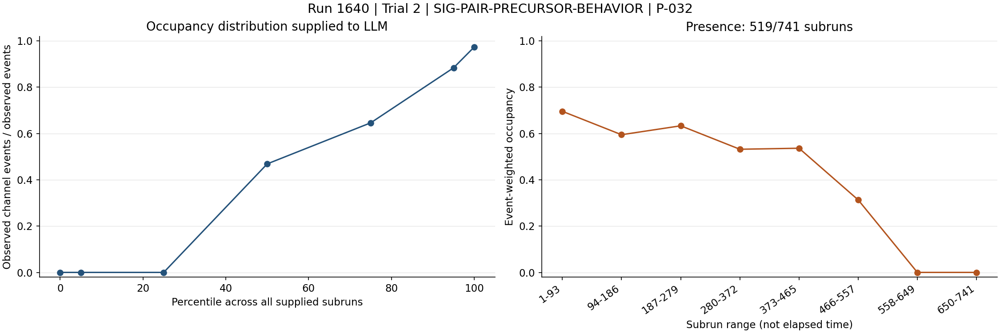

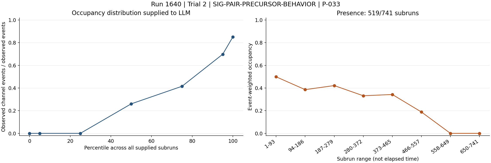

### SIG-LVDS-NO-PERSISTENT-PIN-FAULT

The LVDS summary reports no persistent zero, missing, abnormally low, or abnormally high signal pins across its 741-subrun coverage.

Role: contradicts

Cause link: This argues against a persistent failure visible in the supplied LVDS pin counters, but it cannot exclude an intermittent connection or a fault downstream of those counters.

Action link: Do not begin with blind cable replacement; first correlate the correctly mapped pin with per-subrun counts and board-matching diagnostics.

```text
C-lvds-003.text = "- Persistent zero signal pins: none."
C-lvds-004.text = "- Persistent missing signal pins: none."
C-lvds-005.text = "- Persistently abnormally low signal pins: none."
C-lvds-006.text = "- Persistently abnormally high signal pins: none."
```

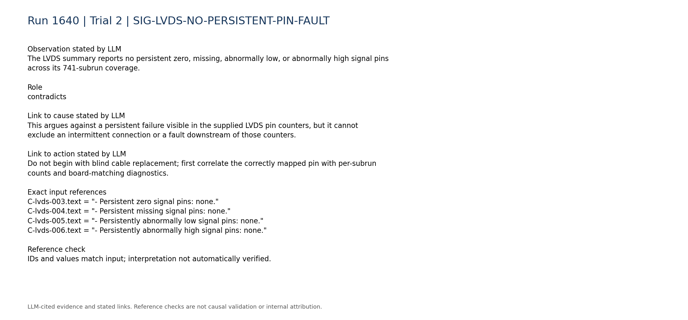

### SIG-NO-GLOBAL-BOUNDARY-520

The largest summarized trigger-rate transition is near subrun 211, while the largest trigger-count and total-LVDS-count transitions are near subrun 741, not subrun 520.

Role: contradicts

Cause link: The pair dropout is not accompanied by the largest aggregate trigger or LVDS transition, disfavoring a detector-wide trigger-rate mechanism. Aggregate summaries could still hide a local change.

Action link: Focus diagnostics on the affected board/channel path while still checking per-pin and per-board telemetry around subrun 520.

```text
C-trigger-001.text = "- Total trigger rate: median 6.092, range 4.079 to 15.13. Temporal behavior: large transition near subrun 211 (largest adjacent relative change 1.044)."
C-trigger-002.text = "- Total trigger counts: median 1003, range 350 to 1009. Temporal behavior: large transition near subrun 741 (largest adjacent relative change 0.651)."
C-lvds-001.text = "- Total LVDS counts: median 1.57e+07, range 6.25e+06 to 1.72e+07. Temporal behavior: large transition near subrun 741 (largest adjacent relative change 0.6008)."
```

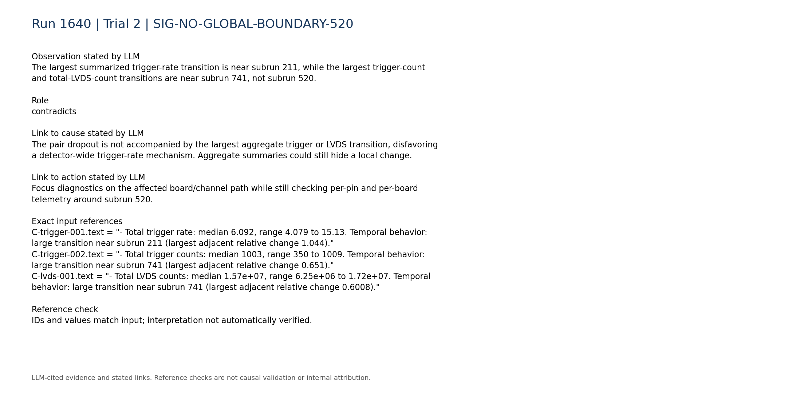

### SIG-STATIC-MASK-NOT-DIAGNOSTIC

The supplied static configuration lists masked physical pins 32-39, 43, and 57-61, while the case explicitly distinguishes physical mask indices from digitizer-channel numbers.

Role: limitation

Cause link: The mask list cannot be interpreted as masking digitizer channels 32 and 33, and the static snapshot cannot show whether an enable or mask state changed at subrun 520.

Action link: Resolve the physical-pin mapping and recover the effective per-subrun configuration before changing masks.

```text
C-daq_config-004.text = "- Masked physical pins: 32, 33, 34, 35, 36, 37, 38, 39, 43, 57, 58, 59, 60, 61."
C-daq_config-007.text = "- Within-run configuration changes: unavailable; only the static per-run configuration snapshot is parsed."
```

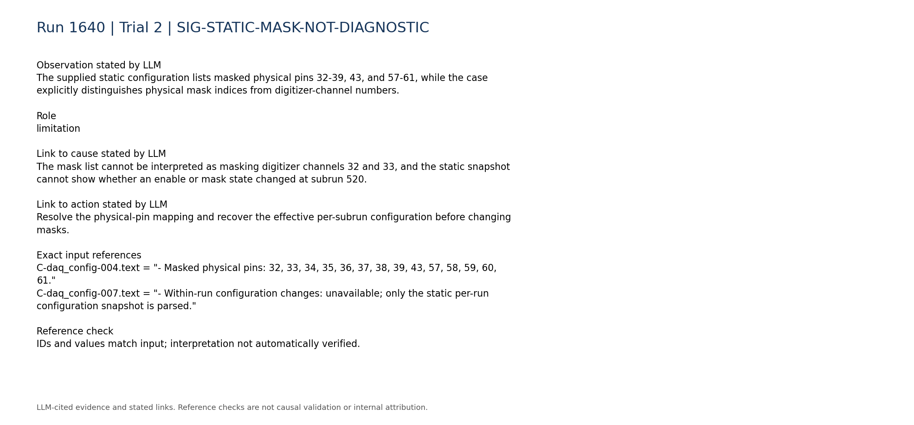

### SIG-DISCRIMINATING-DAQ-TELEMETRY-MISSING

Board matching, synchronization, queue occupancy, and DAQ-state telemetry are unavailable, as is compact digitizer-versus-trigger-board rate consistency.

Role: limitation

Cause link: These missing diagnostics prevent discrimination among digitizer lockup, dropped/unmatched fragments, software disablement, and decoder loss.

Action link: Retrieve these diagnostics or reproduce them in a new run before selecting a hardware intervention.

```text
C-daq_config-008.text = "- Board matching, synchronization, queue occupancy, and DAQ-state telemetry: unavailable."
C-trigger-007.text = "- Digitizer-vs-trigger-board rate consistency: unavailable; no compact processed digitizer-rate telemetry was used."
```

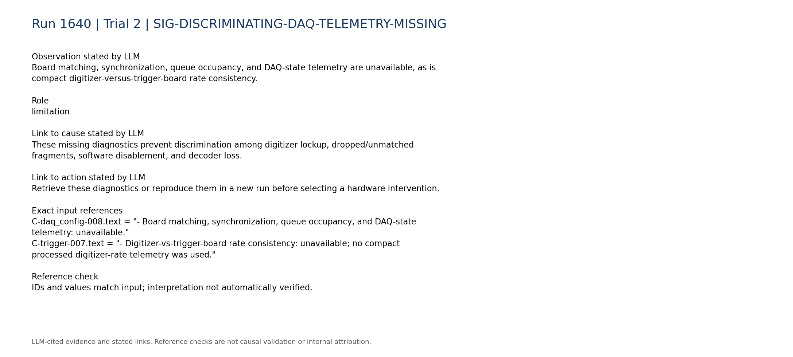

### SIG-SEPARATE-TDC-FORMAT-CONCERN

Channel 89 has a constant TDC value of 149602000000000, whereas channel 91 has TDC identically zero; both have nonzero, extremely large TDCRollovers summaries.

Role: limitation

Cause link: This separate structured inconsistency raises a possible data-format, firmware, or decoding issue elsewhere in the run. It does not directly explain why only channels 32/33 become absent at subrun 520 and no good raw reference was supplied.

Action link: Validate TDC/rollover field decoding and firmware/schema compatibility independently, and determine whether the same decoder handles the missing pair.

```text
R-089-09.mean = 149602000000000.0
R-089-09.std_population = 0.0
R-089-10.mean = 8.4779e+18
R-091-09.mean = 0.0
R-091-10.mean = 8.74662e+18
```

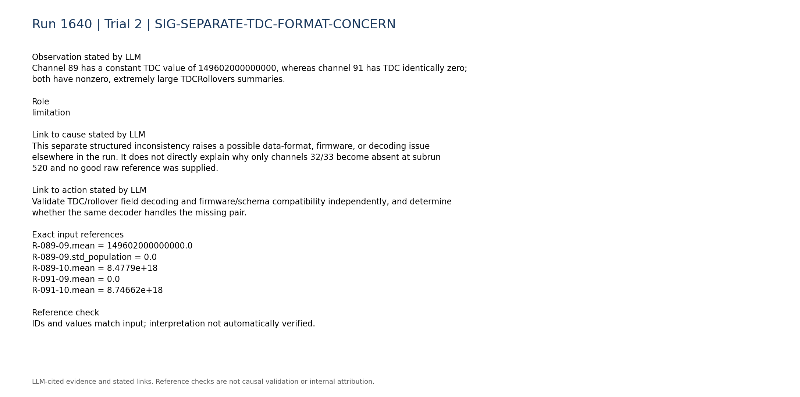

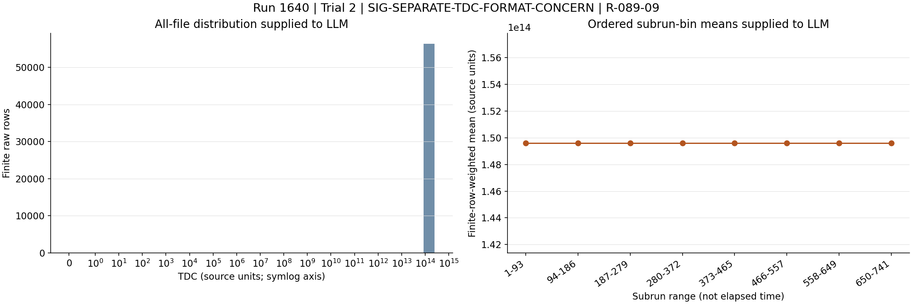

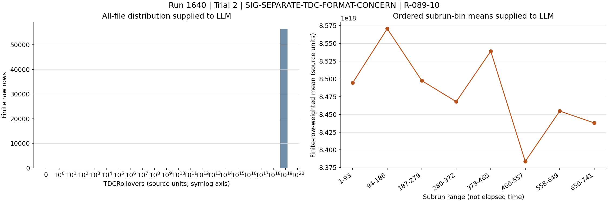

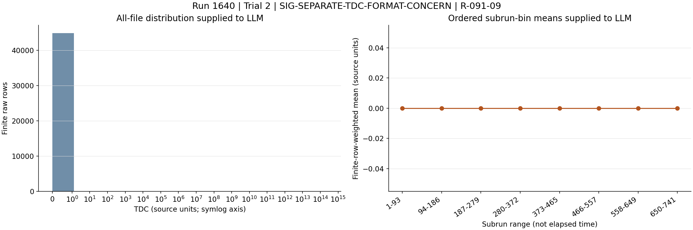

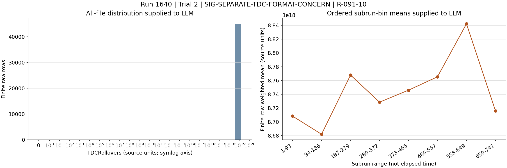

### SIG-HISTORICAL-PARTIAL-ANALOGIES

Historical run 1620 involved a digitizer lockup resolved by rebooting the DAQ PC, while run 2126 involved a localized LVDS/channel-pair problem with unmatched events and abnormal rates. Neither historical pattern is an exact match to the current evidence.

Role: limitation

Cause link: The analogies show plausible digitizer and local-connection mechanisms, but the current case lacks their discriminating status and rate telemetry; therefore neither mechanism is confirmed.

Action link: Use the historical remedies only conditionally after board-status or mapping tests reproduce the corresponding failure signature.

```text
H-1620.entry.category = "digitizer_lockup"
H-1620.entry.action = "Restart the slab DAQ PC while the VME was powered off."
H-2126.entry.category = "LVDS_noise"
H-2126.entry.cause = "DAQ board-matching efficiency dropped below 100% beginning in run 2126, file 26, around event 700. The DAQ queue filled with mostly empty, unmatched digitizer events and the apparent digitizer trigger rate became abnormally high while the trigger-board files remained normal. Trigger-mask tests localized the problem to digitizer 0 LVDS channel 0, corresponding to detector channels 0 and 1. The subsequent intervention indicated an intermittent or degraded LVDS-pin, jumper-wire, or MCX signal connection."
```

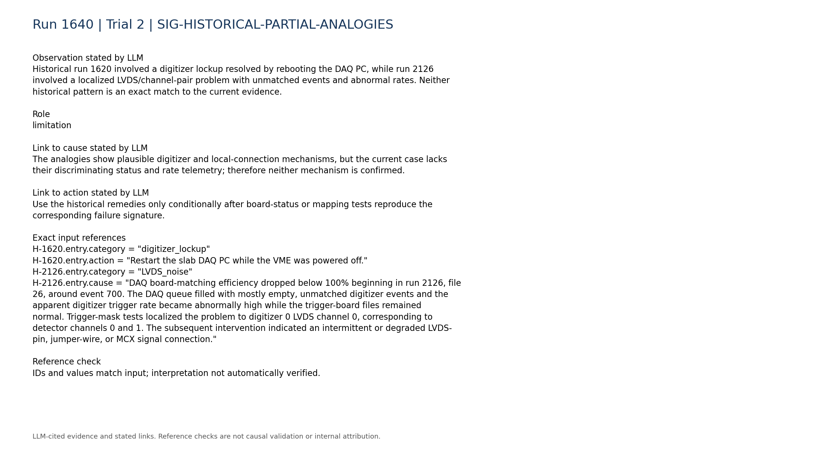

## Missing information

- Raw digitizer fragment and per-board event counts for channels 32/33 around subruns 519-520.
- Effective within-run channel-enable, trigger-mask, threshold, firmware, and decoder configuration history.
- Board-matching efficiency, unmatched-event counts, synchronization status, queue occupancy, and DAQ-state/restart logs.
- Correct physical-pin, LVDS-link, digitizer-board, and detector-channel mapping for channels 32/33.
- Per-subrun LVDS count for the correctly mapped pin around subrun 520 rather than only persistent classifications and aggregate medians.
- A known-good raw reference and validation of TDC/TDCRollovers decoding, especially for channels 88-95.
- Waveforms or original rows around the transition to test whether measurements were absent at acquisition or removed during processing.
