# Run 1640 | Trial 3

## Diagnosis

Category: digitizer_readout_channel_pair_dropout

Cause: Unknown. The observable symptom is complete loss of digitizer channels 32 and 33 beginning at subrun 520. The evidence localizes the likely mechanism to the digitizer-side acquisition/readout path shared by that channel pair, but it does not distinguish an undocumented channel-enable or zero-suppression change, digitizer/firmware state failure, local power or signal-connection loss, or downstream decoding/filtering. A trigger-board LVDS failure is less favored because the supplied LVDS summary reports no persistently zero or missing signal pins. Separate, persistent TDC/rollover inconsistencies on channels 88-95 suggest an additional data-decoding or digitizer-timing integrity problem that may or may not share the same cause.

Action: First compare the raw event/channel inventory and effective DAQ configuration immediately before and after subrun 520, including channel-enable state, zero suppression, thresholds, firmware version and any restart or operator intervention. Check board matching, synchronization, digitizer error/status registers, queue occupancy and per-board event counts; these telemetry are not supplied here. Verify the physical mapping before any intervention: trigger-mask indices are physical pins and must not be treated as same-number digitizer channels. If channels 32/33 are enabled but their digitizer path is unresponsive, conditionally stop the run, restart or reinitialize the affected digitizer/DAQ process, then start a new run and verify both channels reappear. If electronics remain responsive but signals are absent, conditionally inspect and reseat the mapped signal, power and digitizer-side connections. Independently validate the TDC/TDCRollovers decoder and firmware/schema for channels 88-95 before using their timing data.

Confidence: 0.82

OBSERVED: channels 32 and 33 are present only through subrun 519 and absent for subruns 520-741; both had substantial occupancy before disappearing. Their frozen anomaly records flag almost the entire run through missing-channel, occupancy and pulse-statistic features. No persistent zero or missing LVDS signal pin is reported, and the total trigger telemetry does not identify a transition at subrun 520. Channels at the same detector row/column in other layers show declining occupancy but remain present, so changing illumination or trigger acceptance is a partial alternative explanation but does not account for the exact two-channel disappearance. Timing summaries for channels 88-95 are also incompatible with the pattern on channels 0-87, including constant or zero TDC values and enormous nonzero rollover values. INFERRED: the primary anomaly is therefore a localized channel-pair acquisition dropout, more likely downstream of the trigger-board LVDS counters than a global trigger-rate failure. UNKNOWN: the supplied records cannot identify whether this was intentional configuration, digitizer lockup, cabling/power loss, zero-suppression behavior or decoding/filtering, and cannot establish whether the timing corruption is related. There is no exact historical match; run 1620 is only a partial digitizer-lockup analogy.

## LLM-cited signatures

LLM-cited evidence and stated links. Reference checks are not causal validation or internal attribution.

### SIG-PAIR-ABSENCE

Digitizer channels 32 and 33 are both absent for every supplied subrun from 520 through 741, while each is present in 519 subruns.

Role: supports

Cause link: The simultaneous, persistent boundary localizes the symptom to a shared channel-pair acquisition path or a coordinated configuration change; it does not by itself identify the mechanism.

Action link: Inspect the effective configuration and digitizer state at the 519-to-520 boundary before applying a restart or physical intervention.

```text
P-032.absent_subrun_ranges = [[520,741]]
P-032.present_subruns = 519
P-033.absent_subrun_ranges = [[520,741]]
P-033.present_subruns = 519
```

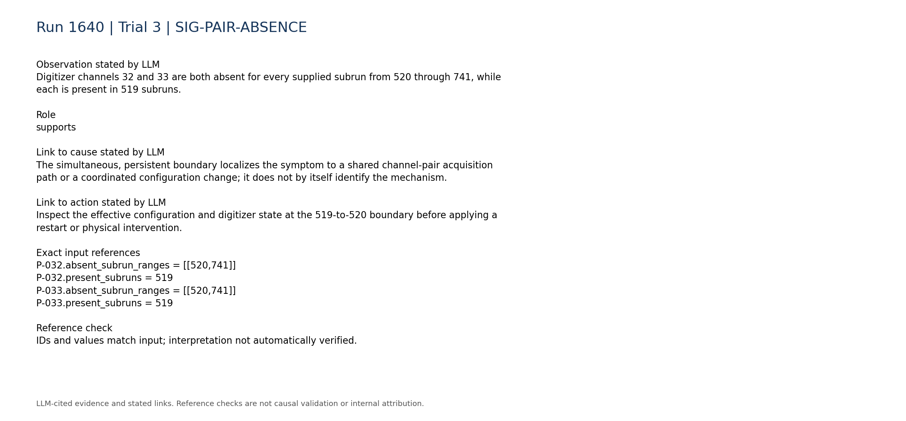

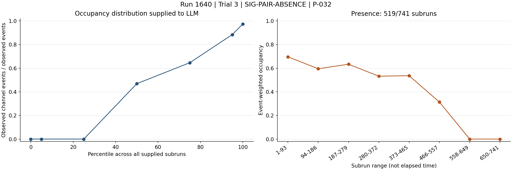

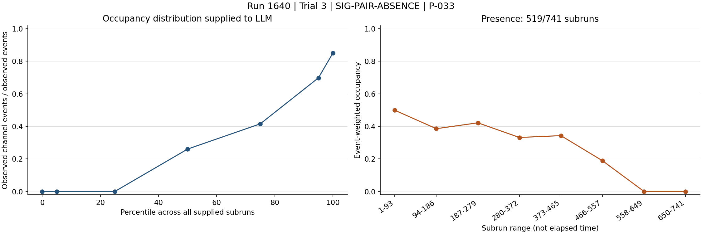

### SIG-PAIR-OCCUPANCY-COLLAPSE

Before the disappearance, channels 32 and 33 had substantial occupancy; their final two time bins contain no valid channel measurements because the channels are absent.

Role: supports

Cause link: This is loss of observed channel data rather than merely a small statistical fluctuation in pulse multiplicity.

Action link: Verify raw channel inventory and per-board event counts across subruns 519 and 520.

```text
P-032.event_weighted_occupancy = 0.415581
P-032.time_bin_occupancy = [0.695848,0.594798,0.633326,0.532006,0.536425,0.313187,0.0,0.0]
P-033.event_weighted_occupancy = 0.272787
P-033.time_bin_occupancy = [0.4989,0.385677,0.421703,0.331669,0.342898,0.18863,0.0,0.0]
R-032-02.time_bin_valid_count = [64519,55108,58696,49226,49652,28604,0,0]
R-033-02.time_bin_valid_count = [46258,35733,39083,30689,31739,17228,0,0]
```

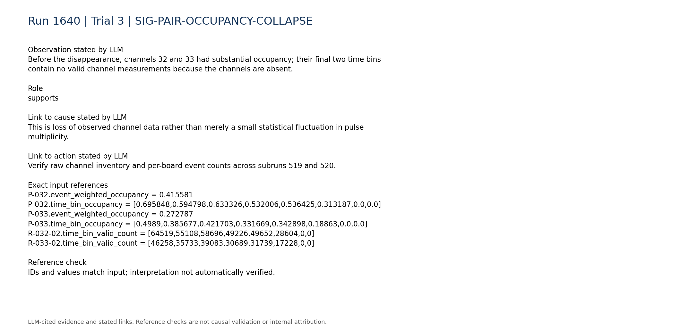

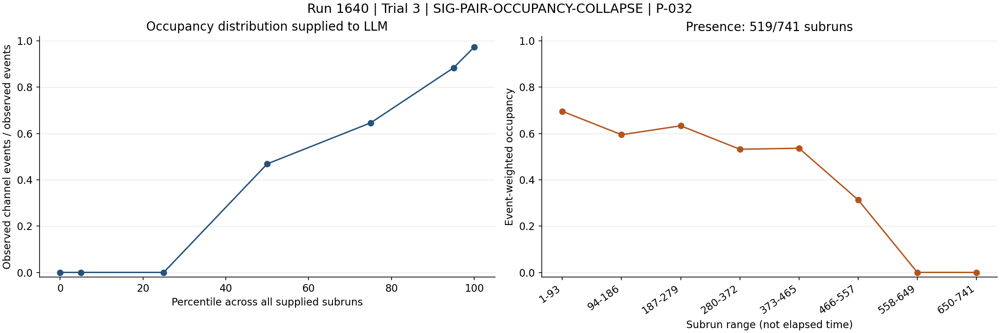

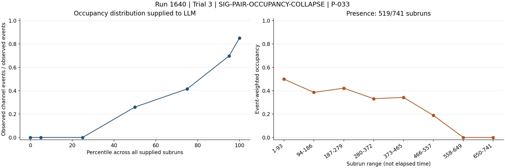

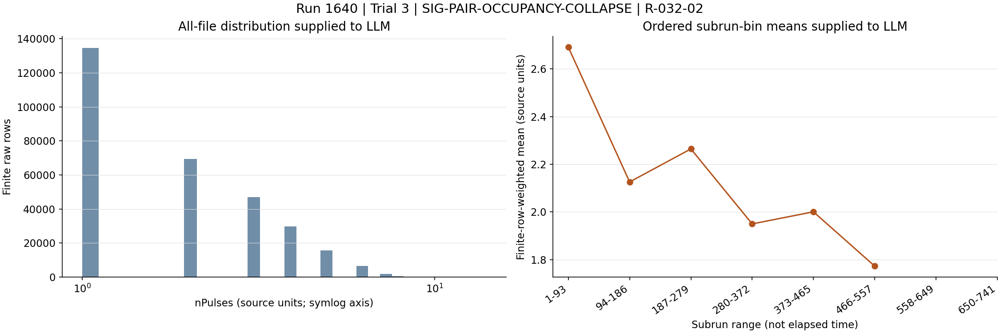

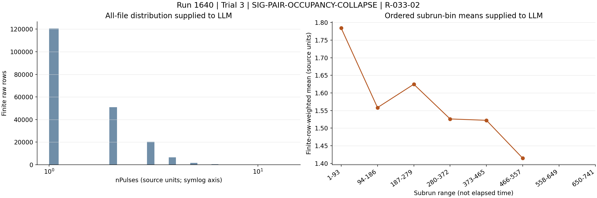

### SIG-FROZEN-ANOMALY-SEVERITY

The frozen detector monitor marks channel 32 anomalous in 740 of 741 subruns and channel 33 in 650, with 222 missing-channel classifications for each.

Role: supports

Cause link: The paired loss is the dominant persistent detector-channel anomaly rather than an isolated outlier.

Action link: Prioritize channels 32/33 and their shared acquisition path in diagnostic triage.

```text
A-032.anomalous_subruns = 740
A-032.method_counts = {"missing_channel":222,"statistical":226,"statistical+IF":292}
A-033.anomalous_subruns = 650
A-033.method_counts = {"missing_channel":222,"statistical":356,"statistical+IF":72}
```

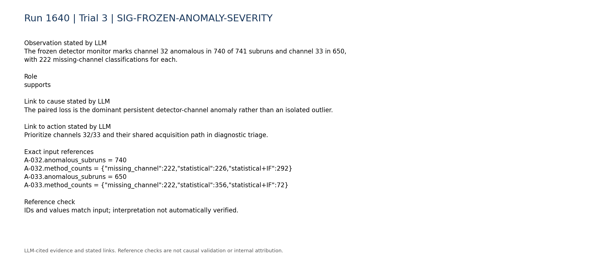

### SIG-LVDS-NOT-PERSISTENTLY-DEAD

The LVDS telemetry reports no persistent zero, missing, abnormally low or abnormally high signal pin.

Role: contradicts

Cause link: This weighs against a persistent trigger-board LVDS counter failure as the sole explanation, although aggregate LVDS summaries cannot exclude a short transition or a digitizer-side connection problem.

Action link: Check the mapped digitizer-side path and time-resolved pin behavior rather than assuming LVDS noise from channel numbering alone.

```text
C-lvds-003.text = "- Persistent zero signal pins: none."
C-lvds-004.text = "- Persistent missing signal pins: none."
C-lvds-005.text = "- Persistently abnormally low signal pins: none."
C-lvds-006.text = "- Persistently abnormally high signal pins: none."
```

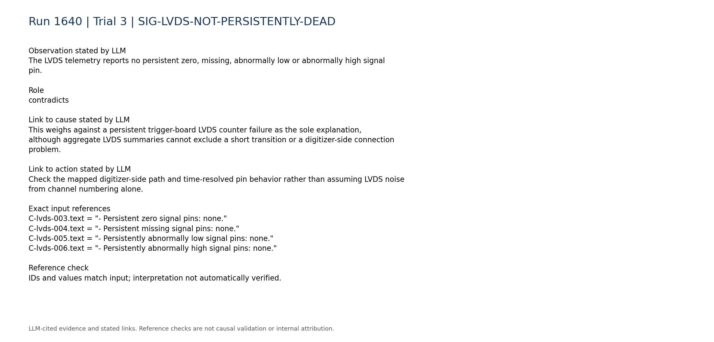

### SIG-NO-GLOBAL-TRIGGER-COLLAPSE-AT-520

The supplied trigger summary reports its largest total-rate transition near subrun 211 and its largest total-count transition near subrun 741, not at the channel-pair loss boundary.

Role: contradicts

Cause link: A run-wide trigger-rate collapse is not supported as the mechanism for the subrun-520 loss, though compact trigger telemetry cannot exclude path-specific changes.

Action link: Compare per-board and per-channel data flow at subrun 520 instead of treating the issue as a global trigger failure.

```text
C-trigger-001.text = "- Total trigger rate: median 6.092, range 4.079 to 15.13. Temporal behavior: large transition near subrun 211 (largest adjacent relative change 1.044)."
C-trigger-002.text = "- Total trigger counts: median 1003, range 350 to 1009. Temporal behavior: large transition near subrun 741 (largest adjacent relative change 0.651)."
```

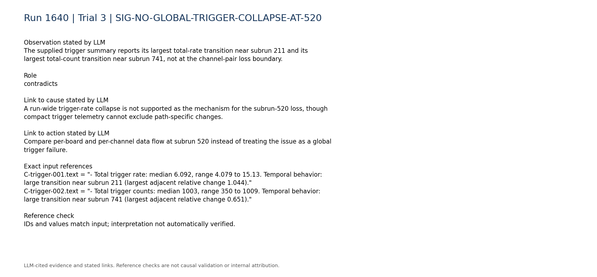

### SIG-COHERENT-GEOMETRIC-RATE-CHANGE

Other channels at the same column/row location in different layers—8, 56 and 80—also show decreasing occupancy over the run but remain nonzero.

Role: limitation

Cause link: Changing illumination, geometry or trigger acceptance may explain part of the pre-drop occupancy evolution, but it does not explain why only channels 32/33 become exactly absent for 222 consecutive subruns.

Action link: Use matched-geometry channels as controls when testing whether the loss is detector exposure or electronics/readout related.

```text
P-008.time_bin_occupancy = [0.193141,0.170157,0.179663,0.157205,0.160618,0.117352,0.062753,0.0614817]
P-056.time_bin_occupancy = [0.428085,0.390405,0.402853,0.368231,0.368298,0.299873,0.210214,0.208885]
P-080.time_bin_occupancy = [0.329767,0.301619,0.30938,0.283544,0.2862,0.237551,0.176654,0.174353]
```

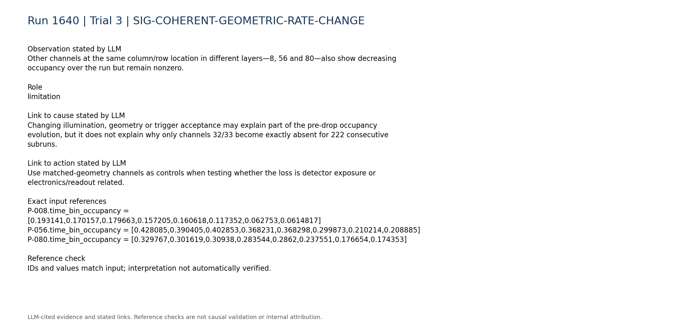

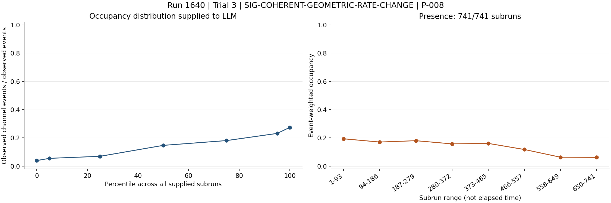

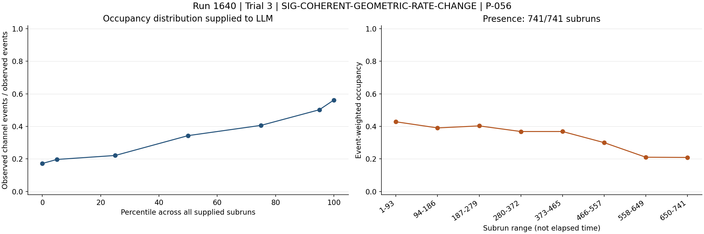

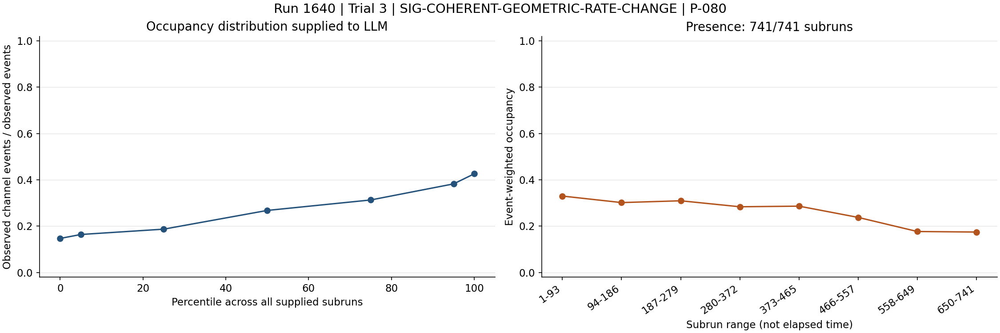

### SIG-TIMING-DATA-INTEGRITY

Timing fields on the final channel group are inconsistent with ordinary channels: channel 89 has a constant TDC of 149602000000000 with enormous nonzero rollovers, while channel 91 has TDC identically zero with enormous rollovers.

Role: supports

Cause link: This supports an additional digitizer-timing or schema/decoder integrity problem, but the summaries do not establish that it caused the channels 32/33 dropout.

Action link: Validate firmware, field layout and decoder logic for channels 88-95 independently before using timing measurements.

```text
R-089-09.mean = 149602000000000.0
R-089-09.std_population = 0.0
R-089-10.mean = 8.4779e+18
R-091-09.mean = 0.0
R-091-10.mean = 8.74662e+18
R-000-10.mean = 0.0
```

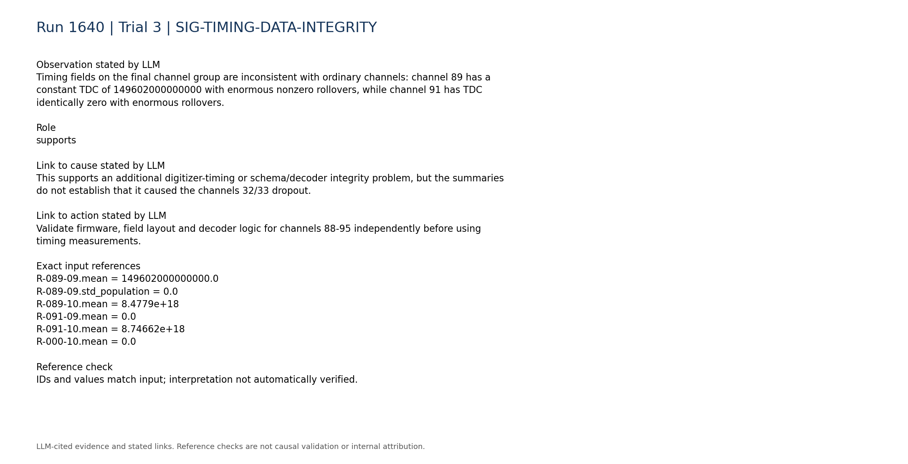

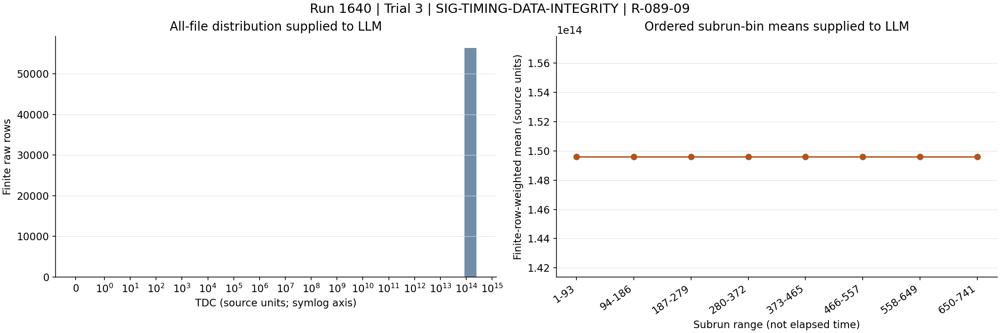

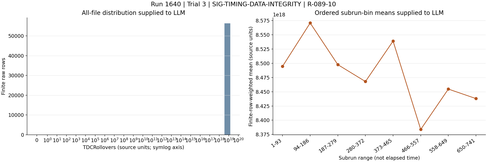

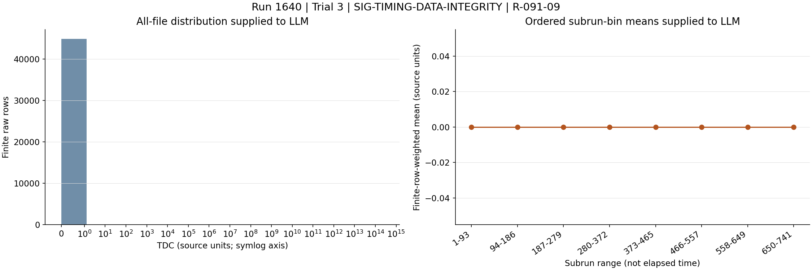

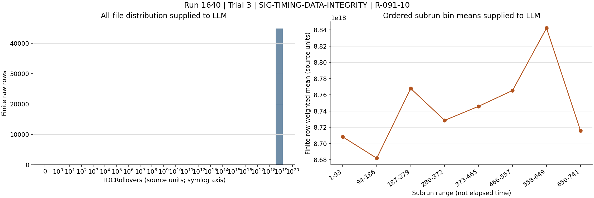

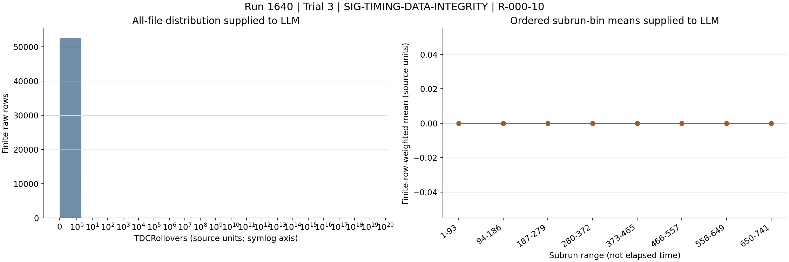

### SIG-MISSING-DISCRIMINATORS

Board matching, synchronization, queue occupancy and DAQ-state telemetry are unavailable, as is within-run configuration history and processed digitizer-rate consistency.

Role: limitation

Cause link: Without these discriminators, intentional reconfiguration, lockup, synchronization loss and downstream filtering cannot be separated.

Action link: Retrieve these telemetry and logs before selecting a definitive corrective action.

```text
C-daq_config-007.text = "- Within-run configuration changes: unavailable; only the static per-run configuration snapshot is parsed."
C-daq_config-008.text = "- Board matching, synchronization, queue occupancy, and DAQ-state telemetry: unavailable."
C-trigger-007.text = "- Digitizer-vs-trigger-board rate consistency: unavailable; no compact processed digitizer-rate telemetry was used."
```

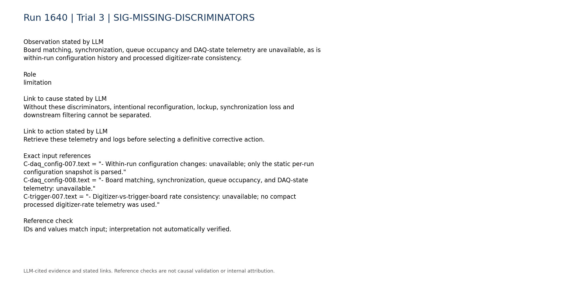

### SIG-HISTORICAL-PARTIAL-ANALOGY

The historical knowledge contains a digitizer-lockup case resolved by rebooting the DAQ PC, but its report does not establish the same paired-channel symptom or confirmed root cause.

Role: limitation

Cause link: This is only a mechanism-level analogy; there is no exact historical match for the current channel-pair dropout plus timing corruption.

Action link: Treat restart as conditional on confirming an unresponsive digitizer, not as an evidence-proven fix.

```text
H-1620.entry.category = "digitizer_lockup"
H-1620.entry.cause = "Digi1 locked up on the slab detector. The report notes that run 1620 may have had an unknown firmware version, but does not establish this as the confirmed cause."
H-1620.entry.action = "Restart the slab DAQ PC while the VME was powered off."
```

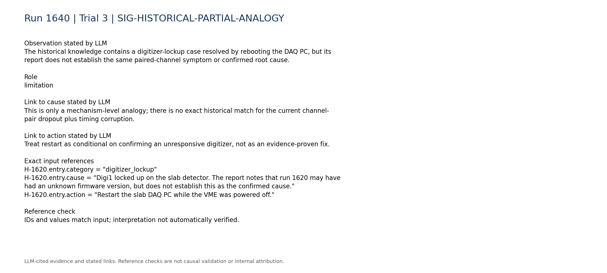

## Missing information

- Effective channel-enable, threshold and zero-suppression configuration before and after subrun 520
- Operator log, restart history and firmware/version changes at the 519-to-520 boundary
- Board matching, synchronization, DAQ-state, queue-occupancy and digitizer error/status telemetry
- Per-board event counts and processed digitizer rates compared with trigger-board rates
- Time-resolved LVDS count for the correctly mapped physical signal pin around subrun 520
- Raw event rows or waveforms showing whether channels 32/33 were absent from readout or merely produced no retained pulses
- Verified physical-pin-to-LVDS-to-digitizer mapping for the affected pair
- Expected TDC and TDCRollovers encoding, firmware schema and decoder behavior for channels 88-95
