# Run 1642 | Trial 1

## Diagnosis

Category: LVDS_signal_loss

Cause: Loss of the LVDS signal on physical signal pin 16, which maps to digitizer channels 32 and 33. The evidence localizes the failure to that shared LVDS path, but does not establish whether the underlying cause was an unseated/degraded connector or jumper, an upstream driver fault, or a transient configuration/state change. The reappearance of both channels in subruns 201-202 indicates recovery or intermittency rather than a permanently dead digitizer pair.

Action: Conditionally treat physical LVDS pin 16 and its shared path to digitizer channels 32/33 as the primary fault location: while the run is stopped, verify the repository mapping, inspect and reseat the pin, jumper, and associated connectors at both ends, and check continuity or swap the path with a known-good LVDS input. Start a new run after each change and confirm nonzero pin-16 counts and normal occupancy on both channels. Before physical intervention, compare subrun 200-201 configuration and DAQ-state logs to exclude an intentional enable/configuration change. Restart or service a digitizer only if board-matching, synchronization, or readout diagnostics specifically show a digitizer-state failure.

Confidence: 0.9

OBSERVED: channels 32 and 33 are absent in subruns 1-200 and appear only in 201-202; LVDS signal pin 16 is reported persistently zero/abnormally low, mapped to exactly those two channels, with its strongest transition near subrun 201. The static trigger-mask list does not include physical pin 16. INFERRED primary mechanism: a shared pin-16 LVDS signal-path outage suppressed both mapped channels. The exact physical or electronic root cause remains unknown. The simultaneous recovery of the pair favors an intermittent/restored shared path or a state/configuration change over two independent channel failures. ALTERNATIVES: an intentional within-run configuration change cannot be excluded because only a static snapshot is available; a digitizer lockup is less favored because the LVDS-board telemetry itself reports the mapped pin as zero, but board matching and synchronization telemetry are unavailable. The stable total trigger rate contradicts a high-rate LVDS-noise presentation. Broad anomalies and count transitions in subruns 201-202 may reflect a separate endpoint condition and do not identify the pin-16 root cause. No historical case is an exact match; run 2126 is only a partial connection-level analogy because it involved noisy/unmatched LVDS behavior rather than a persistently zero signal.

## LLM-cited signatures

LLM-cited evidence and stated links. Reference checks are not causal validation or internal attribution.

### SIG-PIN16-MAPPED-ZERO

The LVDS summary identifies signal pin 16 as persistently zero and maps it to digitizer channels 32/33.

Role: supports

Cause link: Directly localizes the observable signal loss to the one shared LVDS input serving the affected pair.

Action link: Prioritizes inspection and electrical testing of physical signal pin 16 and its associated connection path.

```text
C-lvds-003.text = "- Persistent zero signal pins: pin16->channels 32/33."
C-lvds-005.text = "- Persistently abnormally low signal pins: pin16->channels 32/33."
```

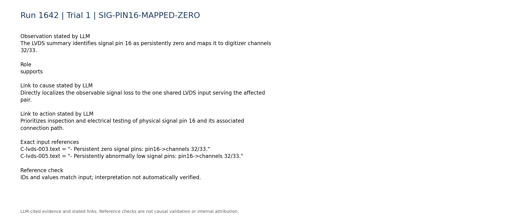

### SIG-CHANNEL32-ABSENCE

Channel 32 is absent in subruns 1-200, is present in only two subruns, and has extremely low event-weighted occupancy.

Role: supports

Cause link: Matches the expected digitizer-side symptom of losing the shared pin-16 LVDS signal.

Action link: Requires confirming restored occupancy on channel 32 after any pin-16 intervention.

```text
P-032.absent_subrun_ranges = [[1,200]]
P-032.present_subruns = 2
P-032.event_weighted_occupancy = 7.04456e-05
```

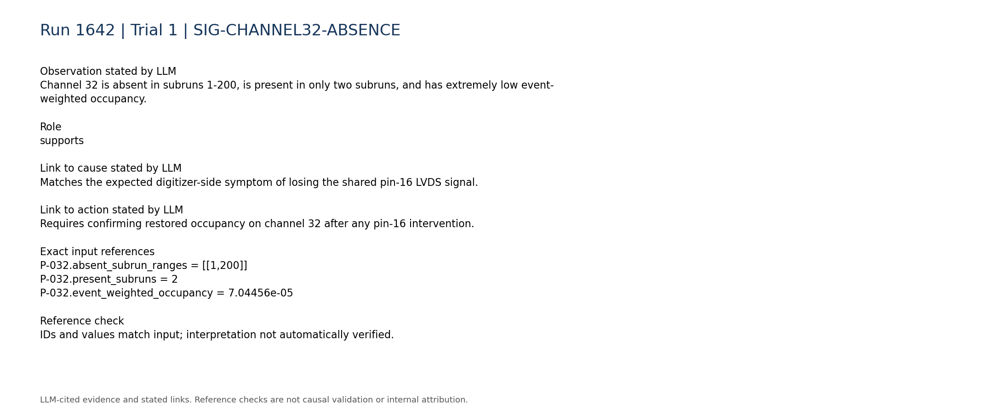

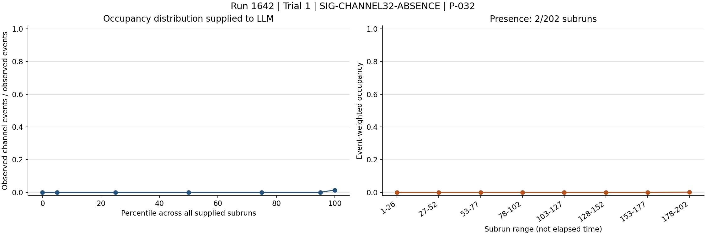

### SIG-CHANNEL33-ABSENCE

Channel 33 independently shows the same subrun absence pattern and similarly negligible occupancy.

Role: supports

Cause link: The paired behavior supports one shared LVDS-path failure rather than two unrelated channel faults.

Action link: Requires verifying both members of the mapped pair after repair; recovery of only one would argue for an additional digitizer-channel issue.

```text
P-033.absent_subrun_ranges = [[1,200]]
P-033.present_subruns = 2
P-033.event_weighted_occupancy = 6.54137e-05
```

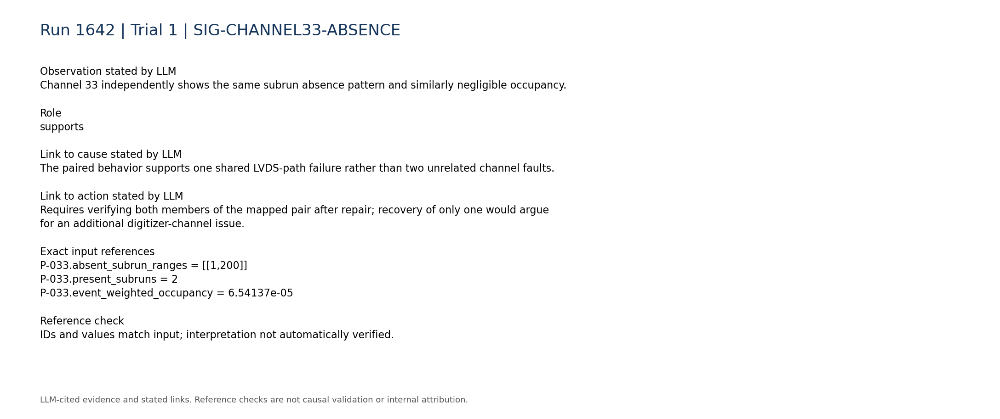


### SIG-PAIR-RECOVERY-201

Pin 16 has its strongest transition near subrun 201, coincident with channels 32 and 33 becoming present.

Role: supports

Cause link: Temporal coincidence reinforces the shared-path localization, while the recovery indicates intermittency or a state change rather than permanent hardware death.

Action link: Motivates comparing subrun 200-201 configuration/state records and reproducing the transition through controlled connection tests.

```text
C-lvds-007.text = "- Strongest pin transitions: pin16->channels 32/33 near subrun 201 (relative change 1580)."
R-032-02.largest_adjacent_mean_change = {"means":[4.66667,14.5],"subruns":[201,202]}
R-033-02.largest_adjacent_mean_change = {"means":[1.09091,8.0],"subruns":[201,202]}
```

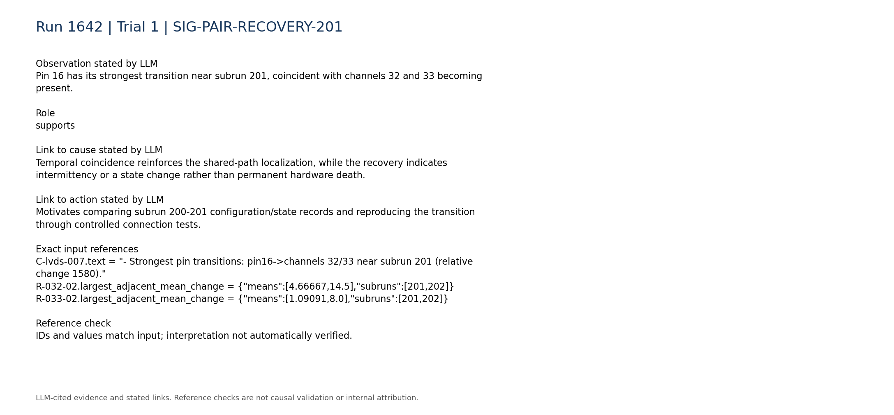

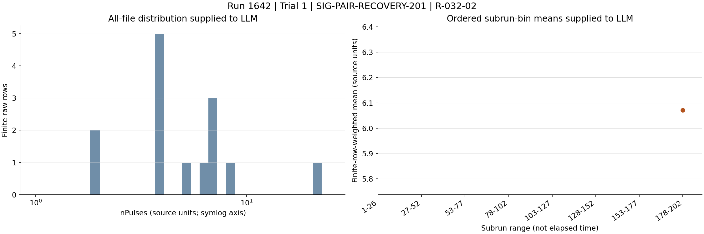

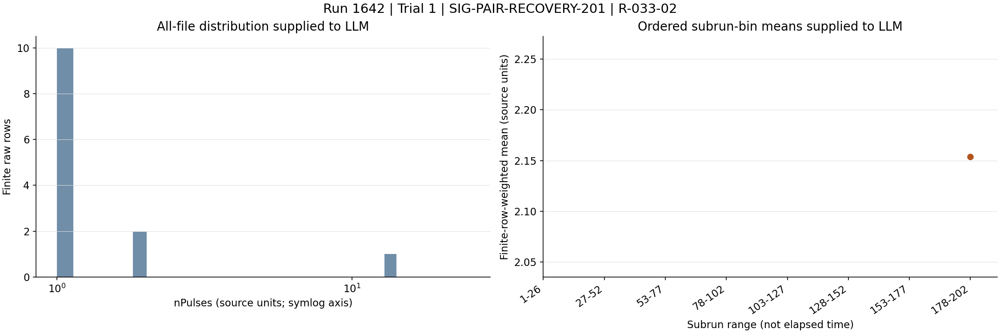

### SIG-NOT-STATICALLY-MASKED

The static trigger-mask snapshot lists 14 masked physical pins, but physical pin 16 is not among them.

Role: supports

Cause link: Makes an intentional static mask of physical pin 16 less likely; mask indices are physical pins and must not be equated with digitizer channel numbers.

Action link: Check the physical-pin mapping and dynamic configuration logs before changing any mask or cable.

```text
C-daq_config-003.text = "- Trigger mask: 50 unmasked, 14 masked physical pins."
C-daq_config-004.text = "- Masked physical pins: 32, 33, 34, 35, 36, 37, 38, 39, 43, 57, 58, 59, 60, 61."
```

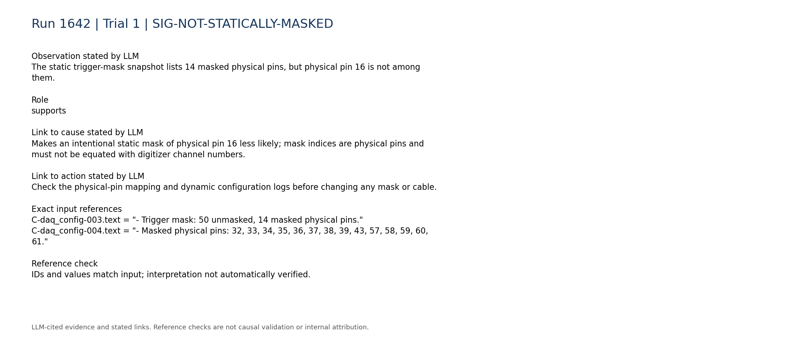

### SIG-RECOVERY-CONTRADICTS-PERMANENT-FAILURE

Both affected channels contain finite measurements in subruns 201-202 rather than remaining absent through the entire run.

Role: contradicts

Cause link: Contradicts a permanently dead channel pair or irreversible digitizer failure, but does not distinguish intermittent contact, restored electronics, or a configuration change.

Action link: Use continuity tests, controlled swaps, and subrun-boundary logs rather than immediately replacing the digitizer.

```text
P-032.present_subruns = 2
P-033.present_subruns = 2
R-032-09.n = 14
R-033-09.n = 13
```

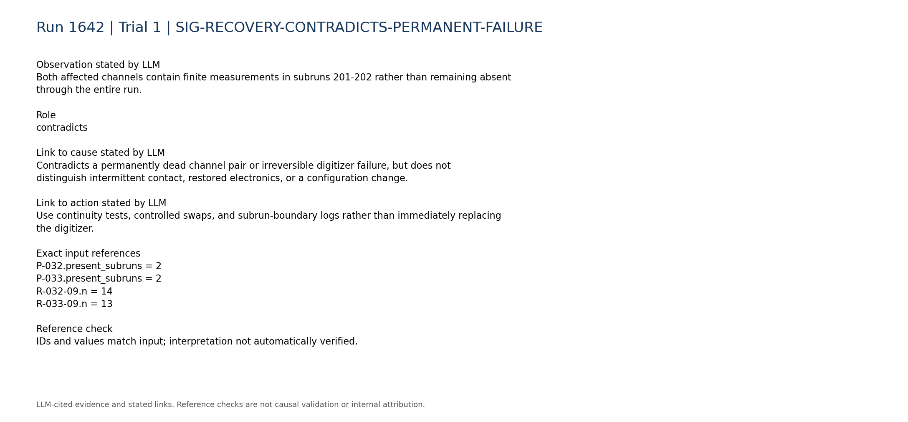

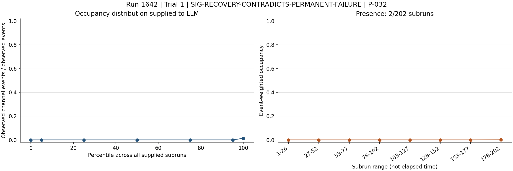


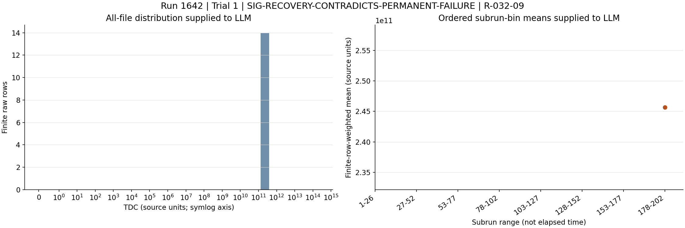

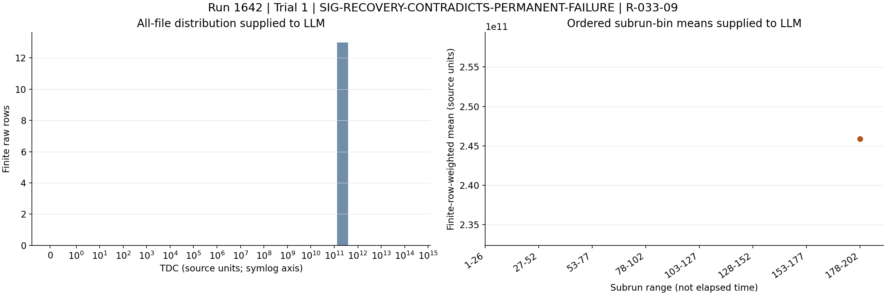

### SIG-NO-HIGH-RATE-PRESENTATION

The total trigger rate is summarized as stable/persistent rather than exhibiting a high-rate transition.

Role: contradicts

Cause link: Argues against directly classifying this case as the high-rate LVDS-noise mechanism seen in historical cases; a zero-signal outage is the observed symptom here.

Action link: Do not apply trigger masking merely as a high-rate mitigation unless direct rate or queue diagnostics establish that separate condition.

```text
C-trigger-001.text = "- Total trigger rate: median 4.454, range 4.132 to 5.262. Temporal behavior: stable/persistent."
```

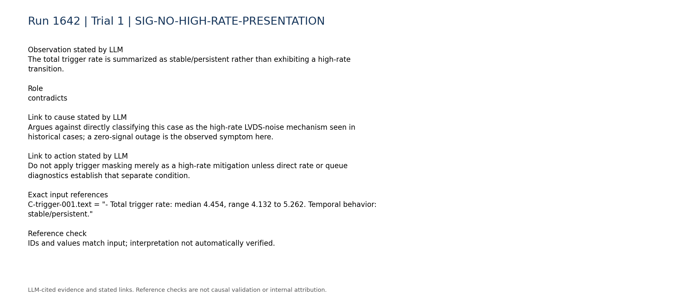

### SIG-CONFIG-DAQ-TELEMETRY-GAP

Within-run configuration changes, board matching, synchronization, queue occupancy, and DAQ-state telemetry are unavailable.

Role: limitation

Cause link: Prevents distinguishing a physical LVDS interruption from a dynamic enable/state change or a readout synchronization failure with certainty.

Action link: Retrieve these logs around the subrun 200-201 boundary before escalating to component replacement or restart.

```text
C-daq_config-007.text = "- Within-run configuration changes: unavailable; only the static per-run configuration snapshot is parsed."
C-daq_config-008.text = "- Board matching, synchronization, queue occupancy, and DAQ-state telemetry: unavailable."
```

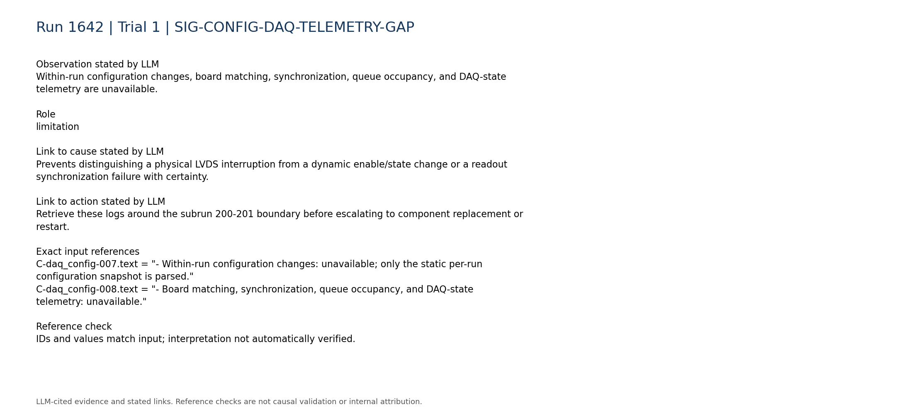

### SIG-ENDPOINT-GLOBAL-TRANSITION

Many channels become anomalous at the endpoint, while trigger and total LVDS counts both have large transitions near subrun 202.

Role: limitation

Cause link: Shows a broader endpoint condition that may affect subrun-level statistics, but it does not explain the pin-16 zero state and channel absence over subruns 1-200.

Action link: Analyze endpoint exposure and DAQ-state information separately so the global final-subrun transition is not mistaken for the long-lived pin-16 fault.

```text
A-ALL.anomalous_channel_count_by_subrun.200 = 33
A-ALL.anomalous_channel_count_by_subrun.201 = 63
C-trigger-002.text = "- Total trigger counts: median 1003, range 82 to 1008. Temporal behavior: large transition near subrun 202 (largest adjacent relative change 0.9184)."
C-lvds-001.text = "- Total LVDS counts: median 1.54e+07, range 1.68e+06 to 1.62e+07. Temporal behavior: large transition near subrun 202 (largest adjacent relative change 0.8911)."
```

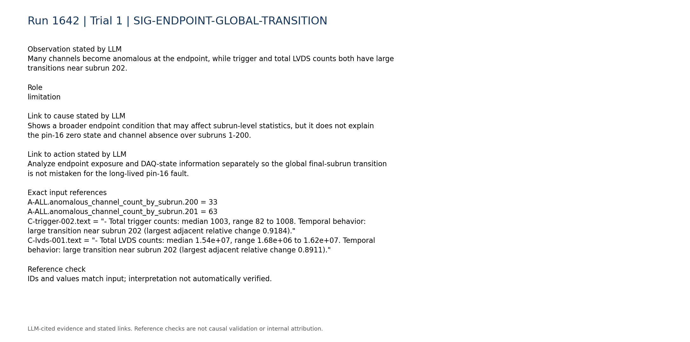

### SIG-HISTORICAL-PARTIAL-ANALOGY

Historical run 2126 linked a mapped digitizer channel pair to an intermittent or degraded LVDS-pin, jumper-wire, or signal connection, but its symptom was noisy unmatched events rather than a zero signal.

Role: limitation

Cause link: Provides only a connection-level analogy and is not an exact diagnostic match for the current zero-pin observation.

Action link: Supports cautious use of mapping verification, reseating, and isolation tests, while requiring current-case confirmation before applying historical fixes.

```text
H-2126.entry.category = "LVDS_noise"
H-2126.entry.cause = "DAQ board-matching efficiency dropped below 100% beginning in run 2126, file 26, around event 700. The DAQ queue filled with mostly empty, unmatched digitizer events and the apparent digitizer trigger rate became abnormally high while the trigger-board files remained normal. Trigger-mask tests localized the problem to digitizer 0 LVDS channel 0, corresponding to detector channels 0 and 1. The subsequent intervention indicated an intermittent or degraded LVDS-pin, jumper-wire, or MCX signal connection."
```

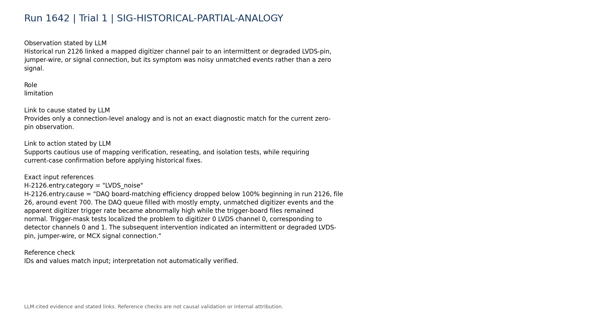

### SIG-INDEPENDENT-TDC-IRREGULARITIES

Several upper channels have persistent, mutually inconsistent TDC/rollover summaries, including a constant very large TDC on channel 88 and zero TDC with huge rollovers on channel 91.

Role: limitation

Cause link: These appear to be a separate timing-field interpretation, sentinel, or data-integrity issue and are not explained by the pin-16 outage; no good raw reference is supplied to classify them.

Action link: Validate TDC/rollover decoding and channel-specific firmware semantics independently rather than folding those observations into the LVDS pin-16 repair.

```text
R-088-09.mean = 149602000000000.0
R-088-09.std_population = 0.0
R-091-09.mean = 0.0
R-091-10.mean = 8.77255e+18
```

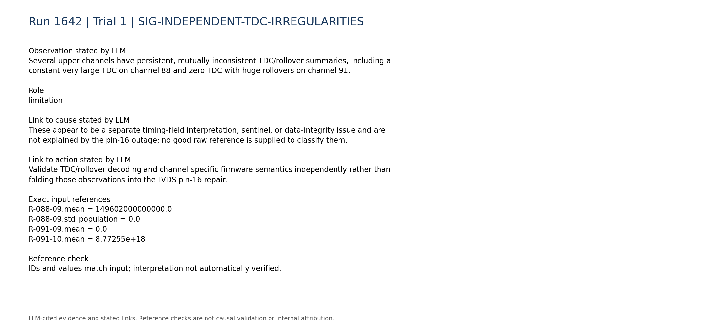

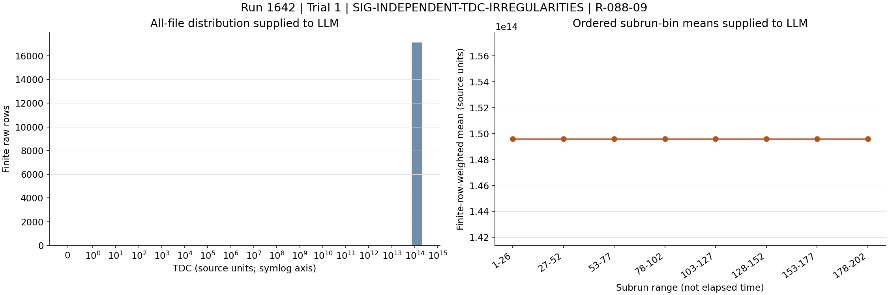

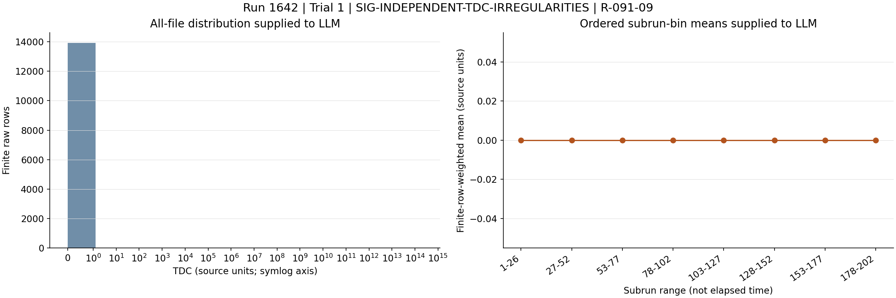

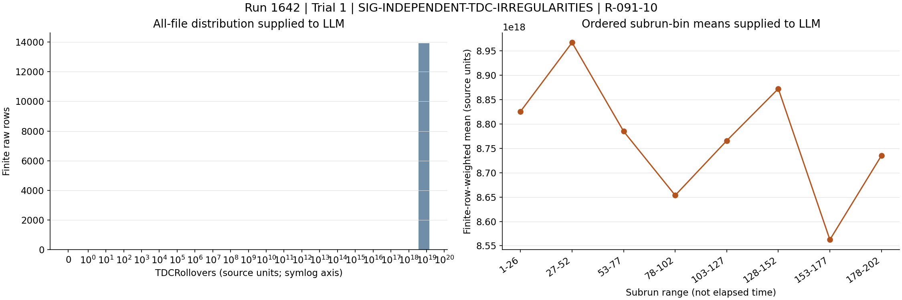

## Missing information

- Direct per-subrun pin-16 counts and waveforms around the subrun 200-201 transition.
- Within-run trigger/LVDS configuration and enable-state changes, especially at the subrun 200-201 boundary.
- Board-matching efficiency, digitizer synchronization, queue occupancy, and DAQ-state/error logs.
- Physical inspection, continuity measurements, connector seating status, and controlled cable or input-swap results for pin 16.
- A known-good reference run using the same firmware, mapping, thresholds, and data format.
- Interpretation or sentinel conventions for the anomalous TDC and TDCRollovers values on upper channels.
- Subrun exposure or elapsed-duration information needed to interpret the broad count drops near subrun 202.
