# Run 1642 | Trial 2

## Diagnosis

Category: localized_lvds_signal_loss

Cause: The observed mechanism is a localized loss or inactivity of the LVDS signal on pin 16, which maps to digitizer channels 32 and 33: both channels are absent for subruns 1-200 while the pin is persistently zero, followed by limited reappearance in subruns 201-202. The underlying root cause is unknown. The leading hypotheses are an intermittent/degraded LVDS connection, cable or trigger-board input, or an unintended source/configuration disablement; the supplied evidence cannot distinguish these.

Action: First verify that LVDS pin 16 and its mapped digitizer channels 32/33 were intended to be enabled, using the physical-pin mapping rather than equating mask indices with digitizer channels. With the run stopped, inspect and reseat the pin-16 LVDS connector and associated jumper/cable at both ends, then start a short validation run and confirm stable pin counts, channel occupancy, and board matching. If movement changes the behavior or the path remains intermittently dead, conditionally replace or swap the cable/connection and retest. If the hardware path is sound, inspect source enablement and within-run configuration. Separately validate the timing-field decoding for channels 88-95 before treating their TDC/rollover values as detector behavior.

Confidence: 0.91

OBSERVED: LVDS pin 16 is the only persistently zero/abnormally low signal pin and is explicitly mapped to channels 32/33. Both channels are absent in subruns 1-200 and have only 14 and 13 supplied rows after reappearing in subruns 201-202. Pin 16 also has the strongest transition near subrun 201. INFERRED: this establishes a localized inactive LVDS path as the primary mechanism and favors an intermittent connection or enablement problem over a detector-wide DAQ failure. UNKNOWN: the evidence does not establish whether the root fault is a connector, cable, board input, upstream source, or configuration state. Trigger rate is stable overall, arguing against a sustained global trigger failure. The large count reductions and broad channel anomalies at the final subruns are an exposure/end-of-run confound and do not explain the preceding 200-subrun absence. No historical case is an exact match; runs 2068, 2071, and 2126 are only partial LVDS-connection analogies and involved noise/rate or board-matching symptoms rather than a persistent zero pin. Separate extreme or constant TDC/rollover fields on channels 88-95 remain unresolved and may represent an independent timing-decoding issue.

## LLM-cited signatures

LLM-cited evidence and stated links. Reference checks are not causal validation or internal attribution.

### SIG-LOCAL-PAIR-ABSENT-32

Channel 32 is absent in subruns 1-200, is present in only 2 of 202 subruns, and has event-weighted occupancy 7.04456e-05.

Role: supports

Cause link: Directly supports a persistent localized loss of channel-32 data rather than an isolated statistical outlier.

Action link: Requires checking the shared LVDS path and intended enablement before applying a hardware fix.

```text
P-032.absent_subrun_ranges = [[1,200]]
P-032.present_subruns = 2
P-032.event_weighted_occupancy = 7.04456e-05
```

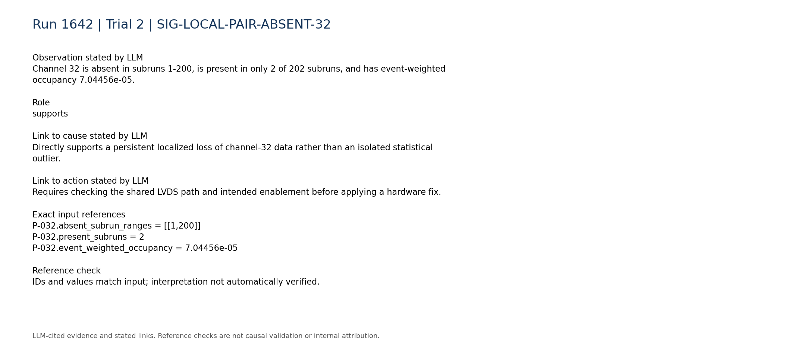

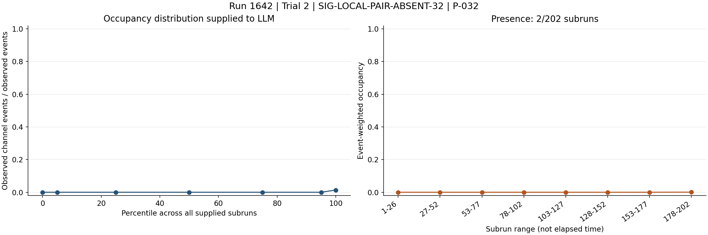

### SIG-LOCAL-PAIR-ABSENT-33

Channel 33 independently shows the same paired behavior: absent in subruns 1-200, present in only 2 subruns, with event-weighted occupancy 6.54137e-05.

Role: supports

Cause link: The coincidence on both channels of a mapped pair strongly favors a shared LVDS-path mechanism over two unrelated channel faults.

Action link: Inspect and test the common pin-16 connection before troubleshooting channels 32 and 33 separately.

```text
P-033.absent_subrun_ranges = [[1,200]]
P-033.present_subruns = 2
P-033.event_weighted_occupancy = 6.54137e-05
```

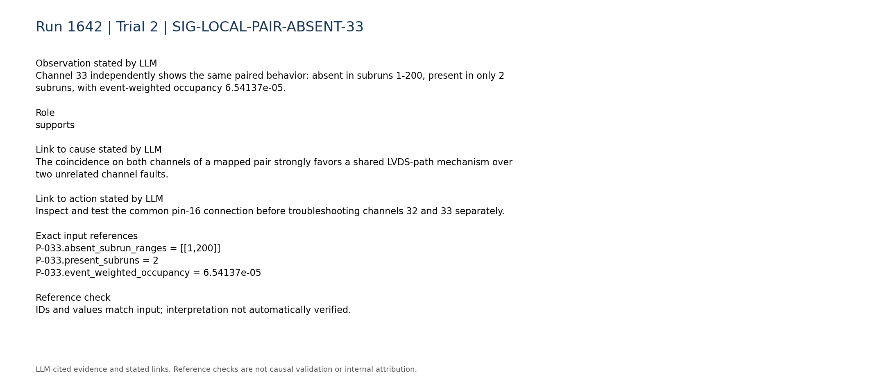


### SIG-LVDS-PIN16-ZERO-MAPPING

The supplied LVDS classification identifies pin 16 as the persistent zero and abnormally low signal pin and maps it to channels 32/33.

Role: supports

Cause link: Links the channel-pair absence to a specific localized LVDS signal path; it establishes the mechanism but not whether the root cause is hardware or configuration.

Action link: Use this explicit mapping for cable and board inspection; do not infer the affected digitizer channels from similarly numbered mask indices.

```text
C-lvds-003.text = "- Persistent zero signal pins: pin16->channels 32/33."
C-lvds-005.text = "- Persistently abnormally low signal pins: pin16->channels 32/33."
C-lvds-008.text = "- Mapping basis: repository mapping for 48 signal pins; non-signal LVDS columns are omitted from abnormal-pin classification."
```

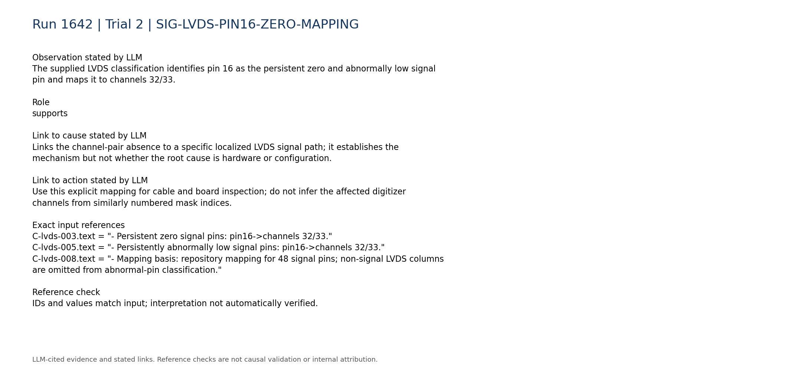

### SIG-PIN16-LATE-TRANSITION

Pin 16 has the strongest LVDS transition near subrun 201, while channels 32 and 33 contain measurements only in subruns 201-202.

Role: supports

Cause link: The late reappearance favors an intermittent path or state change over a permanently uninstrumented channel pair, but it does not identify what changed.

Action link: Reproduce the transition with controlled connector/cable changes and inspect configuration or DAQ state around subrun 201.

```text
C-lvds-007.text = "- Strongest pin transitions: pin16->channels 32/33 near subrun 201 (relative change 1580)."
P-032.absent_subrun_ranges = [[1,200]]
P-033.absent_subrun_ranges = [[1,200]]
```

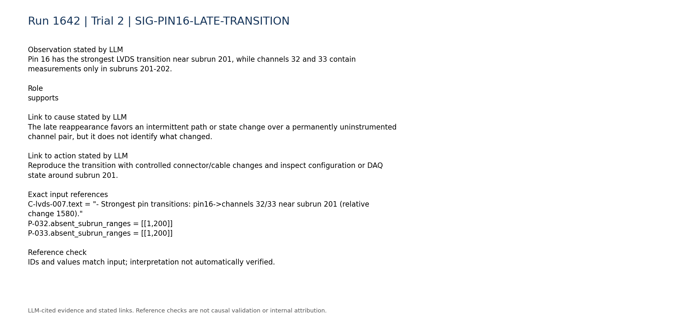


### SIG-TRIGGER-NOT-GLOBALLY-FAILED

The total trigger rate is described as stable and persistent, with median 4.454 and range 4.132 to 5.262.

Role: contradicts

Cause link: Contradicts a sustained detector-wide trigger outage as the primary explanation, while remaining compatible with one inactive LVDS input pair.

Action link: Prioritize localized pin/cable/source checks rather than a broad trigger restart unless board-state telemetry reveals a wider problem.

```text
C-trigger-001.text = "- Total trigger rate: median 4.454, range 4.132 to 5.262. Temporal behavior: stable/persistent."
```

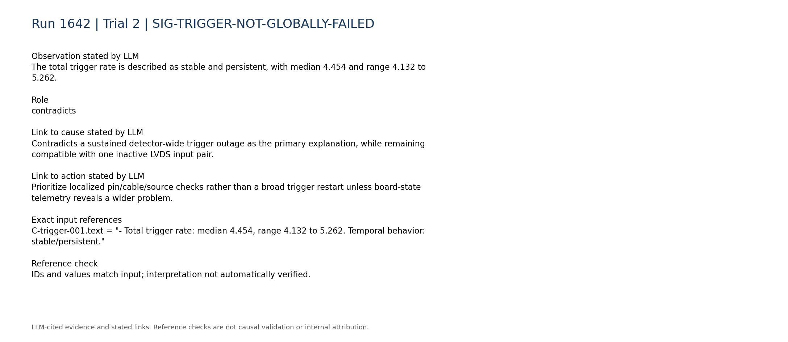

### SIG-END-OF-RUN-EXPOSURE-CONFOUND

Trigger and LVDS total counts both undergo large reductions near subrun 202, and the anomaly overview rises to 33 anomalous channels at subrun 201 and 63 at subrun 202.

Role: limitation

Cause link: The final-subrun count reduction can generate broad nPulses anomalies and limits interpretation of the late measurements, but it cannot explain why channels 32/33 were absent for subruns 1-200.

Action link: Normalize validation comparisons for subrun exposure and confirm the pin-16 recovery in a new full-length run.

```text
C-trigger-002.text = "- Total trigger counts: median 1003, range 82 to 1008. Temporal behavior: large transition near subrun 202 (largest adjacent relative change 0.9184)."
C-lvds-001.text = "- Total LVDS counts: median 1.54e+07, range 1.68e+06 to 1.62e+07. Temporal behavior: large transition near subrun 202 (largest adjacent relative change 0.8911)."
A-ALL.anomalous_channel_count_by_subrun.200 = 33
A-ALL.anomalous_channel_count_by_subrun.201 = 63
```

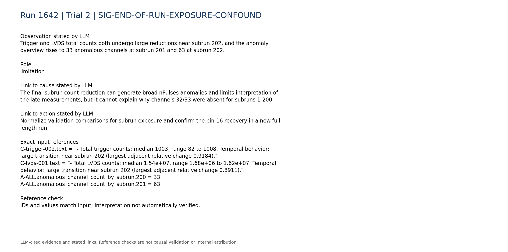

### SIG-DISCRIMINATING-TELEMETRY-UNAVAILABLE

Within-run configuration changes, board matching, synchronization, queue occupancy, and DAQ-state telemetry are unavailable.

Role: limitation

Cause link: Prevents distinguishing a physical LVDS interruption from source disablement, configuration change, or unmatched-board behavior.

Action link: Collect these telemetry sources during a controlled retest before declaring the cable or board defective.

```text
C-daq_config-007.text = "- Within-run configuration changes: unavailable; only the static per-run configuration snapshot is parsed."
C-daq_config-008.text = "- Board matching, synchronization, queue occupancy, and DAQ-state telemetry: unavailable."
C-trigger-007.text = "- Digitizer-vs-trigger-board rate consistency: unavailable; no compact processed digitizer-rate telemetry was used."
```

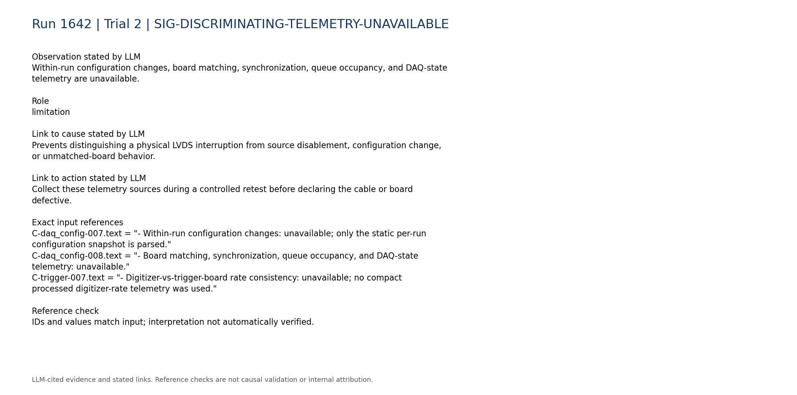

### SIG-TIMING-FIELDS-INDEPENDENT-ANOMALY

There are separate persistent timing-field discontinuities outside channels 32/33: channel 88 has constant TDC 149602000000000 and constant TDCRollovers 1103820000000, while channel 91 has TDC fixed at zero and extremely large nonzero TDCRollovers.

Role: limitation

Cause link: These values are not explained by the pin-16 signal loss and indicate a potentially independent timing-decoding, schema, or data-field problem; without a good raw reference they are not assigned as the primary cause.

Action link: Validate timing-field types, units, firmware/schema compatibility, and raw decoding for channels 88-95 separately.

```text
R-088-09.mean = 149602000000000.0
R-088-09.std_population = 0.0
R-088-10.mean = 1103820000000.0
R-091-09.mean = 0.0
R-091-10.mean = 8.77255e+18
```

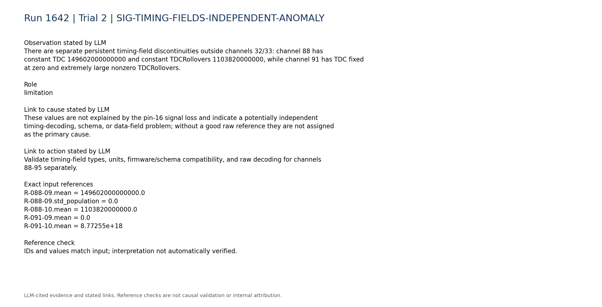

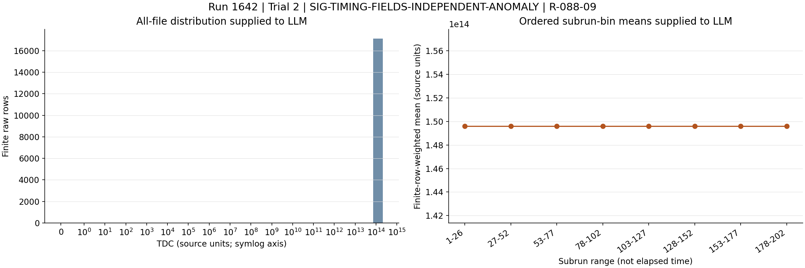

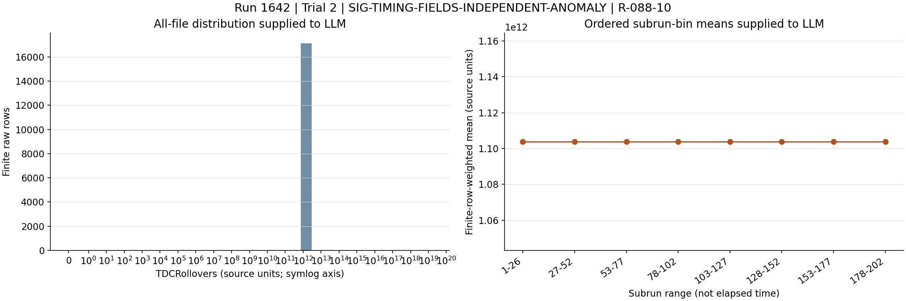

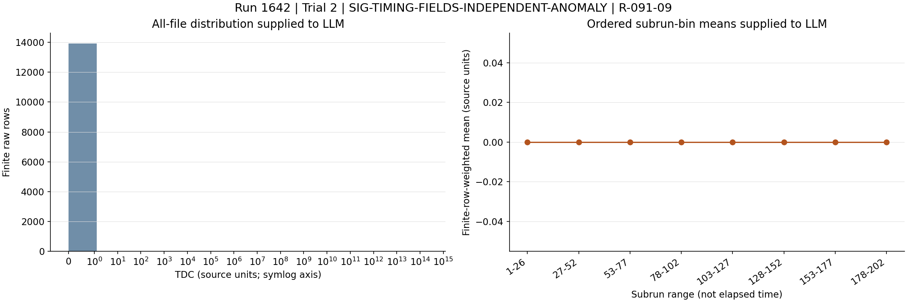

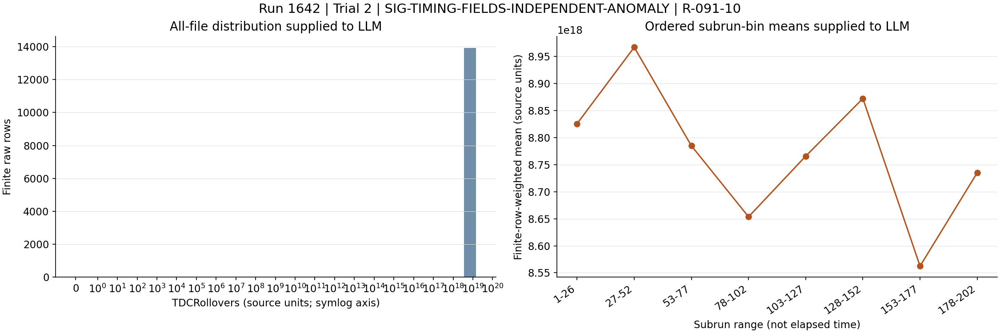

### SIG-HISTORICAL-ANALOGY-NOT-EXACT

Historical runs 2068, 2071, and 2126 concern LVDS connection problems, but their recorded category is LVDS_noise and run 2126 specifically involved abnormal rates, unmatched events, and board-matching loss rather than a persistently zero pin.

Role: limitation

Cause link: Provides only a partial analogy supporting inspection of LVDS connections; it does not prove that the current zero pin has the same physical cause.

Action link: Borrow the controlled reseat/isolation procedure, but require current-case confirmation before replacement or masking.

```text
H-2068.entry.category = "LVDS_noise"
H-2071.entry.category = "LVDS_noise"
H-2126.entry.category = "LVDS_noise"
H-2126.entry.cause = "DAQ board-matching efficiency dropped below 100% beginning in run 2126, file 26, around event 700. The DAQ queue filled with mostly empty, unmatched digitizer events and the apparent digitizer trigger rate became abnormally high while the trigger-board files remained normal. Trigger-mask tests localized the problem to digitizer 0 LVDS channel 0, corresponding to detector channels 0 and 1. The subsequent intervention indicated an intermittent or degraded LVDS-pin, jumper-wire, or MCX signal connection."
```

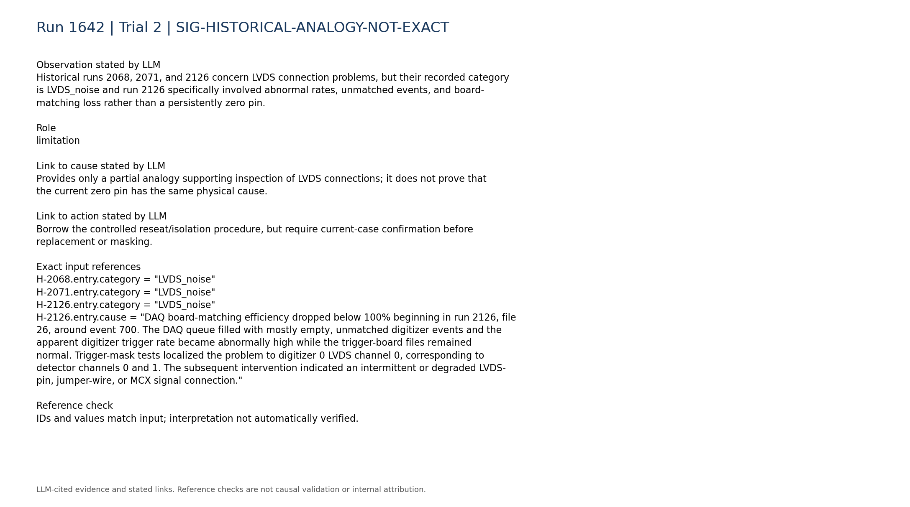

## Missing information

- Whether LVDS pin 16 and digitizer channels 32/33 were intentionally disabled or disconnected for subruns 1-200.
- Per-subrun configuration history, including source enables and any changes around subrun 201.
- Trigger-board versus digitizer per-input rates for pin 16 and channels 32/33.
- Board-matching efficiency, synchronization status, unmatched-event counts, and DAQ queue occupancy.
- Electrical continuity or swap-test results for the pin-16 connector, jumper, cable, board input, and upstream signal source.
- A full-length post-intervention run showing whether channels 32/33 remain stably present.
- Raw waveform or event-level data for the sparse channel-32/33 reappearance.
- Firmware/schema and raw-decoder validation for the anomalous TDC and TDCRollovers fields on channels 88-95.
