# Run 1642 | Trial 3

## Diagnosis

Category: persistent_lvds_signal_loss

Cause: The observed mechanism is loss of the signal on LVDS physical pin 16, the mapped path for digitizer channels 32 and 33, causing those channels to be absent in subruns 1-200. Their sparse reappearance in subruns 201-202 suggests an intermittent or restored path. The underlying root cause is unknown; plausible causes include an unseated/degraded pin, jumper or cable, a failed upstream signal source, or an unrecorded configuration/electronics-state change.

Action: With the run stopped, verify the repository mapping and inspect, continuity-test, and carefully reseat the physical LVDS pin-16 path at both ends, including its jumper and associated signal connections. Start a new run after each change and confirm that channels 32 and 33 have sustained occupancy and that pin 16 has normal counts. Before replacing hardware, compare live source signals at the digitizer and trigger-board ends and inspect within-run configuration, board-matching, synchronization, and queue telemetry. Replace or repair a cable/pin/source component only if these checks localize the loss; if an undocumented configuration change explains it, restore and record the intended configuration instead.

Confidence: 0.92

OBSERVED: LVDS pin 16 is the only persistently zero/abnormally low signal pin and is mapped to channels 32/33. Both channels are absent from raw presence data for subruns 1-200 and have only 14 and 13 supplied rows after appearing in subruns 201-202. Pin 16 has a strong transition near subrun 201. The static trigger mask does not list physical pin 16, while total trigger rate is described as stable. INFERRED: the primary mechanism is a localized loss of the pin-16 LVDS signal path, not a detector-wide trigger-rate failure. Sparse late reappearance favors intermittency or restoration but does not identify whether the fault is a connector/cable, source electronics, or an unlogged state/configuration change. The widespread channel anomalies at subruns 201-202 are partly confounded by a run-wide count reduction near subrun 202 and are secondary to the persistent channel-32/33 loss. No historical case is an exact match: runs 2068, 2071, and 2126 are only partial analogies involving degraded LVDS connections, and their reported high-rate or board-matching symptoms are not observed here. UNKNOWN: board matching, synchronization, queue state, endpoint signal levels, within-run configuration changes, and physical continuity are unavailable, so the hardware-level root cause remains unconfirmed.

## LLM-cited signatures

LLM-cited evidence and stated links. Reference checks are not causal validation or internal attribution.

### sig-localized-pin16-zero

The LVDS summary identifies physical pin 16 as the persistent zero signal pin mapped to digitizer channels 32 and 33, with no other persistent missing signal pins.

Role: supports

Cause link: Supports a localized pin-16 signal-path loss rather than a broad LVDS-input failure.

Action link: Prioritizes inspection and endpoint signal comparison on physical pin 16 and the mapped 32/33 pair.

```text
C-lvds-003.text = "- Persistent zero signal pins: pin16->channels 32/33."
C-lvds-004.text = "- Persistent missing signal pins: none."
C-lvds-005.text = "- Persistently abnormally low signal pins: pin16->channels 32/33."
```

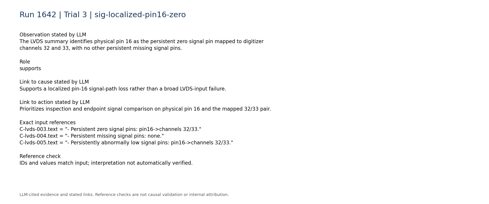

### sig-ch32-ch33-missing-200

Channels 32 and 33 are each absent in subruns 1-200 and present in only two subruns.

Role: supports

Cause link: The matching two-channel absence corroborates failure of their shared mapped LVDS path.

Action link: Recovery testing must require sustained presence of both channels, not merely isolated events.

```text
P-032.absent_subrun_ranges = [[1,200]]
P-032.present_subruns = 2
P-033.absent_subrun_ranges = [[1,200]]
P-033.present_subruns = 2
```

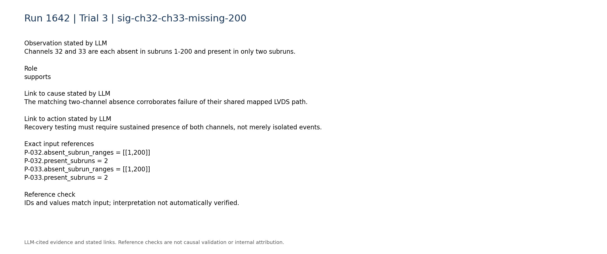

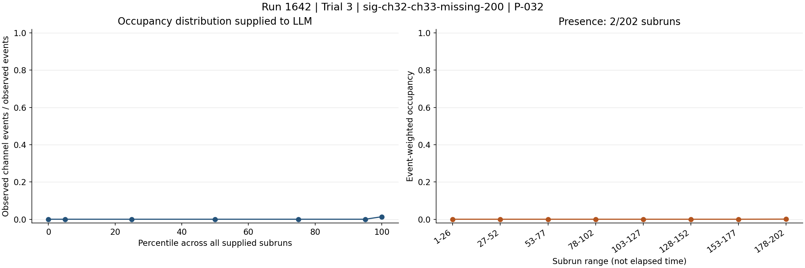


### sig-sparse-late-reappearance

Pin 16 has its strongest transition near subrun 201, while the two recovered channels contain only 14 and 13 supplied rows respectively.

Role: supports

Cause link: Sparse reappearance supports intermittency or restoration, but does not distinguish a mechanical connection from an electronics or configuration transition.

Action link: Inspect change logs and endpoint signals around subrun 201 and require a new-run persistence test after intervention.

```text
C-lvds-007.text = "- Strongest pin transitions: pin16->channels 32/33 near subrun 201 (relative change 1580)."
R-032-02.n = 14
R-033-02.n = 13
```

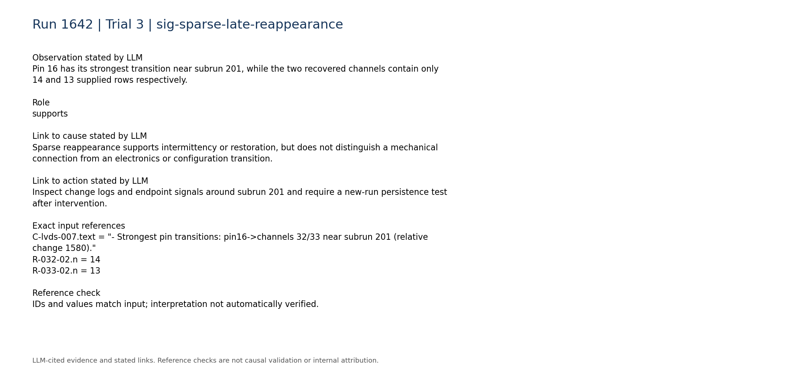

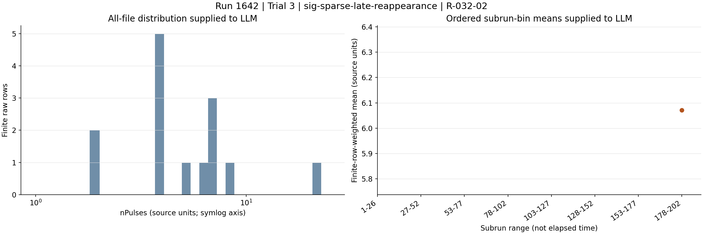

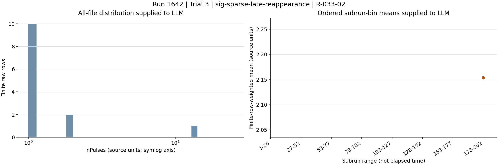

### sig-static-mask-does-not-explain-pin16

The supplied static trigger mask lists physical pins 32-39, 43, and 57-61 as masked; physical pin 16 is not listed.

Role: contradicts

Cause link: Contradicts an explanation based solely on the supplied static mask, while not excluding an unrecorded within-run configuration state.

Action link: Verify live configuration and mapping before attributing the loss to hardware.

```text
C-daq_config-004.text = "- Masked physical pins: 32, 33, 34, 35, 36, 37, 38, 39, 43, 57, 58, 59, 60, 61."
```

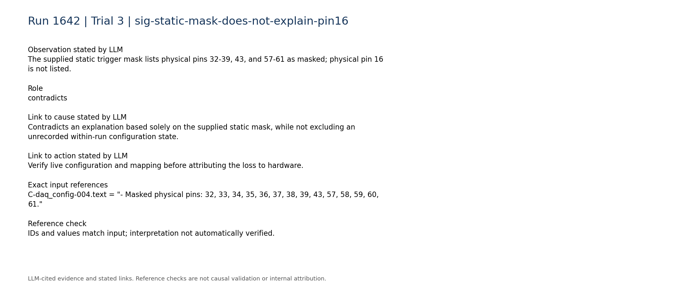

### sig-no-high-rate-state

The total trigger rate is described as stable and persistent, with a median of 4.454 and range 4.132 to 5.262.

Role: contradicts

Cause link: Argues against the high-trigger-rate manifestation reported in the historical LVDS-noise cases; those cases are not exact matches.

Action link: Do not mask channels or treat this as a high-rate noise condition unless live rate or board-matching checks establish that diagnosis.

```text
C-trigger-001.text = "- Total trigger rate: median 4.454, range 4.132 to 5.262. Temporal behavior: stable/persistent."
```

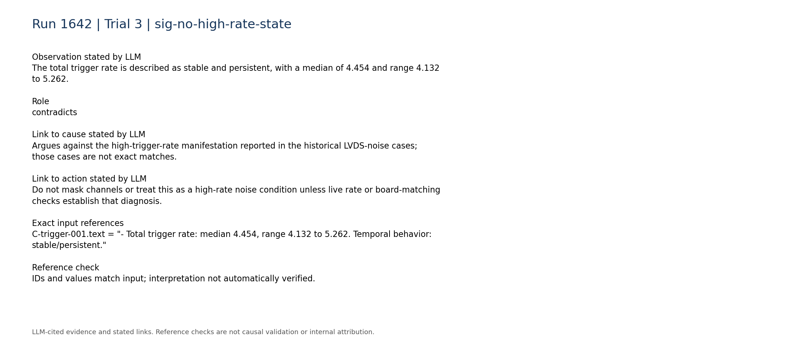

### sig-end-run-global-count-confound

Both total trigger counts and total LVDS counts have large reductions near subrun 202.

Role: limitation

Cause link: The global end-run reduction can contribute to widespread subrun-202 statistical anomalies, but cannot explain why only channels 32/33 were absent for the preceding 200 subruns.

Action link: Evaluate subruns 201-202 separately from the persistent loss and compare normalized rates or a new full-length run.

```text
C-trigger-002.text = "- Total trigger counts: median 1003, range 82 to 1008. Temporal behavior: large transition near subrun 202 (largest adjacent relative change 0.9184)."
C-lvds-001.text = "- Total LVDS counts: median 1.54e+07, range 1.68e+06 to 1.62e+07. Temporal behavior: large transition near subrun 202 (largest adjacent relative change 0.8911)."
```

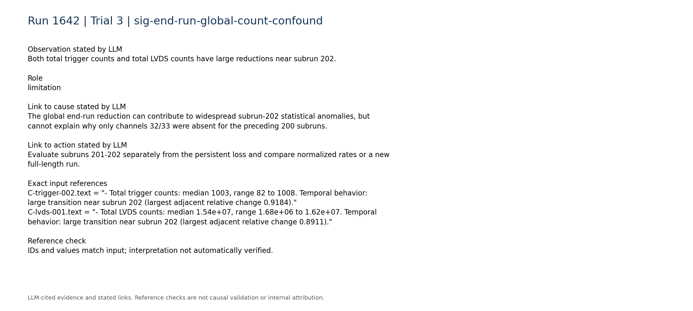

### sig-discriminating-telemetry-unavailable

Within-run configuration changes, board matching, synchronization, queue occupancy, and DAQ-state telemetry are unavailable.

Role: limitation

Cause link: Prevents distinguishing a physical LVDS connection failure from source-electronics, matching, or unlogged configuration causes.

Action link: Acquire these telemetry streams and compare signal/rate behavior at both endpoints before choosing a component-level fix.

```text
C-daq_config-007.text = "- Within-run configuration changes: unavailable; only the static per-run configuration snapshot is parsed."
C-daq_config-008.text = "- Board matching, synchronization, queue occupancy, and DAQ-state telemetry: unavailable."
C-trigger-007.text = "- Digitizer-vs-trigger-board rate consistency: unavailable; no compact processed digitizer-rate telemetry was used."
```

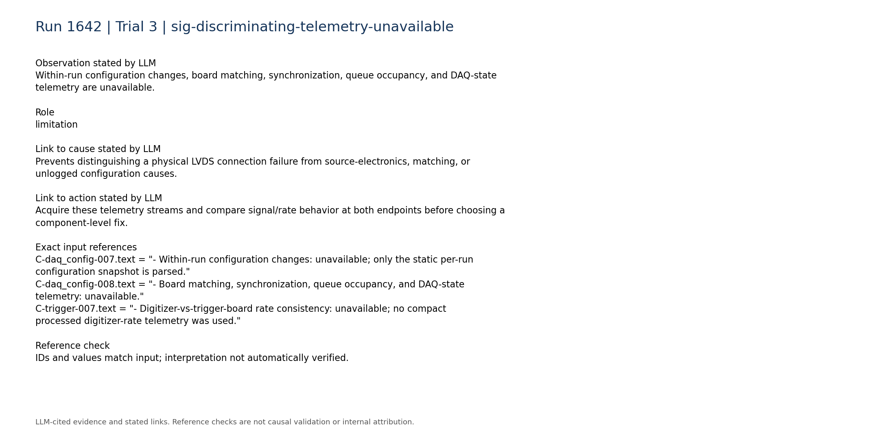

### sig-historical-analogy-only

The closest historical cases concern LVDS connection problems, but the detailed run-2126 case included abnormal apparent digitizer rate, queue filling, empty unmatched events, and degraded board matching—measurements unavailable or not observed in the current case.

Role: limitation

Cause link: Provides only a partial mechanical-connection analogy and does not establish the same root cause in CASE_TARGET.

Action link: Supports cautious connector and cable checks while requiring current-case localization before repair or masking.

```text
H-2126.entry.category = "LVDS_noise"
H-2126.entry.cause = "DAQ board-matching efficiency dropped below 100% beginning in run 2126, file 26, around event 700. The DAQ queue filled with mostly empty, unmatched digitizer events and the apparent digitizer trigger rate became abnormally high while the trigger-board files remained normal. Trigger-mask tests localized the problem to digitizer 0 LVDS channel 0, corresponding to detector channels 0 and 1. The subsequent intervention indicated an intermittent or degraded LVDS-pin, jumper-wire, or MCX signal connection."
```

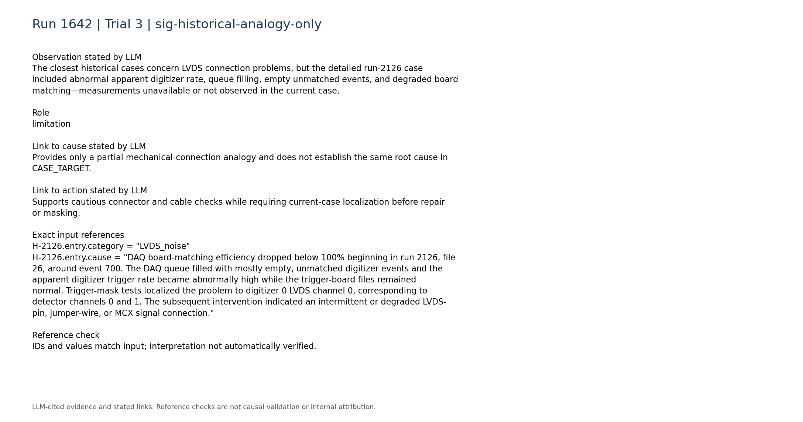

## Missing information

- Direct signal-level or continuity measurements at both ends of physical LVDS pin 16.
- Board-matching efficiency, synchronization status, queue occupancy, and empty/unmatched event fractions, especially around subruns 200-202.
- Digitizer-versus-trigger-board per-path rate comparison.
- Within-run configuration and electronics-state change log around subrun 201.
- Whether channels 32/33 were intentionally disabled upstream despite not being in the supplied static physical-pin mask.
- A subsequent full-length run showing whether the sparse channel-32/33 reappearance persisted.
- Original event ordering and waveforms for the 27 late channel-32/33 rows; supplied raw summaries are lossy.
