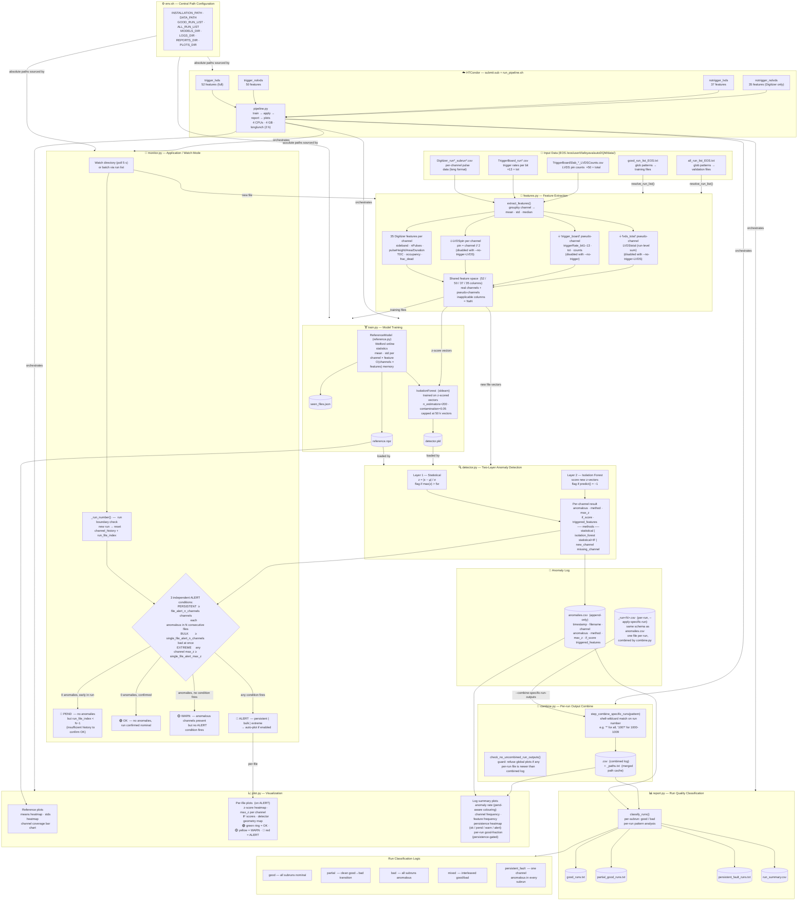

# autoDQM Isolation Forest — Full Architecture

```mermaid
flowchart TD

    %% ── Configuration ────────────────────────────────────────────────────────
    subgraph CFG["⚙️  env.sh  —  Central Path Configuration"]
        ENV["INSTALLATION_PATH · DATA_PATH
        GOOD_RUN_LIST · ALL_RUN_LIST
        MODELS_DIR · LOGS_DIR · REPORTS_DIR · PLOTS_DIR"]
    end

    %% ── Input ────────────────────────────────────────────────────────────────
    subgraph INPUT["📂  Input Data  (EOS /eos/user/t/tafoyava/autoDQM/data/)"]
        GOOD_LIST["good_run_list_EOS.txt
        glob patterns → training files"]
        ALL_LIST["all_run_list_EOS.txt
        glob patterns → validation files"]
        DIG["Digitizer_run*_subrun*.csv
        per-channel pulse data (long format)"]
        TRIG["TriggerBoard_run*.csv
        trigger rates per bit  ×13 + tot"]
        LVDS["TriggerBoardSlab_*_LVDSCounts.csv
        LVDS pin counts  ×50 + total"]
    end

    %% ── Feature Extraction ───────────────────────────────────────────────────
    subgraph FEAT["🔧  features.py  —  Feature Extraction"]
        direction TB
        FE["extract_features()
        groupby channel → mean · std · median"]
        F35["35 Digitizer features per channel
        sideband · nPulses · pulseHeight/Area/Duration
        TDC · occupancy · frac_dead"]
        FLVDSP["＋LVDSpin per channel
        pin = channel // 2
        (disabled with --no-trigger-LVDS)"]
        F15["＋'trigger_board' pseudo-channel
        triggerRate_bit1–13 · tot · counts
        (disabled with --no-trigger)"]
        F51["＋'lvds_total' pseudo-channel
        LVDStotal (run-level sum)
        (disabled with --no-trigger-LVDS)"]
        FV["Shared feature space  (52 / 50 / 37 / 35 columns)
        real channels + pseudo-channels
        inapplicable columns = NaN"]
        FE --> F35 --> FV
        FE --> FLVDSP --> FV
        FE --> F15 --> FV
        FE --> F51 --> FV
    end

    %% ── Training ─────────────────────────────────────────────────────────────
    subgraph TRAIN["🏋️  train.py  —  Model Training"]
        direction TB
        REF["ReferenceModel  (reference.py)
        Welford online statistics
        mean · std per  channel × feature
        O(channels × features) memory"]
        REFNPZ[("reference.npz")]
        SEEN[("seen_files.json")]
        IFT["IsolationForest  (sklearn)
        trained on z-scored vectors
        n_estimators=200 · contamination=0.05
        capped at 50 k vectors"]
        DETPKL[("detector.pkl")]
        REF --> REFNPZ
        REF --> SEEN
        REF --> IFT --> DETPKL
    end

    %% ── Detection ────────────────────────────────────────────────────────────
    subgraph DETECT["🔍  detector.py  —  Two-Layer Anomaly Detection"]
        direction LR
        L1["Layer 1 — Statistical
        z = |x − μ| / σ
        flag if  max(z) > 5σ"]
        L2["Layer 2 — Isolation Forest
        score new z-vectors
        flag if predict() = −1"]
        COMB["Per-channel result
        anomalous · method · max_z
        if_score · triggered_features
        ── methods ──
        statistical | isolation_forest
        statistical+IF | new_channel
        missing_channel"]
        L1 --> COMB
        L2 --> COMB
    end

    %% ── Application ──────────────────────────────────────────────────────────
    subgraph APPLY["📡  monitor.py  —  Application / Watch Mode"]
        direction TB
        WATCH["Watch directory  (poll 5 s)
        or batch via run list"]
        RUNBND["_run_number()  —  run boundary check
        new run → reset channel_history + run_file_index"]
        THRESH{"3 independent ALERT conditions:
        PERSISTENT  ≥ file_alert_n_channels channels
                    each anomalous in N consecutive files
        BULK        ≥ single_file_alert_n_channels bad at once
        EXTREME     any channel max_z ≥ single_file_alert_max_z"}
        PEND["🔵 PEND  — no anomalies
        but run_file_index &lt; N−1
        (insufficient history to confirm OK)"]
        OK["🟢 OK  — no anomalies, run confirmed nominal"]
        WARN["🟡 WARN  — anomalous channels present
        but no ALERT condition fires"]
        ALT["🔴 ALERT  — persistent | bulk | extreme
        → auto-plot if enabled"]
        WATCH --> RUNBND --> THRESH
        THRESH -->|"0 anomalies, early in run"| PEND
        THRESH -->|"0 anomalies, confirmed"| OK
        THRESH -->|"anomalies, no condition fires"| WARN
        THRESH -->|"any condition fires"| ALT
    end

    %% ── Log ──────────────────────────────────────────────────────────────────
    subgraph LOG["📝  Anomaly Log"]
        CSV[("anomalies.csv  (append-only)
        timestamp · filename · channel
        anomalous · method · max_z · if_score
        triggered_features")]
        RUNCSV[("<tag>_run&lt;N&gt;.csv  (per-run, --apply-specific-run)
        same schema as anomalies.csv
        one file per run, combined by combine.py")]
    end

    %% ── Combine ──────────────────────────────────────────────────────────────
    subgraph COMBINE["🔗  combine.py  —  Per-run Output Combine"]
        direction TB
        COMB_F["step_combine_specific_runs(pattern)
        shell-wildcard match on run number
        e.g. '*' for all, '100?' for 1000-1009"]
        COMB_G["check_no_uncombined_run_outputs()
        guard: refuse global plots if any
        per-run file is newer than combined log"]
        COMB_OUT[("<tag>.csv  (combined log)
        + <tag>_paths.txt  (merged path cache)")]
        COMB_F --> COMB_OUT
    end

    %% ── Reporting ────────────────────────────────────────────────────────────
    subgraph REPORT["📊  report.py  —  Run Quality Classification"]
        direction TB
        CL["classify_runs()
        per-subrun: good / bad
        per-run pattern analysis"]
        RG[("good_runs.txt")]
        RP[("partial_good_runs.txt")]
        RF[("persistent_fault_runs.txt")]
        RS[("run_summary.csv")]
        CL --> RG & RP & RF & RS
    end

    %% ── Run classifications ──────────────────────────────────────────────────
    subgraph RUNCLASS["Run Classification Logic"]
        direction TB
        CL_G["good  — all subruns nominal"]
        CL_P["partial  — clean good→bad transition"]
        CL_B["bad  — all subruns anomalous"]
        CL_M["mixed  — interleaved good/bad"]
        CL_F["persistent_fault  — one channel
        anomalous in every subrun"]
    end

    %% ── Plots ────────────────────────────────────────────────────────────────
    subgraph PLOTS["📈  plot.py  —  Visualization"]
        direction TB
        PR["Reference plots
        means heatmap · stds heatmap
        channel coverage bar chart"]
        PF["Per-file plots  (on ALERT)
        z-score heatmap · max_z per channel
        IF scores · detector geometry map
        🟢 green ring = OK · 🟡 yellow = WARN · 🔴 red = ALERT"]
        PL["Log summary plots
        anomaly rate (pend-aware colouring)
        channel frequency · feature frequency
        persistence heatmap  (ok / pend / warn / alert)
        per-run good-fraction (persistence-gated)"]
    end

    %% ── Condor ───────────────────────────────────────────────────────────────
    subgraph CONDOR["☁️  HTCondor  —  submit.sub + run_pipeline.sh"]
        direction TB
        V1["trigger_lvds
        52 features  (full)"]
        V2["trigger_nolvds
        50 features"]
        V3["notrigger_lvds
        37 features"]
        V4["notrigger_nolvds
        35 features  (Digitizer only)"]
        PIPE["pipeline.py
        train → apply → report → plots
        4 CPUs · 4 GB · longlunch (2 h)"]
        V1 & V2 & V3 & V4 --> PIPE
    end

    %% ── Edges ────────────────────────────────────────────────────────────────
    CFG -->|"absolute paths sourced by"| TRAIN
    CFG -->|"absolute paths sourced by"| APPLY
    CFG -->|"absolute paths sourced by"| CONDOR

    GOOD_LIST -->|"resolve_run_list()"| FEAT
    ALL_LIST  -->|"resolve_run_list()"| FEAT
    DIG  --> FE
    TRIG --> FE
    LVDS --> FE

    FV -->|"training files"| TRAIN
    FV -->|"z-score vectors"| IFT

    REFNPZ & DETPKL -->|"loaded by"| DETECT

    WATCH -->|"new file"| FEAT
    FV -->|"new file vectors"| DETECT
    COMB --> THRESH
    COMB --> CSV

    CSV --> CL
    CL --> RUNCLASS

    REFNPZ --> PR
    CSV    --> PL
    ALT    -->|"per-file"| PF

    RUNCSV -->|"--combine-specific-run-outputs"| COMB_F
    COMB_OUT --> CL
    COMB_OUT --> PL

    PIPE -->|"orchestrates"| TRAIN
    PIPE -->|"orchestrates"| APPLY
    PIPE -->|"orchestrates"| COMBINE
    PIPE -->|"orchestrates"| REPORT
    PIPE -->|"orchestrates"| PLOTS
```
