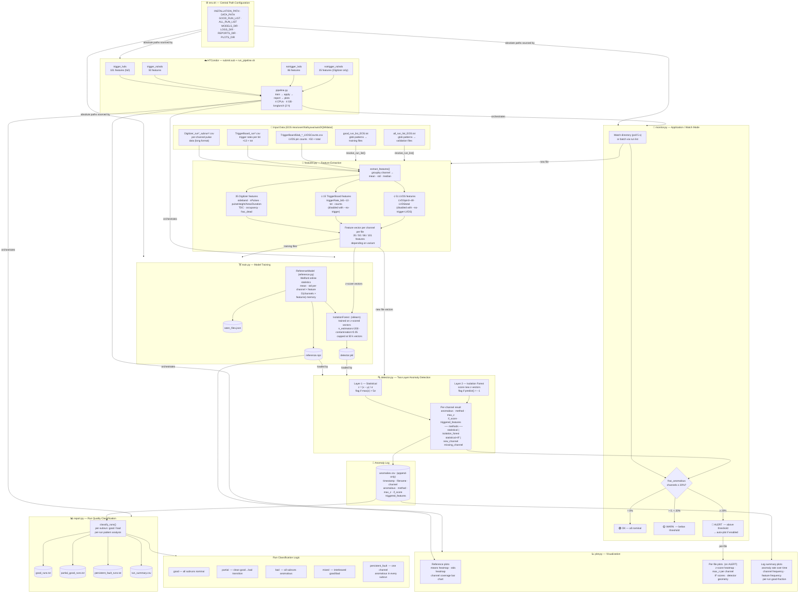

# autoDQM Isolation Forest — Architecture Diagram



---

## Feature Variants (4 Condor Jobs)

| Variant | Flags | Features |
|---|---|---|
| `trigger_lvds` | *(none)* | 35 + 15 + 51 = **101** |
| `trigger_nolvds` | `--no-trigger-LVDS` | 35 + 15 = **50** |
| `notrigger_lvds` | `--no-trigger` | 35 + 51 = **86** |
| `notrigger_nolvds` | `--no-trigger --no-trigger-LVDS` | **35** |

## Key Parameters

| Parameter | Default | Effect |
|---|---|---|
| `z_threshold` | 5.0 σ | Statistical layer sensitivity |
| `if_contamination` | 0.05 | Expected anomaly fraction in training data |
| `file_alert_threshold` | 0.20 | Fraction of bad channels to trigger `[ALERT]` |
| `n_estimators` | 200 | Isolation Forest size |
| `max_IF_samples` | 50 000 | Cap on training vectors (scalability) |
| `poll_interval` | 5 s | Watch-mode scan frequency |

## Output Artifacts

```
isolation_forest/
├── models/
│   ├── reference.npz       ← Welford statistics (mean, std per channel×feature)
│   ├── detector.pkl        ← Trained IsolationForest + thresholds
│   └── seen_files.json     ← Filenames already incorporated in reference
├── logs/
│   └── anomalies.csv       ← Append-only anomaly log (one row per channel per file)
├── reports/
│   ├── good_runs.txt
│   ├── partial_good_runs.txt
│   ├── persistent_fault_runs.txt
│   └── run_summary.csv
└── plots/
    ├── reference_means.png
    ├── reference_stds.png
    ├── reference_coverage.png
    ├── log_anomaly_rate.png
    ├── log_channel_frequency.png
    ├── log_feature_frequency.png
    └── <variant>/          ← per-alerted-file subdirectory
        ├── *_zscore_heatmap.png
        ├── *_max_zscore.png
        ├── *_if_scores.png
        └── *_geometry.png
```
