# autoDQM Isolation Forest — Simplified Overview

```mermaid
flowchart TD

    %% ── Inputs ───────────────────────────────────────────────────────────────
    subgraph IN["  Input Data  "]
        direction LR
        DIG["📄 Digitizer_run*_subrun*.csv\npulse data · ~8 k events/file"]
        AUX["📄 TriggerBoard + LVDSCounts\ntrigger rates · LVDS pin counts"]
    end

    %% ── Feature Extraction ───────────────────────────────────────────────────
    subgraph FE["  Feature Extraction  ·  features.py  "]
        direction TB
        AGG["group by channel\n─────────────────────────────\nmean · std · median\nof 11 pulse metrics\n+ occupancy  +  frac_dead\n+ LVDSpin (pin = ch // 2)"]
        VEC["shared feature space  (d columns)\n─────────────────────────────\nreal channels: digitizer + LVDSpin\n'trigger_board' pseudo-ch: 15 trigger cols\n'lvds_total' pseudo-ch: LVDStotal col\ninapplicable columns = NaN\n─────────────────────────────\nd = 35   Digitizer only\nd = 50   + TriggerBoard\nd = 37   + LVDS\nd = 52   full"]
        AGG --> VEC
    end

    %% ── Training ─────────────────────────────────────────────────────────────
    subgraph TR["  Training  ·  train.py  "]
        direction TB
        WEL["🔵  Welford Reference  ·  reference.py\n━━━━━━━━━━━━━━━━━━━━━━━━━━━━━━━━\nfor each new file k :\n  δₖ  =  xₖ − μₖ₋₁\n  μₖ  =  μₖ₋₁  +  δₖ / nₖ\n  M₂ₖ =  M₂ₖ₋₁  +  δₖ·(xₖ − μₖ)\n\nestimated std :\n  σ̂  =  √( M₂ₙ / n )\n\nO(channels × d) memory — scales to ∞ files"]
        IFT["🟠  Isolation Forest  ·  sklearn\n━━━━━━━━━━━━━━━━━━━━━━━━━━━━━━━━\ntrain on z-scored good-data vectors\n\nanomaly score :\n  s(x,n) = 2^( −E[h(x)] / c(n) )\n\n  h(x)  = path length in isolation tree\n  c(n)  = 2H(n−1) − 2(n−1)/n   avg path\n  H(i)  = ln(i) + γ   harmonic number\n\nn_estimators = 200 · contamination = 0.05\ncapped at 50 000 training vectors"]
        WEL --> IFT
    end

    %% ── Models ───────────────────────────────────────────────────────────────
    MOD[("💾  models/\nreference.npz\ndetector.pkl")]

    %% ── Detection ────────────────────────────────────────────────────────────
    subgraph DET["  Two-Layer Detection  ·  detector.py  "]
        direction LR
        L1["🔵  Layer 1 — Statistical\n━━━━━━━━━━━━━━━━━━━━━━━\nz-score per feature j :\n\n  zⱼ = |xⱼ − μⱼ| / σ̂ⱼ\n\nflag channel if :\n  max_z = maxⱼ(zⱼ)  >  5σ"]
        L2["🟠  Layer 2 — Isolation Forest\n━━━━━━━━━━━━━━━━━━━━━━━\npredict on z-scored vector\n\nflag channel if :\n  predict(z)  =  −1\n  i.e.  s(x,n)  >  0.5\n\ncaptures multivariate anomalies\nnot visible in any single zⱼ"]
        OR["channel flagged if\nL1  OR  L2  triggers\n─────────────────\nmethod label :\n  statistical\n  isolation_forest\n  statistical+IF\n  new_channel\n  missing_channel"]
        L1 --> OR
        L2 --> OR
    end

    %% ── Application ──────────────────────────────────────────────────────────
    subgraph APP["  Application  ·  monitor.py  "]
        THR["file-level alert threshold\n─────────────────────────────\n  f_bad = n_anom / n_channels\n\n  f_bad = 0          → 🟢 OK\n  0 < f_bad < 0.001  → 🟡 WARN\n  f_bad ≥ 0.001      → 🔴 ALERT"]
    end

    %% ── Log ──────────────────────────────────────────────────────────────────
    LOG[("📋  logs/anomalies.csv\ntimestamp · filename · channel\nanomaly · method · max_z · if_score")]

    %% ── Outputs ──────────────────────────────────────────────────────────────
    subgraph OUT["  Outputs  "]
        direction LR
        REP["📊  report.py\n─────────────────────────────────\nclassify runs:\n  good  · partial  · bad\n  mixed · persistent_fault\n\npersistent fault :\n  channel anomalous in every\n  subrun of a run"]
        PLT["📈  plot.py\n─────────────────────────────────\nreference : means · stds · coverage\nper-file  : z-heatmap · max_z\n            IF scores · geometry\nlog       : anomaly rate over time\n            channel / feature freq"]
    end

    %% ── Condor ───────────────────────────────────────────────────────────────
    subgraph CND["  ☁️  HTCondor  —  4 parallel jobs  "]
        direction LR
        C1["trigger_lvds\nd=52"]
        C2["trigger_nolvds\nd=50"]
        C3["notrigger_lvds\nd=37"]
        C4["notrigger_nolvds\nd=35"]
    end

    %% ── Edges ────────────────────────────────────────────────────────────────
    DIG & AUX --> FE
    FE -->|"good-run list\n(training)"| TR
    TR --> MOD
    MOD --> DET
    FE -->|"new file\n(inference)"| DET
    DET --> APP
    APP --> LOG
    LOG --> REP & PLT
    CND -->|"pipeline.py\norchestrates all steps"| FE
```

---

## Statistical Metrics

### Feature Extraction

Each Digitizer CSV is compressed from ~8 000 events to **one row per channel** by applying three aggregations to each of the 11 pulse metrics:

$$\bar{v}_c = \frac{1}{N_c}\sum_{i=1}^{N_c} v_i \qquad \sigma_{v,c} = \sqrt{\frac{1}{N_c}\sum_{i=1}^{N_c}(v_i - \bar{v}_c)^2} \qquad \tilde{v}_c = \text{median}(\{v_i\})$$

plus two occupancy features:

$$\text{occupancy}_{c} = \frac{|\text{events where channel } c \text{ fired}|}{|\text{total events}|} \qquad \text{frac\\_dead}_{c} = \frac{|\text{appearances with nPulses}=0|}{|\text{appearances of } c|}$$

giving a feature vector $\mathbf{x}_c \in \mathbb{R}^d$ per row per file, with $d \in \{35, 37, 50, 52\}$ depending on which companion files are enabled. Trigger and run-level quantities are not appended to channel rows; instead they are represented as **pseudo-channel rows** (`"trigger_board"`, `"lvds_total"`) in the same shared feature space, with `NaN` in columns that do not apply to them.

---

### Reference Model — Welford's Online Algorithm

The reference is built incrementally: adding a new file costs $\mathcal{O}(C \times d)$ memory and never touches previous files.  For file $k$ and feature $j$ of channel $c$:

$$\delta_k = x_k - \mu_{k-1}$$

$$\mu_k = \mu_{k-1} + \frac{\delta_k}{n_k}$$

$$M_{2,k} = M_{2,k-1} + \delta_k\,(x_k - \mu_k)$$

Estimated standard deviation used at inference:

$$\hat{\sigma} = \sqrt{\frac{M_{2,n}}{n}} \quad \text{(floored at } 10^{-6}\text{)}$$

`NaN` features (e.g. missing TriggerBoard entry) set $\delta_k = 0$, leaving $\mu$ and $M_2$ unchanged.

---

### Layer 1 — Statistical Z-Score

For each feature $j$ of channel $c$ in the incoming file:

$$z_j = \frac{|x_j - \hat{\mu}_j|}{\hat{\sigma}_j}$$

$$\text{max\\_z} = \max_j\, z_j$$

The channel is flagged if $\text{max\\_z} > z_{\text{thresh}} = 5$.

---

### Layer 2 — Isolation Forest

The Isolation Forest is trained on **z-scored** vectors from the good-data corpus, making it scale-invariant across channels.  The anomaly score for a point $x$ in a forest of $n$ training samples is:

$$s(x,\,n) = 2^{-\,\mathbb{E}[h(x)]\,/\,c(n)}$$

where $h(x)$ is the path length to isolate $x$ in a single tree, and

$$c(n) = 2H(n-1) - \frac{2(n-1)}{n}, \qquad H(i) = \ln(i) + \gamma$$

is the expected path length for $n$ samples ($\gamma \approx 0.5772$ is the Euler–Mascheroni constant).

- $s \to 1$: short path → easily isolated → **anomalous**
- $s \to 0$: long path → hard to isolate → **nominal**

A channel is flagged when `predict(z) = −1`, corresponding to $s > 0.5$.

---

### File-Level Alert

$$f_{\text{bad}} = \frac{n_{\text{anomalous}}}{n_{\text{channels}}}$$

| $f_{\text{bad}}$ | Status |
|---|---|
| $= 0$ | 🟢 **OK** |
| $0 < f_{\text{bad}} < 0.001$ | 🟡 **WARN** |
| $\geq 0.001$ | 🔴 **ALERT** |

---

### Feature Variants (4 Condor Jobs)

| Variant | Digitizer | TriggerBoard | LVDS | $d$ |
|---|:---:|:---:|:---:|:---:|
| `trigger_lvds` | ✓ | ✓ | ✓ | **52** |
| `trigger_nolvds` | ✓ | ✓ | — | **50** |
| `notrigger_lvds` | ✓ | — | ✓ | **37** |
| `notrigger_nolvds` | ✓ | — | — | **35** |
